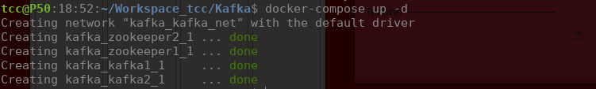
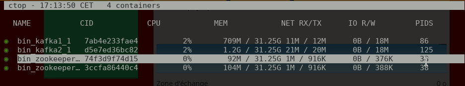
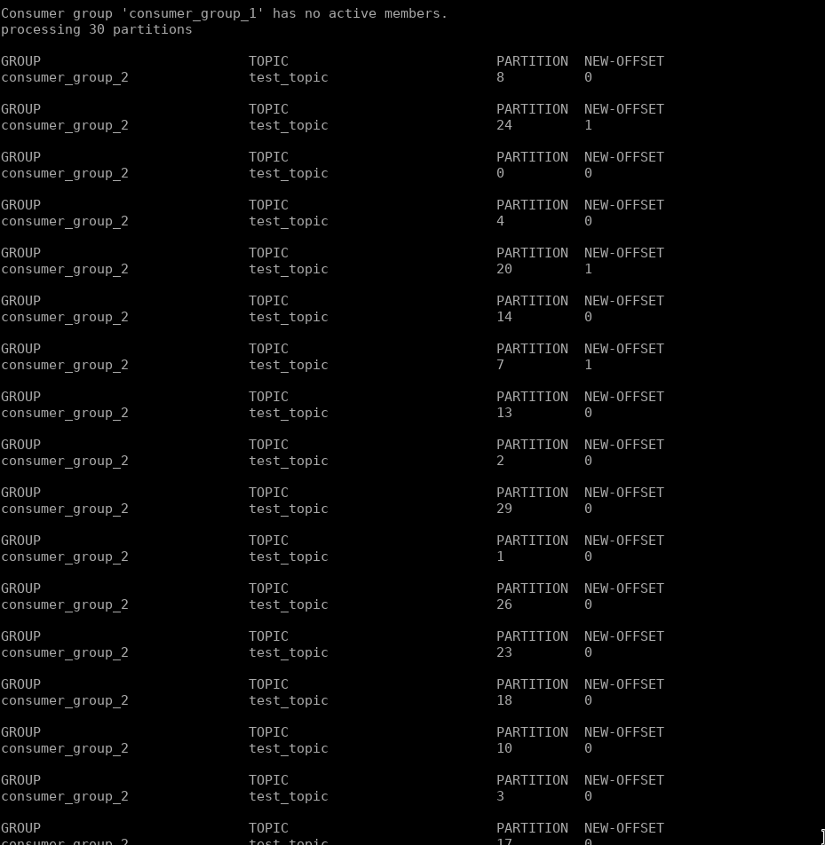

# kafka-offset-migrator
This is a suite of tools to test and simulate the migration of a kafka
consumer groups offsets between two kafka clusters and a mirror-maker.


this project has been built on top of the original Apache Kafka project : https://kafka.apache.org/downloads
based on an original production need :
- migrate all kafka based jobs without messing or losing data
- assuming the lowest service interruption
- insure that any consumer wont consume a message twice

## Setup the project
download latest kafka binaries

Requirements :

openjdk 11.0.4 2019-07-16 (or more recent)
docker-ce
docker-compose

```

  wget http://apache.crihan.fr/dist/kafka/2.3.0/kafka-2.3.0-src.tgz

```

Copy all the kafka-offset-migrator files and the config/ dir to the kafka binary path

```

git clone git@github.com:tcarecolin/kafka-offset-migrator.git
cp -r kafka-offset-migrator/* <KAFKA-SOURCE-DIR>/<KAFKA_VERSION>/bin

```

## Start the contenerized Kafka clusters

```
cd <KAFKA-SOURCE-DIR>/<KAFKA_VERSION>/bin
docker-compose up -d

```



now you should see 4 new application running :
2 kafka instances
2 zookeeper instances

@NOTE: i recommend using ctop for easy docker opperations


## Next step we want to simulate an offset migration
### Step 1:
start the main.sh script to
- create topics and configuration on both kafka clusters
- start a consumer listenning on the first kafka topic
- start a producer that fills the topics periodicaly

NOTE: consumers are designed to output consumed messages in kafka_N.log files,
i recommend tailing them in a separate shell to watch the magic operate

```
./main.sh
tail -f kafka_1.log

```

```
tail -f kafka_2.log

```

### Step 2:
Create a topic mirroring over the second kafka cluster:

get the kafka2 docker container image name and connect to it
then start the mirror

```
docker exec -it <KAFKA 2 NAME> bash
bash /root/config/start-mirror.sh <TOPIC>

```
Now you are able to stop consumer 1
and migrate the offsets

```
bash stop-bg-consumers <CONSUMER_GROUP NAME>
bash migrate-offset.sh \
  <KAFKA_1_IP:PORT> \
  <KAFKA_2_IP:PORT> \
  <KAFKA_1_CONSUMER_GROUP> \
  <KAFKA_2_CONSUMER_GROUP> \
  <TOPIC TO MIGRATE>

```

Note: if any existing consumer are remaining in  <KAFKA_2_CONSUMER_GROUP>
they will be shot down before the migration opperations

example output:



## Other uses cases
Start manualy a consumer on kafka1 or 2

```
bash start-consumer1.sh
....
bash start-consumer2.sh

```
Terminate all consumers

```
bash stop-bg-consumers.sh

```

Terminate only consumer group consumers

```
bash stop-bg-consumers.sh <CONSUMER GROUP NAME>

```

Reset all consumer group offsets to zero

```
bash reset-offsets.sh <BROKER_IP:PORT> <TOPIC> <CONSUMER_GROUP>
```

reconfigure kafka topics manualy (after editing parameters)

```
bash configure-topics.sh

```