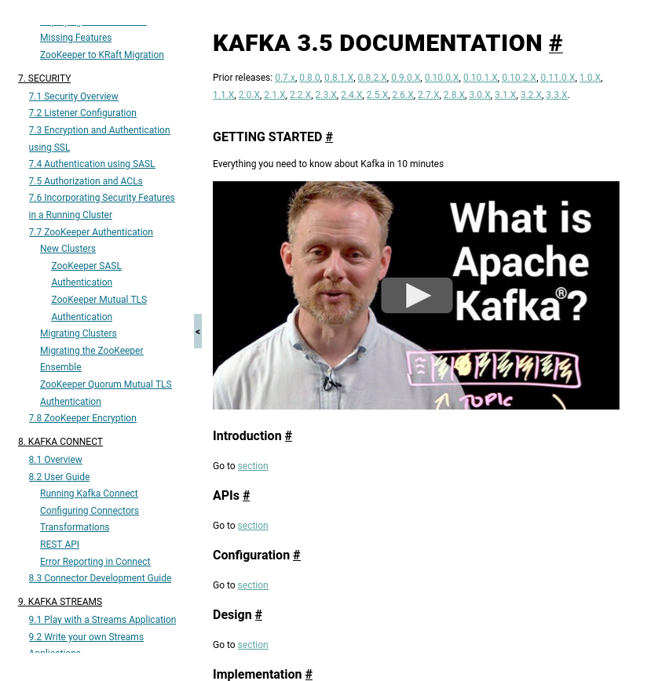
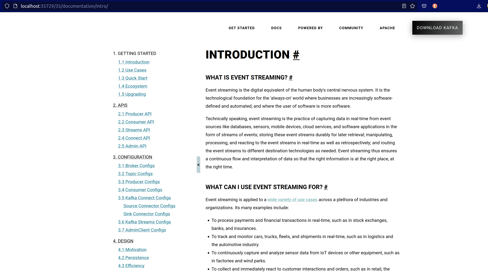

# Kafka documentation

## Changes from old approach

### Single-page into multiple pages

It may be possible to build a single-page with hugo, 
though including Markdown pages into a single one is not supported out-of-the-box.

Because of this, 
and as the single page is getting quite long and harder to navigate,
I'm migrating sections into its own page.
So, instead of `documentation#intro`, Introduction section will be located at `documentation/intro`.

Inevitably, some old links to `/documentation` will be broken, e.g. redirecting `/documentation#brokerconfigs_bootstrap.servers` to `/documentation/configuration#brokerconfigs_bootstrap.servers` may be too complicated.

To alleviate this, the index page can keep some main headers to redirect to the proper section: 



### Moving images closer to the content where it's used

As sections will have their own page, Hugo supports either having a markdown file or a directory with `_index.md` with the content.
When content has images or other attachments, these can be placed at the same directory, making navigation work the same way when deployed as when navigated via GitHub or IDE.

### Integration with kafka-site

Integration with kafka-site should be quite similar to the current one.
Hugo should build static-site and move content to kafka-site version.

### Tables in Markdown

Tables are probably the weakest feature in Markdown. They don't have support for multi-line, it becomes very cumbersome to edit and style.
More often than not HTML tables are simpler to use.
So, for Kafka documentation, there are 2 alternatives:

- Use Markdown tables for simple, specific tables, where data fits in one line.
- For data-driven tables (e.g. metrics, configs) a combination of [Hugo data 
  templates](https://gohugo.io/templates/data-templates/) with [shortcodes](https://gohugo.io/content-management/shortcodes/). Here are some examples:
  - Configs:
    - [Data set](data/config/admin_client_config.json)
    - [Template](layouts/shortcodes/config.html)

### Kafka Streams docs

Kafka Streams docs have been moved to the same structure as the main docs.
These to simplify the migration to Markdown.

As a side effect, most dynamic behavior and navigation is now under the main menu.

### Themes

To make the transition as low-friction as possible, the same template has been copied from `kafka-site` to keep the same user-experience, though it can be improved later using Hugo templates.

```shell
make site
```



Though, a version using the same theme as Flink as baseline is also an alternative:

```shell
make site-book
```


## Dependencies

- Generating JSON instead of HTML for Configs and Metrics: https://github.com/apache/kafka/compare/trunk...jeqo:config-json

## Project structure

- `content/`: Contains all documentation and images in Markdown -- html is left for diff any change on Kafka trunk before merging
- `data/`: contains all JSON files to generate tables
- `docker/`: Docker config files for testing site with kafka-site
- `kafka-site/`: Git sub-module to test integration with common site
- `layouts/`:
  - `shortcodes/`: Data templates to generate tables out of JSON data
  
- `static/`: Keeps kafka-site static assets for same templating as current one.
- `themes/`:
  - `book`: copied from Flink docs site, but adapted to kafka docs.
  - `ak-docs-v1/`: Initial template, cleaned up version of book. Together with `../static/` make the docs theme. Has some assets from book to eventually use some of its features (e.g. search, right menu for section navigation)
    - `layouts/partials/toc.html`: Contains previous toc.html adapted to new structure
    - `layouts/_default/baseof.html`: Contains previous index.html adapted to new structure, using Hugo partials.
  
## How to run

- Run Hugo site in development mode:
  ```shell
  make test
  # or to test with book theme
  make test-book
  ```
- Build site and run Apache with kafka-site:
  ```shell
  make site run
  ```
  Make sure to update kafka-site `documentation/index.html` to load latest version (e.g. 35):
  ```html
  <!--#include virtual="../35/documentation/index.html" -->
  ```

## Tools

- Pandoc: to transform HTML into Markdown files
- Convert tools to turn HTML tables into Markdown and JSON files:
  - https://www.convertjson.com/html-table-to-json.htm
  - https://tableconvert.com/html-to-markdown