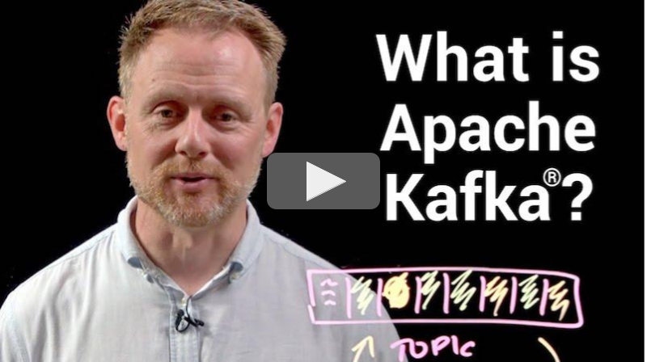

# Kafka  Documentation

Prior releases: [0.7.x](/07/documentation.html),
[0.8.0](/08/documentation.html), [0.8.1.X](/081/documentation.html),
[0.8.2.X](/082/documentation.html), [0.9.0.X](/090/documentation.html),
[0.10.0.X](/0100/documentation.html),
[0.10.1.X](/0101/documentation.html),
[0.10.2.X](/0102/documentation.html),
[0.11.0.X](/0110/documentation.html), [1.0.X](/10/documentation.html),
[1.1.X](/11/documentation.html), [2.0.X](/20/documentation.html),
[2.1.X](/21/documentation.html), [2.2.X](/22/documentation.html),
[2.3.X](/23/documentation.html), [2.4.X](/24/documentation.html),
[2.5.X](/25/documentation.html), [2.6.X](/26/documentation.html),
[2.7.X](/27/documentation.html), [2.8.X](/28/documentation.html),
[3.0.X](/30/documentation.html), [3.1.X](/31/documentation.html),
[3.2.X](/32/documentation.html), [3.3.X](/33/documentation.html).

## Getting Started {#gettingStarted}

Everything you need to know about Kafka in 10 minutes

### Introduction {#introduction}

Go to [section](intro)

### APIs {#api}

Go to [section](api)

### Configuration {#configuration}

Go to [section](configuration)

### Design {#design}

Go to [section](design)

### Implementation

Go to [section](implementation)

### Operations

Go to [section](operations)

### Security

Go to [section](security)

### Kafka Connect {#connect}

Go to [section](connect)

### Kafka Streams {#streams}

Go to [section](streams)
