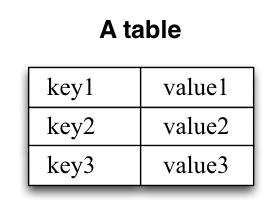
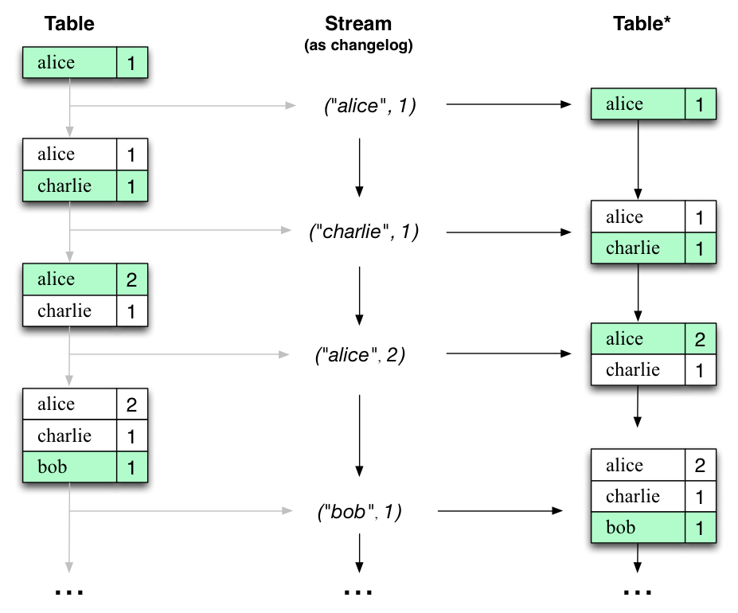

# Core Concepts

Kafka Streams is a client library for processing and analyzing data
stored in Kafka. It builds upon important stream processing concepts
such as properly distinguishing between event time and processing time,
windowing support, and simple yet efficient management and real-time
querying of application state.

Kafka Streams has a **low barrier to entry**: You can quickly write and
run a small-scale proof-of-concept on a single machine; and you only
need to run additional instances of your application on multiple
machines to scale up to high-volume production workloads. Kafka Streams
transparently handles the load balancing of multiple instances of the
same application by leveraging Kafka\'s parallelism model.

Some highlights of Kafka Streams:

-   Designed as a **simple and lightweight client library**, which can
    be easily embedded in any Java application and integrated with any
    existing packaging, deployment and operational tools that users have
    for their streaming applications.
-   Has **no external dependencies on systems other than Apache Kafka
    itself** as the internal messaging layer; notably, it uses Kafka\'s
    partitioning model to horizontally scale processing while
    maintaining strong ordering guarantees.
-   Supports **fault-tolerant local state**, which enables very fast and
    efficient stateful operations like windowed joins and aggregations.
-   Supports **exactly-once** processing semantics to guarantee that
    each record will be processed once and only once even when there is
    a failure on either Streams clients or Kafka brokers in the middle
    of processing.
-   Employs **one-record-at-a-time processing** to achieve millisecond
    processing latency, and supports **event-time based windowing
    operations** with out-of-order arrival of records.
-   Offers necessary stream processing primitives, along with a
    **high-level Streams DSL** and a **low-level Processor API**.

We first summarize the key concepts of Kafka Streams.

## Stream Processing Topology {#streams_topology .anchor-link}

-   A **stream** is the most important abstraction provided by Kafka
    Streams: it represents an unbounded, continuously updating data set.
    A stream is an ordered, replayable, and fault-tolerant sequence of
    immutable data records, where a **data record** is defined as a
    key-value pair.
-   A **stream processing application** is any program that makes use of
    the Kafka Streams library. It defines its computational logic
    through one or more **processor topologies**, where a processor
    topology is a graph of stream processors (nodes) that are connected
    by streams (edges).
-   A [**stream processor**](../developer-guide/processor-api#defining-a-stream-processor)
    is a node in the processor topology; it represents a processing step
    to transform data in streams by receiving one input record at a time
    from its upstream processors in the topology, applying its operation
    to it, and may subsequently produce one or more output records to
    its downstream processors.

There are two special processors in the topology:

-   **Source Processor**: A source processor is a special type of stream
    processor that does not have any upstream processors. It produces an
    input stream to its topology from one or multiple Kafka topics by
    consuming records from these topics and forwarding them to its
    down-stream processors.
-   **Sink Processor**: A sink processor is a special type of stream
    processor that does not have down-stream processors. It sends any
    received records from its up-stream processors to a specified Kafka
    topic.

Note that in normal processor nodes other remote systems can also be
accessed while processing the current record. Therefore the processed
results can either be streamed back into Kafka or written to an external
system.

Kafka Streams offers two ways to define the stream processing topology:
the [**Kafka Streams DSL**](../developer-guide/dsl-api)
provides the most common data transformation operations such as `map`,
`filter`, `join` and `aggregations` out of the box; the lower-level
[**Processor API**](../developer-guide/processor-api)
allows developers define and connect custom processors as well as to
interact with [state stores](#streams_state).

A processor topology is merely a logical abstraction for your stream
processing code. At runtime, the logical topology is instantiated and
replicated inside the application for parallel processing (see 
[**Stream Partitions and Tasks**](../architecture#streams_architecture_tasks)
for details).

## Time {#streams_time .anchor-link}

A critical aspect in stream processing is the notion of **time**, and
how it is modeled and integrated. For example, some operations such as
**windowing** are defined based on time boundaries.

Common notions of time in streams are:

-   **Event time** - The point in time when an event or data record
    occurred, i.e. was originally created \"at the source\".
    **Example:** If the event is a geo-location change reported by a GPS
    sensor in a car, then the associated event-time would be the time
    when the GPS sensor captured the location change.
-   **Processing time** - The point in time when the event or data
    record happens to be processed by the stream processing application,
    i.e. when the record is being consumed. The processing time may be
    milliseconds, hours, or days etc. later than the original event
    time. **Example:** Imagine an analytics application that reads and
    processes the geo-location data reported from car sensors to present
    it to a fleet management dashboard. Here, processing-time in the
    analytics application might be milliseconds or seconds (e.g. for
    real-time pipelines based on Apache Kafka and Kafka Streams) or
    hours (e.g. for batch pipelines based on Apache Hadoop or Apache
    Spark) after event-time.
-   **Ingestion time** - The point in time when an event or data record
    is stored in a topic partition by a Kafka broker. The difference to
    event time is that this ingestion timestamp is generated when the
    record is appended to the target topic by the Kafka broker, not when
    the record is created \"at the source\". The difference to
    processing time is that processing time is when the stream
    processing application processes the record. **For example,** if a
    record is never processed, there is no notion of processing time for
    it, but it still has an ingestion time.

The choice between event-time and ingestion-time is actually done
through the configuration of Kafka (not Kafka Streams): From Kafka
0.10.x onwards, timestamps are automatically embedded into Kafka
messages. Depending on Kafka\'s configuration these timestamps represent
event-time or ingestion-time. The respective Kafka configuration setting
can be specified on the broker level or per topic. The default timestamp
extractor in Kafka Streams will retrieve these embedded timestamps
as-is. Hence, the effective time semantics of your application depend on
the effective Kafka configuration for these embedded timestamps.

Kafka Streams assigns a **timestamp** to every data record via the
`TimestampExtractor` interface. These per-record timestamps describe the
progress of a stream with regards to time and are leveraged by
time-dependent operations such as window operations. As a result, this
time will only advance when a new record arrives at the processor. We
call this data-driven time the **stream time** of the application to
differentiate with the **wall-clock time** when this application is
actually executing. Concrete implementations of the `TimestampExtractor`
interface will then provide different semantics to the stream time
definition. For example retrieving or computing timestamps based on the
actual contents of data records such as an embedded timestamp field to
provide event time semantics, and returning the current wall-clock time
thereby yield processing time semantics to stream time. Developers can
thus enforce different notions of time depending on their business
needs.

Finally, whenever a Kafka Streams application writes records to Kafka,
then it will also assign timestamps to these new records. The way the
timestamps are assigned depends on the context:

-   When new output records are generated via processing some input
    record, for example, `context.forward()` triggered in the
    `process()` function call, output record timestamps are inherited
    from input record timestamps directly.
-   When new output records are generated via periodic functions such as
    `Punctuator#punctuate()`, the output record timestamp is defined as
    the current internal time (obtained through `context.timestamp()`)
    of the stream task.
-   For aggregations, the timestamp of a result update record will be
    the maximum timestamp of all input records contributing to the
    result.

You can change the default behavior in the Processor API by assigning
timestamps to output records explicitly when calling `#forward()`.

For aggregations and joins, timestamps are computed by using the
following rules.

-   For joins (stream-stream, table-table) that have left and right
    input records, the timestamp of the output record is assigned
    `max(left.ts, right.ts)`.
-   For stream-table joins, the output record is assigned the timestamp
    from the stream record.
-   For aggregations, Kafka Streams also computes the `max` timestamp
    over all records, per key, either globally (for non-windowed) or
    per-window.
-   For stateless operations, the input record timestamp is passed
    through. For `flatMap` and siblings that emit multiple records, all
    output records inherit the timestamp from the corresponding input
    record.

## Duality of Streams and Tables {#streams_concepts_duality .anchor-link}

When implementing stream processing use cases in practice, you typically
need both **streams** and also **databases**. An example use case that
is very common in practice is an e-commerce application that enriches an
incoming *stream* of customer transactions with the latest customer
information from a *database table*. In other words, streams are
everywhere, but databases are everywhere, too.

Any stream processing technology must therefore provide **first-class
support for streams and tables**. Kafka\'s Streams API provides such
functionality through its core abstractions for
[streams](../developer-guide/dsl-api#streams_concepts_kstream)
and
[tables](../developer-guide/dsl-api#streams_concepts_ktable),
which we will talk about in a minute. Now, an interesting observation is
that there is actually a **close relationship between streams and
tables**, the so-called stream-table duality. And Kafka exploits this
duality in many ways: for example, to make your applications
[elastic](../developer-guide/running-app#elastic-scaling-of-your-application),
to support [fault-tolerant stateful processing](../architecture#streams_architecture_recovery),
or to run [interactive queries](../developer-guide/interactive-queries#interactive-queries)
against your application\'s latest processing results. And, beyond its
internal usage, the Kafka Streams API also allows developers to exploit
this duality in their own applications.

Before we discuss concepts such as
[aggregations](../developer-guide/dsl-api#aggregating){#streams-developer-guide-dsl-aggregating}
in Kafka Streams, we must first introduce **tables** in more detail, and
talk about the aforementioned stream-table duality. Essentially, this
duality means that a stream can be viewed as a table, and a table can be
viewed as a stream. Kafka\'s log compaction feature, for example,
exploits this duality.

A simple form of a table is a collection of key-value pairs, also called
a map or associative array. Such a table may look as follows:

The **stream-table duality** describes the close relationship between
streams and tables.

-   **Stream as Table**: A stream can be considered a changelog of a
    table, where each data record in the stream captures a state change
    of the table. A stream is thus a table in disguise, and it can be
    easily turned into a \"real\" table by replaying the changelog from
    beginning to end to reconstruct the table. Similarly, in a more
    general analogy, aggregating data records in a stream - such as
    computing the total number of pageviews by user from a stream of
    pageview events - will return a table (here with the key and the
    value being the user and its corresponding pageview count,
    respectively).
-   **Table as Stream**: A table can be considered a snapshot, at a
    point in time, of the latest value for each key in a stream (a
    stream\'s data records are key-value pairs). A table is thus a
    stream in disguise, and it can be easily turned into a \"real\"
    stream by iterating over each key-value entry in the table.

Let\'s illustrate this with an example. Imagine a table that tracks the
total number of pageviews by user (first column of diagram below). Over
time, whenever a new pageview event is processed, the state of the table
is updated accordingly. Here, the state changes between different points
in time - and different revisions of the table - can be represented as a
changelog stream (second column).

Interestingly, because of the stream-table duality, the same stream can
be used to reconstruct the original table (third column):

The same mechanism is used, for example, to replicate databases via
change data capture (CDC) and, within Kafka Streams, to replicate its
so-called state stores across machines for fault-tolerance. The
stream-table duality is such an important concept that Kafka Streams
models it explicitly via the [KStream, KTable, and GlobalKTable](#streams_kstream_ktable) interfaces.

## Aggregations {#streams_concepts_aggregations}

An **aggregation** operation takes one input stream or table, and yields
a new table by combining multiple input records into a single output
record. Examples of aggregations are computing counts or sum.

In the `Kafka Streams DSL`, an input stream of an `aggregation` can be a
KStream or a KTable, but the output stream will always be a KTable. This
allows Kafka Streams to update an aggregate value upon the out-of-order
arrival of further records after the value was produced and emitted.
When such out-of-order arrival happens, the aggregating KStream or
KTable emits a new aggregate value. Because the output is a KTable, the
new value is considered to overwrite the old value with the same key in
subsequent processing steps.

## Windowing {#streams_concepts_windowing}

Windowing lets you control how to *group records that have the same key*
for stateful operations such as `aggregations` or `joins` into so-called
*windows*. Windows are tracked per record key.

`Windowing operations` are available in the `Kafka Streams DSL`. When
working with windows, you can specify a **grace period** for the window.
This grace period controls how long Kafka Streams will wait for
**out-of-order** data records for a given window. If a record arrives
after the grace period of a window has passed, the record is discarded
and will not be processed in that window. Specifically, a record is
discarded if its timestamp dictates it belongs to a window, but the
current stream time is greater than the end of the window plus the grace
period.

Out-of-order records are always possible in the real world and should be
properly accounted for in your applications. It depends on the effective
`time semantics ` how out-of-order records are handled. In the case of
processing-time, the semantics are \"when the record is being
processed\", which means that the notion of out-of-order records is not
applicable as, by definition, no record can be out-of-order. Hence,
out-of-order records can only be considered as such for event-time. In
both cases, Kafka Streams is able to properly handle out-of-order
records.

## States {#streams_state}

Some stream processing applications don\'t require state, which means
the processing of a message is independent from the processing of all
other messages. However, being able to maintain state opens up many
possibilities for sophisticated stream processing applications: you can
join input streams, or group and aggregate data records. Many such
stateful operators are provided by the 
[**Kafka Streams DSL**](../developer-guide/dsl-api).

Kafka Streams provides so-called **state stores**, which can be used by
stream processing applications to store and query data. This is an
important capability when implementing stateful operations. Every task
in Kafka Streams embeds one or more state stores that can be accessed
via APIs to store and query data required for processing. These state
stores can either be a persistent key-value store, an in-memory hashmap,
or another convenient data structure. Kafka Streams offers
fault-tolerance and automatic recovery for local state stores.

Kafka Streams allows direct read-only queries of the state stores by
methods, threads, processes or applications external to the stream
processing application that created the state stores. This is provided
through a feature called **Interactive Queries**. All stores are named
and Interactive Queries exposes only the read operations of the
underlying implementation.

## Processing Guarantees {#streams_processing_guarantee .anchor-link}

In stream processing, one of the most frequently asked question is
\"does my stream processing system guarantee that each record is
processed once and only once, even if some failures are encountered in
the middle of processing?\" Failing to guarantee exactly-once stream
processing is a deal-breaker for many applications that cannot tolerate
any data-loss or data duplicates, and in that case a batch-oriented
framework is usually used in addition to the stream processing pipeline,
known as the [Lambda Architecture](http://lambda-architecture.net/).
Prior to 0.11.0.0, Kafka only provides at-least-once delivery guarantees
and hence any stream processing systems that leverage it as the backend
storage could not guarantee end-to-end exactly-once semantics. In fact,
even for those stream processing systems that claim to support
exactly-once processing, as long as they are reading from / writing to
Kafka as the source / sink, their applications cannot actually guarantee
that no duplicates will be generated throughout the pipeline.\
Since the 0.11.0.0 release, Kafka has added support to allow its
producers to send messages to different topic partitions in a
[transactional and idempotent manner](../design#semantics), and Kafka
Streams has hence added the end-to-end exactly-once processing semantics
by leveraging these features. More specifically, it guarantees that for
any record read from the source Kafka topics, its processing results
will be reflected exactly once in the output Kafka topic as well as in
the state stores for stateful operations. Note the key difference
between Kafka Streams end-to-end exactly-once guarantee with other
stream processing frameworks\' claimed guarantees is that Kafka Streams
tightly integrates with the underlying Kafka storage system and ensure
that commits on the input topic offsets, updates on the state stores,
and writes to the output topics will be completed atomically instead of
treating Kafka as an external system that may have side-effects. For
more information on how this is done inside Kafka Streams, see
[KIP-129](https://cwiki.apache.org/confluence/display/KAFKA/KIP-129%3A+Streams+Exactly-Once+Semantics).\
As of the 2.6.0 release, Kafka Streams supports an improved
implementation of exactly-once processing, named \"exactly-once v2\",
which requires broker version 2.5.0 or newer. This implementation is
more efficient, because it reduces client and broker resource
utilization, like client threads and used network connections, and it
enables higher throughput and improved scalability. As of the 3.0.0
release, the first version of exactly-once has been deprecated. Users
are encouraged to use exactly-once v2 for exactly-once processing from
now on, and prepare by upgrading their brokers if necessary. For more
information on how this is done inside the brokers and Kafka Streams,
see
[KIP-447](https://cwiki.apache.org/confluence/display/KAFKA/KIP-447%3A+Producer+scalability+for+exactly+once+semantics).\
To enable exactly-once semantics when running Kafka Streams
applications, set the `processing.guarantee` config value (default value
is **at_least_once**) to **StreamsConfig.EXACTLY_ONCE_V2** (requires
brokers version 2.5 or newer). For more information, see the 
[Kafka Streams Configs](../developer-guide/config-streams)
section.

## Out-of-Order Handling {#streams_out_of_ordering .anchor-link}

Besides the guarantee that each record will be processed exactly-once,
another issue that many stream processing application will face is how
to handle [out-of-order data](https://dl.acm.org/citation.cfm?id=3242155) that may impact their
business logic. In Kafka Streams, there are two causes that could
potentially result in out-of-order data arrivals with respect to their
timestamps:

-   Within a topic-partition, a record\'s timestamp may not be
    monotonically increasing along with their offsets. Since Kafka
    Streams will always try to process records within a topic-partition
    to follow the offset order, it can cause records with larger
    timestamps (but smaller offsets) to be processed earlier than
    records with smaller timestamps (but larger offsets) in the same
    topic-partition.
-   Within a [stream task](../architecture#streams_architecture_tasks)
    that may be processing multiple topic-partitions, if users configure
    the application to not wait for all partitions to contain some
    buffered data and pick from the partition with the smallest
    timestamp to process the next record, then later on when some
    records are fetched for other topic-partitions, their timestamps may
    be smaller than those processed records fetched from another
    topic-partition.

For stateless operations, out-of-order data will not impact processing
logic since only one record is considered at a time, without looking
into the history of past processed records; for stateful operations such
as aggregations and joins, however, out-of-order data could cause the
processing logic to be incorrect. If users want to handle such
out-of-order data, generally they need to allow their applications to
wait for longer time while bookkeeping their states during the wait
time, i.e. making trade-off decisions between latency, cost, and
correctness. In Kafka Streams specifically, users can configure their
window operators for windowed aggregations to achieve such trade-offs
(details can be found in [**Developer Guide**](../developer-guide)).
As for Joins, users have to be aware that some of the out-of-order data
cannot be handled by increasing on latency and cost in Streams yet:

-   For Stream-Stream joins, all three types (inner, outer, left) handle
    out-of-order records correctly, but the resulted stream may contain
    unnecessary leftRecord-null for left joins, and leftRecord-null or
    null-rightRecord for outer joins.
-   For Stream-Table joins, out-of-order records are not handled (i.e.,
    Streams applications don\'t check for out-of-order records and just
    process all records in offset order), and hence it may produce
    unpredictable results.
-   For Table-Table joins, out-of-order records are not handled (i.e.,
    Streams applications don\'t check for out-of-order records and just
    process all records in offset order). However, the join result is a
    changelog stream and hence will be eventually consistent.
