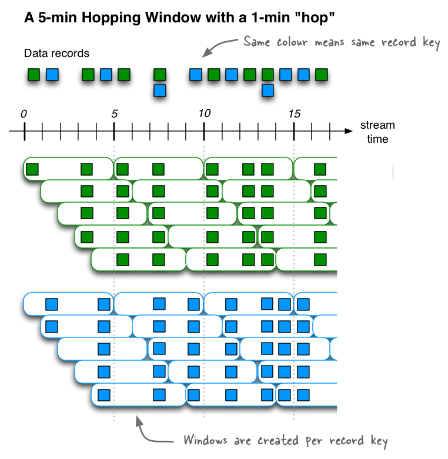
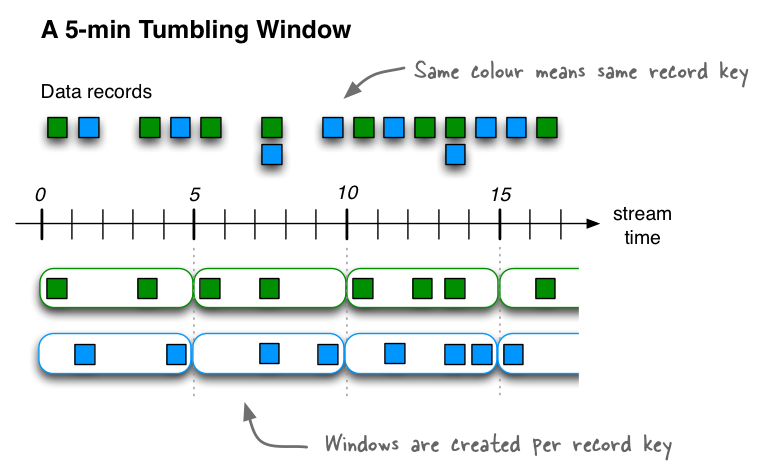

# Streams DSL {#streams-dsl}

The Kafka Streams DSL (Domain Specific Language) is built on top of the
Streams Processor API. It is the recommended for most users, especially
beginners. Most data processing operations can be expressed in just a
few lines of DSL code.

**Table of Contents**

-   [Overview](#overview)
-   [Creating source streams from Kafka](#creating-source-streams-from-kafka)
-   [Transform a stream](#transform-a-stream)
    -   [Stateless transformations](#stateless-transformations)
    -   [Stateful transformations](#stateful-transformations)
        -   [Aggregating](#aggregating)
        -   [Joining](#joining)
            -   [Join co-partitioning requirements](#join-co-partitioning-requirements)
            -   [KStream-KStream Join](#kstream-kstream-join)
            -   [KTable-KTable Equi-Join](#ktable-ktable-equi-join)
            -   [KTable-KTable Foreign-Key Join](#ktable-ktable-fk-join)
            -   [KStream-KTable Join](#kstream-ktable-join)
            -   [KStream-GlobalKTable Join](#kstream-globalktable-join)
        -   [Windowing](#windowing)
            -   [Hopping time windows](#hopping-time-windows)
            -   [Tumbling time windows](#tumbling-time-windows)
            -   [Sliding time windows](#sliding-time-windows)
            -   [Session Windows](#session-windows)
            -   [Window Final Results](#window-final-results)
    -   [Applying processors and transformers (Processor API integration)](#applying-processors-and-transformers-processor-api-integration)
-   [Naming Operators in a Streams DSL application](#naming-a-streams-app)
-   [Controlling KTable update rate](#controlling-emit-rate)
-   [Writing streams back to Kafka](#writing-streams-back-to-kafka)
-   [Testing a Streams application](#testing-a-streams-app)
-   [Kafka Streams DSL for Scala](#scala-dsl)
-   -   [Sample Usage](#scala-dsl-sample-usage)
    -   [Implicit Serdes](#scala-dsl-implicit-serdes)
    -   [User-Defined Serdes](#scala-dsl-user-defined-serdes)

## Overview {#overview}

In comparison to the [Processor API](../processor-api#streams-developer-guide-processor-api), 
only the DSL supports:

-   Built-in abstractions for [streams and tables](../../core-concepts#streams_concepts_duality) in the form of [KStream](#streams_concepts_kstream),
    [KTable](#streams_concepts_ktable), and [GlobalKTable](#streams_concepts_globalktable).
    Having first-class support for streams and tables is crucial
    because, in practice, most use cases require not just either streams
    or databases/tables, but a combination of both. For example, if your
    use case is to create a customer 360-degree view that is updated in
    real-time, what your application will be doing is transforming many
    input *streams* of customer-related events into an output *table*
    that contains a continuously updated 360-degree view of your
    customers.
-   Declarative, functional programming style with [stateless transformations](#streams-developer-guide-dsl-transformations-stateless) 
    (e.g. `map` and `filter`) as well as [stateful transformations](#streams-developer-guide-dsl-transformations-stateful) 
    such as [aggregations](#streams-developer-guide-dsl-aggregating) (e.g. `count` and
    `reduce`), [joins](#streams-developer-guide-dsl-joins)
    (e.g. `leftJoin`), and [windowing](#streams-developer-guide-dsl-windowing) (e.g. [session windows](#windowing-session)).

With the DSL, you can define [processor topologies](../../core-concepts#streams_topology)
(i.e., the logical processing plan) in your application. The steps to
accomplish this are:

1.  Specify [one or more input streams that are read from Kafka topics](#streams-developer-guide-dsl-sources).
2.  Compose [transformations](#streams-developer-guide-dsl-transformations) on these streams.
3.  Write the [resulting output streams back to Kafka topics](#streams-developer-guide-dsl-destinations), or expose the processing results of your application
    directly to other applications through [interactive queries](../interactive-queries#streams-developer-guide-interactive-queries) (e.g., via a REST API).

After the application is run, the defined processor topologies are
continuously executed (i.e., the processing plan is put into action). A
step-by-step guide for writing a stream processing application using the
DSL is provided below.

For a complete list of available API functionality, see also the
[Streams](//javadoc/org/apache/kafka/streams/package-summary.html)
API docs.

#### KStream {#kstream .anchor-heading}

Only the **Kafka Streams DSL** has the notion of a `KStream`.

A **KStream** is an abstraction of a **record stream**, where each data
record represents a self-contained datum in the unbounded data set.
Using the table analogy, data records in a record stream are always
interpreted as an \"INSERT\" \-- think: adding more entries to an
append-only ledger \-- because no record replaces an existing row with
the same key. Examples are a credit card transaction, a page view event,
or a server log entry.

To illustrate, let\'s imagine the following two data records are being
sent to the stream:

```
("alice", 1) --> ("alice", 3)
```

If your stream processing application were to sum the values per user,
it would return `4` for `alice`. Why? Because the second data record
would not be considered an update of the previous record. Compare this
behavior of KStream to `KTable` below, which would return `3` for
`alice`.

#### KTable {#ktable .anchor-heading}

Only the **Kafka Streams DSL** has the notion of a `KTable`.

A **KTable** is an abstraction of a **changelog stream**, where each
data record represents an update. More precisely, the value in a data
record is interpreted as an \"UPDATE\" of the last value for the same
record key, if any (if a corresponding key doesn\'t exist yet, the
update will be considered an INSERT). Using the table analogy, a data
record in a changelog stream is interpreted as an UPSERT aka
INSERT/UPDATE because any existing row with the same key is overwritten.
Also, `null` values are interpreted in a special way: a record with a
`null` value represents a \"DELETE\" or tombstone for the record\'s key.

To illustrate, let\'s imagine the following two data records are being
sent to the stream:

```
("alice", 1) --> ("alice", 3)
```

If your stream processing application were to sum the values per user,
it would return `3` for `alice`. Why? Because the second data record
would be considered an update of the previous record.

**Effects of Kafka\'s log compaction:** Another way of thinking about
KStream and KTable is as follows: If you were to store a KTable into a
Kafka topic, you\'d probably want to enable Kafka\'s [log
compaction](../../../design#compaction)
feature, e.g. to save storage space.

However, it would not be safe to enable log compaction in the case of a
KStream because, as soon as log compaction would begin purging older
data records of the same key, it would break the semantics of the data.
To pick up the illustration example again, you\'d suddenly get a `3` for
`alice` instead of a `4` because log compaction would have removed the
`("alice", 1)` data record. Hence log compaction is perfectly safe for a
KTable (changelog stream) but it is a mistake for a KStream (record
stream).

We have already seen an example of a changelog stream in the section
[streams and tables](../../core-concepts#streams_concepts_duality). 
Another example are change data capture (CDC) records in the
changelog of a relational database, representing which row in a database
table was inserted, updated, or deleted.

KTable also provides an ability to look up *current* values of data
records by keys. This table-lookup functionality is available through
**join operations** (see also **Joining** in the Developer Guide) as
well as through **Interactive Queries**.

#### GlobalKTable {#globalktable .anchor-heading}

Only the **Kafka Streams DSL** has the notion of a **GlobalKTable**.

Like a **KTable**, a **GlobalKTable** is an abstraction of a **changelog
stream**, where each data record represents an update.

A GlobalKTable differs from a KTable in the data that they are being
populated with, i.e. which data from the underlying Kafka topic is being
read into the respective table. Slightly simplified, imagine you have an
input topic with 5 partitions. In your application, you want to read
this topic into a table. Also, you want to run your application across 5
application instances for **maximum parallelism**.

-   If you read the input topic into a **KTable**, then the \"local\"
    KTable instance of each application instance will be populated with
    data **from only 1 partition** of the topic\'s 5 partitions.
-   If you read the input topic into a **GlobalKTable**, then the local
    GlobalKTable instance of each application instance will be populated
    with data **from all partitions of the topic**.

GlobalKTable provides the ability to look up *current* values of data
records by keys. This table-lookup functionality is available through
`join operations`. Note that a GlobalKTable has
**no** notion of time in contrast to a KTable.

Benefits of global tables:

-   More convenient and/or efficient **joins**: Notably, global tables
    allow you to perform star joins, they support \"foreign-key\"
    lookups (i.e., you can lookup data in the table not just by record
    key, but also by data in the record values), and they are more
    efficient when chaining multiple joins. Also, when joining against a
    global table, the input data does not need to be **co-partitioned**.
-   Can be used to \"broadcast\" information to all the running
    instances of your application.

Downsides of global tables:

-   Increased local storage consumption compared to the (partitioned)
    KTable because the entire topic is tracked.
-   Increased network and Kafka broker load compared to the
    (partitioned) KTable because the entire topic is read.

## Creating source streams from Kafka {#creating-source-streams-from-kafka}

You can easily read data from Kafka topics into your application. The
following operations are supported.



## Transform a stream {#transform-a-stream}

The KStream and KTable interfaces support a variety of transformation
operations. Each of these operations can be translated into one or more
connected processors into the underlying processor topology. Since
KStream and KTable are strongly typed, all of these transformation
operations are defined as generic functions where users could specify
the input and output data types.

Some KStream transformations may generate one or more KStream objects,
for example: - `filter` and `map` on a KStream will generate another KStream -
`split` on KStream can generate multiple
KStreams

Some others may generate a KTable object, for example an aggregation of
a KStream also yields a KTable. This allows Kafka Streams to
continuously update the computed value upon arrivals of [out-of-order
records](../../core-concepts#streams_concepts_aggregations) 
after it has already been produced to the downstream
transformation operators.

All KTable transformation operations can only generate another KTable.
However, the Kafka Streams DSL does provide a special function that
converts a KTable representation into a KStream. All of these
transformation methods can be chained together to compose a complex
processor topology.

These transformation operations are described in the following
subsections:

-   [Stateless transformations](#streams-developer-guide-dsl-transformations-stateless)
-   [Stateful transformations](#streams-developer-guide-dsl-transformations-stateful)

### Stateless transformations {#stateless-transformations}

Stateless transformations do not require state for processing and they
do not require a state store associated with the stream processor. Kafka
0.11.0 and later allows you to materialize the result from a stateless
`KTable` transformation. This allows the
result to be queried through [interactive queries](../interactive-queries#streams-developer-guide-interactive-queries). To materialize a `KTable`, each
of the below stateless operations [can be augmented](../interactive-queries#streams-developer-guide-interactive-queries-local-key-value-stores) with an optional `queryableStoreName` argument.



### Stateful transformations {#stateful-transformations}

Stateful transformations depend on state for processing inputs and
producing outputs and require a [state store](../../architecture#streams_architecture_state) associated with the stream processor. For example, in
aggregating operations, a windowing state store is used to collect the
latest aggregation results per window. In join operations, a windowing
state store is used to collect all of the records received so far within
the defined window boundary.

**Note:** Following store types are used regardless of the possibly
specified type (via the parameter `materialized`):

-   non-windowed aggregations and non-windowed KTables use
    [TimestampedKeyValueStore](//javadoc/org/apache/kafka/streams/state/TimestampedKeyValueStore.html){.reference
    .external}s
-   time-windowed aggregations and KStream-KStream joins use
    [TimestampedWindowStore](//javadoc/org/apache/kafka/streams/state/TimestampedWindowStore.html){.reference
    .external}s
-   session windowed aggregations use
    [SessionStore](//javadoc/org/apache/kafka/streams/state/SessionStore.html){.reference
    .external}s (there is no timestamped session store as of now)

Note, that state stores are fault-tolerant. In case of failure, Kafka
Streams guarantees to fully restore all state stores prior to resuming
the processing. See [Fault Tolerance](../../architecture#streams_architecture_recovery) for further information.

Available stateful transformations in the DSL include:

-   [Aggregating](#streams-developer-guide-dsl-aggregating)
-   [Joining](#streams-developer-guide-dsl-joins)
-   [Windowing](#streams-developer-guide-dsl-windowing) (as part of aggregations and joins)
-   [Applying custom processors and transformers](#streams-developer-guide-dsl-process), which may be stateful, for Processor API integration

The following diagram shows their relationships:


Here is an example of a stateful application: the WordCount algorithm.

WordCount example in Java 8+, using lambda expressions:

```java line-numbers
// Assume the record values represent lines of text.  For the sake of this example, you can ignore
// whatever may be stored in the record keys.
KStream<String, String> textLines = ...;

KStream<String, Long> wordCounts = textLines
    // Split each text line, by whitespace, into words.  The text lines are the record
    // values, i.e. you can ignore whatever data is in the record keys and thus invoke
    // `flatMapValues` instead of the more generic `flatMap`.
    .flatMapValues(value -> Arrays.asList(value.toLowerCase().split("\\W+")))
    // Group the stream by word to ensure the key of the record is the word.
    .groupBy((key, word) -> word)
    // Count the occurrences of each word (record key).
    //
    // This will change the stream type from `KGroupedStream<String, String>` to
    // `KTable<String, Long>` (word -> count).
    .count()
    // Convert the `KTable<String, Long>` into a `KStream<String, Long>`.
    .toStream();
```

WordCount example in Java 7:

```java line-numbers
// Code below is equivalent to the previous Java 8+ example above.
KStream<String, String> textLines = ...;

KStream<String, Long> wordCounts = textLines
    .flatMapValues(new ValueMapper<String, Iterable<String>>() {
        @Override
        public Iterable<String> apply(String value) {
            return Arrays.asList(value.toLowerCase().split("\\W+"));
        }
    })
    .groupBy(new KeyValueMapper<String, String, String>>() {
        @Override
        public String apply(String key, String word) {
            return word;
        }
    })
    .count()
    .toStream();
```

#### Aggregating {#aggregating}

After records are [grouped](#streams-developer-guide-dsl-transformations-stateless) by key via `groupByKey` or
`groupBy` -- and thus represented as either a `KGroupedStream` or a
`KGroupedTable`, they can be aggregated via an operation such as `reduce`. Aggregations
are key-based operations, which means that they always operate over
records (notably record values) of the same key. You can perform
aggregations on [windowed](#streams-developer-guide-dsl-windowing)
or non-windowed data.



**Example of semantics for stream aggregations:** A
`KGroupedStream` → `KTable` example is shown below. The streams and the table are
initially empty. Bold font is used in the column for "KTable
`aggregated`" to highlight changed state. An
entry such as `(hello, 1)` denotes a record with key
`hello` and value `1`. To improve the readability of the semantics table you
can assume that all records are processed in timestamp order.

```java line-numbers
// Key: word, value: count
KStream<String, Integer> wordCounts = ...;

KGroupedStream<String, Integer> groupedStream = wordCounts
    .groupByKey(Grouped.with(Serdes.String(), Serdes.Integer()));

KTable<String, Integer> aggregated = groupedStream.aggregate(
    () -> 0, /* initializer */
    (aggKey, newValue, aggValue) -> aggValue + newValue, /* adder */
    Materialized.<String, Long, KeyValueStore<Bytes, byte[]>as("aggregated-stream-store" /* state store name */)
      .withKeySerde(Serdes.String()) /* key serde */
      .withValueSerde(Serdes.Integer()); /* serde for aggregate value */
```

**Note**

**Impact of record caches**: For illustration purposes, the column
"KTable `aggregated`" below shows the
table's state changes over time in a very granular way. In practice, you
would observe state changes in such a granular way only when 
[record caches](../../memory-mgmt#streams-developer-guide-memory-management-record-cache) are disabled (default: enabled). When record caches are
enabled, what might happen for example is that the output results of the
rows with timestamps 4 and 5 would be 
[compacted](../../memory-mgmt#streams-developer-guide-memory-management-record-cache), and there would only be a single state update for the key
`kafka` in the KTable (here: from
`(kafka 1)` directly to
`(kafka, 3)`. Typically, you should only
disable record caches for testing or debugging purposes -- under normal
circumstances it is better to leave record caches enabled.



**Example of semantics for table aggregations:** A
`KGroupedTable` → `KTable` example is shown below. The tables are initially empty.
Bold font is used in the column for "KTable `aggregated`" to highlight changed state. An entry such as
`(hello, 1)` denotes a record with key
`hello` and value `1`. To improve the readability of the semantics table you
can assume that all records are processed in timestamp order.

```java line-numbers
// Key: username, value: user region (abbreviated to "E" for "Europe", "A" for "Asia")
KTable<String, String> userProfiles = ...;

// Re-group `userProfiles`.  Don't read too much into what the grouping does:
// its prime purpose in this example is to show the *effects* of the grouping
// in the subsequent aggregation.
KGroupedTable<String, Integer> groupedTable = userProfiles
    .groupBy((user, region) -> KeyValue.pair(region, user.length()), Serdes.String(), Serdes.Integer());

KTable<String, Integer> aggregated = groupedTable.aggregate(
    () -> 0, /* initializer */
    (aggKey, newValue, aggValue) -> aggValue + newValue, /* adder */
    (aggKey, oldValue, aggValue) -> aggValue - oldValue, /* subtractor */
    Materialized.<String, Long, KeyValueStore<Bytes, byte[]>as("aggregated-table-store" /* state store name */)
      .withKeySerde(Serdes.String()) /* key serde */
      .withValueSerde(Serdes.Integer()); /* serde for aggregate value */
```

**Note**

**Impact of record caches**: For illustration purposes, the column
"KTable `aggregated`" below shows the
table's state changes over time in a very granular way. In practice, you
would observe state changes in such a granular way only when [record
caches](../../memory-mgmt#streams-developer-guide-memory-management-record-cache) are disabled (default: enabled). When record caches are
enabled, what might happen for example is that the output results of the
rows with timestamps 4 and 5 would be [compacted](../../memory-mgmt#streams-developer-guide-memory-management-record-cache), and there would only be a single state update for the key
`kafka` in the KTable (here: from
`(kafka, 1)` directly to
`(kafka, 3)`. Typically, you should only
disable record caches for testing or debugging purposes -- under normal
circumstances it is better to leave record caches enabled.



#### Joining {#joining}

Streams and tables can also be joined. Many stream processing
applications in practice are coded as streaming joins. For example,
applications backing an online shop might need to access multiple,
updating database tables (e.g. sales prices, inventory, customer
information) in order to enrich a new data record (e.g. customer
transaction) with context information. That is, scenarios where you need
to perform table lookups at very large scale and with a low processing
latency. Here, a popular pattern is to make the information in the
databases available in Kafka through so-called *change data capture* in
combination with [Kafka's Connect API](../../#connect), and then implementing
applications that leverage the Streams API to perform very fast and
efficient local joins of such tables and streams, rather than requiring
the application to make a query to a remote database over the network
for each record. In this example, the KTable concept in Kafka Streams
would enable you to track the latest state (e.g., snapshot) of each
table in a local state store, thus greatly reducing the processing
latency as well as reducing the load of the remote databases when doing
such streaming joins.

The following join operations are supported, see also the diagram in the
[overview section](#streams-developer-guide-dsl-transformations-stateful-overview) of 
[Stateful Transformations](#streams-developer-guide-dsl-transformations-stateful). 
Depending on the operands, joins are either [windowed](#streams-developer-guide-dsl-windowing)
joins or non-windowed joins.

| Join operands                      | Type          | (INNER) JOIN   | LEFT JOIN     |  OUTER JOIN
|------------------------------------|---------------|----------------|---------------|---------------
| KStream-to-KStream                 | Windowed      | Supported      | Supported     |  Supported
| KTable-to-KTable                   | Non-windowed  | Supported      | Supported     |  Supported
| KTable-to-KTable Foreign-Key Join  | Non-windowed  | Supported      | Supported     |  Not Supported
| KStream-to-KTable                  | Non-windowed  | Supported      | Supported     |  Not Supported
| KStream-to-GlobalKTable            | Non-windowed  | Supported      | Supported     |  Not Supported
| KTable-to-GlobalKTable             | N/A           | Not Supported  | Not Supported |  Not Supported

Each case is explained in more detail in the subsequent sections.

##### Join co-partitioning requirements {#join-co-partitioning-requirements}

For equi-joins, input data must be co-partitioned when joining. This
ensures that input records with the same key from both sides of the
join, are delivered to the same stream task during processing. **It is
your responsibility to ensure data co-partitioning when joining**.
Co-partitioning is not required when performing 
[KTable-KTable Foreign-Key joins](#streams-developer-guide-dsl-joins-ktable-ktable-fk-join) and 
[Global KTable joins](#streams_concepts_globalktable).

The requirements for data co-partitioning are:

-   The input topics of the join (left side and right side) must have
    the **same number of partitions**.
-   All applications that *write* to the input topics must have the
    **same partitioning strategy** so that records with the same key are
    delivered to same partition number. In other words, the keyspace of
    the input data must be distributed across partitions in the same
    manner. This means that, for example, applications that use Kafka's
    [Java Producer API](../../../api#producerapi) must use the same partitioner (cf. the producer setting
    `"partitioner.class"` aka
    `ProducerConfig.PARTITIONER_CLASS_CONFIG`), and applications that use the Kafka's Streams API
    must use the same `StreamPartitioner`
    for operations such as `KStream#to()`.
    The good news is that, if you happen to use the default
    partitioner-related settings across all applications, you do not
    need to worry about the partitioning strategy.

Why is data co-partitioning required? Because [KStream-KStream](#streams-developer-guide-dsl-joins-kstream-kstream), [KTable-KTable](#streams-developer-guide-dsl-joins-ktable-ktable), and [KStream-KTable](#streams-developer-guide-dsl-joins-kstream-ktable) joins are performed based on the keys of records (e.g.,
`leftRecord.key == rightRecord.key`), it is required
that the input streams/tables of a join are co-partitioned by key.

There are two exceptions where co-partitioning is not required. For
[KStream-GlobalKTable joins](#streams-developer-guide-dsl-joins-kstream-globalktable) joins, co-partitioning is not required because *all*
partitions of the `GlobalKTable`'s
underlying changelog stream are made available to each
`KafkaStreams` instance. That is, each
instance has a full copy of the changelog stream. Further, a
`KeyValueMapper` allows for non-key based
joins from the `KStream` to the
`GlobalKTable`. [KTable-KTable Foreign-Key
joins](#streams-developer-guide-dsl-joins-ktable-ktable-fk-join) also do not require co-partitioning. Kafka Streams internally
ensures co-partitioning for Foreign-Key joins.

**Note**

**Kafka Streams partly verifies the co-partitioning requirement:**
During the partition assignment step, i.e. at runtime, Kafka Streams
verifies whether the number of partitions for both sides of a join are
the same. If they are not, a `TopologyBuilderException` (runtime exception) is being thrown. Note that Kafka
Streams cannot verify whether the partitioning strategy matches between
the input streams/tables of a join -- it is up to the user to ensure
that this is the case.

**Ensuring data co-partitioning:** If the inputs of a join are not
co-partitioned yet, you must ensure this manually. You may follow a
procedure such as outlined below. It is recommended to repartition the
topic with fewer partitions to match the larger partition number of
avoid bottlenecks. Technically it would also be possible to repartition
the topic with more partitions to the smaller partition number. For
stream-table joins, it\'s recommended to repartition the KStream because
repartitioning a KTable might result in a second state store. For
table-table joins, you might also consider to size of the KTables and
repartition the smaller KTable.

1.  Identify the input KStream/KTable in the join whose underlying Kafka
    topic has the smaller number of partitions. Let's call this
    stream/table "SMALLER", and the other side of the join "LARGER". To
    learn about the number of partitions of a Kafka topic you can use,
    for example, the CLI tool `bin/kafka-topics` with the `--describe`
    option.

2.  Within your application, re-partition the data of "SMALLER". You
    must ensure that, when repartitioning the data with
    `repartition`, the same partitioner is
    used as for "LARGER".

    -   If "SMALLER" is a KStream:
        `KStream#repartition(Repartitioned.numberOfPartitions(...))`.
    -   If "SMALLER" is a KTable:
        `KTable#toStream#repartition(Repartitioned.numberOfPartitions(...).toTable())`.

3.  Within your application, perform the join between "LARGER" and the
    new stream/table.

##### KStream-KStream Join {#kstream-kstream-join}

KStream-KStream joins are always [windowed](#windowing-sliding) joins, because
otherwise the size of the internal state store used to perform the join
-- e.g., a [sliding window](#windowing-sliding) or "buffer" --
would grow indefinitely. For stream-stream joins it's important to
highlight that a new input record on one side will produce a join output
*for each* matching record on the other side, and there can be
*multiple* such matching records in a given join window (cf. the row
with timestamp 15 in the join semantics table below, for example).

Join output records are effectively created as follows, leveraging the
user-supplied `ValueJoiner`:

```java line-numbers
KeyValue<K, LV> leftRecord = ...;
KeyValue<K, RV> rightRecord = ...;
ValueJoiner<LV, RV, JV> joiner = ...;

KeyValue<K, JV> joinOutputRecord = KeyValue.pair(
    leftRecord.key, /* by definition, leftRecord.key == rightRecord.key */
    joiner.apply(leftRecord.value, rightRecord.value)
  );
```



**Semantics of stream-stream joins:** The semantics of the various
stream-stream join variants are explained below. To improve the
readability of the table, assume that (1) all records have the same key
(and thus the key in the table is omitted), and (2) all records are
processed in timestamp order. We assume a join window size of 10 seconds
with a grace period of 5 seconds.

**Note:** If you use the old and now deprecated API to specify the grace
period, i.e., `JoinWindows.of(...).grace(...)`, left/outer join results are emitted eagerly, and the
observed result might differ from the result shown below.

The columns INNER JOIN, LEFT JOIN, and OUTER JOIN denote what is passed
as arguments to the user-supplied
[ValueJoiner](//javadoc/org/apache/kafka/streams/kstream/ValueJoiner.html) for the `join`,
`leftJoin`, and `outerJoin` methods, respectively, whenever a new input record is
received on either side of the join. An empty table cell denotes that
the `ValueJoiner` is not called at all.

| Timestamp | Left (KStream) | Right (KStream) | (INNER) JOIN                   | LEFT JOIN                      | OUTER JOIN                     |
|-----------|----------------|-----------------|--------------------------------|--------------------------------|--------------------------------|
| 1         | null           |                 |                                |                                |                                |
| 2         |                | null            |                                |                                |                                |
| 3         | A              |                 |                                |                                |                                |
| 4         |                | a               | [A, a]                         | [A, a]                         | [A, a]                         |
| 5         | B              |                 | [B, a]                         | [B, a]                         | [B, a]                         |
| 6         |                | b               | [A, b], [B, b]                 | [A, b], [B, b]                 | [A, b], [B, b]                 |
| 7         | null           |                 |                                |                                |                                |
| 8         |                | null            |                                |                                |                                |
| 9         | C              |                 | [C, a], [C, b]                 | [C, a], [C, b]                 | [C, a], [C, b]                 |
| 10        |                | c               | [A, c], [B, c], [C, c]         | [A, c], [B, c], [C, c]         | [A, c], [B, c], [C, c]         |
| 11        |                | null            |                                |                                |                                |
| 12        | null           |                 |                                |                                |                                |
| 13        |                | null            |                                |                                |                                |
| 14        |                | d               | [A, d], [B, d], [C, d]         | [A, d], [B, d], [C, d]         | [A, d], [B, d], [C, d]         |
| 15        | D              |                 | [D, a], [D, b], [D, c], [D, d] | [D, a], [D, b], [D, c], [D, d] | [D, a], [D, b], [D, c], [D, d] |
|  ...      |                |                 |                                |                                |                                |
| 40        | E              |                 |                                |                                |                                |
|  ...      |                |                 |                                |                                |                                |
| 60        | F              |                 |                                | [E, null]                      | [E, null]                      |
|  ...      |                |                 |                                |                                |                                |
| 80        |                | f               |                                | [F, null]                      | [F, null]                      |
|  ...      |                |                 |                                |                                |                                |
| 100       | G              |                 |                                |                                | [null, f]                      |


##### KTable-KTable Equi-Join {#ktable-ktable-equi-join}

KTable-KTable equi-joins are always *non-windowed* joins. They are
designed to be consistent with their counterparts in relational
databases. The changelog streams of both KTables are materialized into
local state stores to represent the latest snapshot of their [table
duals](#streams_concepts_ktable).
The join result is a new KTable that represents the changelog stream of
the join operation.

Join output records are effectively created as follows, leveraging the
user-supplied `ValueJoiner`:

```java line-numbers
KeyValue<K, LV> leftRecord = ...;
KeyValue<K, RV> rightRecord = ...;
ValueJoiner<LV, RV, JV> joiner = ...;

KeyValue<K, JV> joinOutputRecord = KeyValue.pair(
    leftRecord.key, /* by definition, leftRecord.key == rightRecord.key */
    joiner.apply(leftRecord.value, rightRecord.value)
  );
```



**Semantics of table-table equi-joins:** The semantics of the various
table-table equi-join variants are explained below. To improve the
readability of the table, you can assume that (1) all records have the
same key (and thus the key in the table is omitted) and that (2) all
records are processed in timestamp order. The columns INNER JOIN, LEFT
JOIN, and OUTER JOIN denote what is passed as arguments to the
user-supplied
[ValueJoiner](//javadoc/org/apache/kafka/streams/kstream/ValueJoiner.html) for the `join`,
`leftJoin`, and `outerJoin` methods, respectively, whenever a new input record is
received on either side of the join. An empty table cell denotes that
the `ValueJoiner` is not called at all.

| Timestamp | Left (KTable) | Right (KTable) | (INNER) JOIN | LEFT JOIN | OUTER JOIN |
|-----------|---------------|----------------|--------------|-----------|------------|
| 1         | null          |                |              |           |            |
| 2         |               | null           |              |           |            |
| 3         | A             |                |              | [A, null] | [A, null]  |
| 4         |               | a              | [A, a]       | [A, a]    | [A, a]     |
| 5         | B             |                | [B, a]       | [B, a]    | [B, a]     |
| 6         |               | b              | [B, b]       | [B, b]    | [B, b]     |
| 7         | null          |                | null         | null      | [null, b]  |
| 8         |               | null           |              |           | null       |
| 9         | C             |                |              | [C, null] | [C, null]  |
| 10        |               | c              | [C, c]       | [C, c]    | [C, c]     |
| 11        |               | null           | null         | [C, null] | [C, null]  |
| 12        | null          |                |              | null      | null       |
| 13        |               | null           |              |           |            |
| 14        |               | d              |              |           | [null, d]  |
| 15        | D             |                | [D, d]       | [D, d]    | [D, d]     |

##### KTable-KTable Foreign-Key Join

KTable-KTable foreign-key joins are always *non-windowed* joins.
Foreign-key joins are analogous to joins in SQL. As a rough example:

```
SELECT ... FROM {this KTable} JOIN {other KTable} ON {other.key} = {result of foreignKeyExtractor(this.value)} ... `
```

The output of the operation is a new KTable containing the join result.

The changelog streams of both KTables are materialized into local state
stores to represent the latest snapshot of their [table duals](#streams_concepts_ktable). A
foreign-key extractor function is applied to the left record, with a new
intermediate record created and is used to lookup and join with the
corresponding primary key on the right hand side table. The result is a
new KTable that represents the changelog stream of the join operation.

The left KTable can have multiple records which map to the same key on
the right KTable. An update to a single left KTable entry may result in
a single output event, provided the corresponding key exists in the
right KTable. Consequently, a single update to a right KTable entry will
result in an update for each record in the left KTable that has the same
foreign key.\



**Semantics of table-table foreign-key joins:** The semantics of the
table-table foreign-key INNER and LEFT JOIN variants are demonstrated
below. The key is shown alongside the value for each record. Records are
processed in incrementing offset order. The columns INNER JOIN and LEFT
JOIN denote what is passed as arguments to the user-supplied
[ValueJoiner](//javadoc/org/apache/kafka/streams/kstream/ValueJoiner.html) for the `join` and
`leftJoin` methods, respectively, whenever a
new input record is received on either side of the join. An empty table
cell denotes that the `ValueJoiner` is not
called at all. For the purpose of this example,
`Function foreignKeyExtractor` simply uses
the left-value as the output.


| Record Offset | Left KTable (K, extracted-FK) | Right KTable (FK, VR) | (INNER) JOIN | LEFT JOIN
|--------|---------------|----------|----------------------|----------------------
| 1      | (k,1)         |  (1,foo) | (k,1,foo)            | (k,1,foo)
| 2      | (k,2)         |          | (k,null)             | (k,2,null)
| 3      | (k,3)         |          | (k,null)             | (k,3,null)
| 4      |               | (3,bar)  | (k,3,bar)            | (k,3,bar)
| 5      | (k,null)      |          | (k,null)             | (k,null,null)
| 6      | (k,1)         |          | (k,1,foo)            | (k,1,foo)
| 7      | (q,10)        |          |                      | (q,10,null)
| 8      | (r,10)        |          |                      | (r,10,null)
| 9      |               | (10,baz) | (q,10,baz),(r,10,baz)| (q,10,baz), (r,10,baz)

##### KStream-KTable Join {#kstream-ktable-join}

KStream-KTable joins are always *non-windowed* joins. They allow you to
perform *table lookups* against a KTable (changelog stream) upon
receiving a new record from the KStream (record stream). An example use
case would be to enrich a stream of user activities (KStream) with the
latest user profile information (KTable).

Join output records are effectively created as follows, leveraging the
user-supplied `ValueJoiner`:

```java line-numbers
KeyValue<K, LV> leftRecord = ...;
KeyValue<K, RV> rightRecord = ...;
ValueJoiner<LV, RV, JV> joiner = ...;

KeyValue<K, JV> joinOutputRecord = KeyValue.pair(
    leftRecord.key, /* by definition, leftRecord.key == rightRecord.key */
    joiner.apply(leftRecord.value, rightRecord.value)
  );
```



**Semantics of stream-table joins:** The semantics of the various
stream-table join variants are explained below. To improve the
readability of the table we assume that (1) all records have the same
key (and thus we omit the key in the table) and that (2) all records are
processed in timestamp order. The columns INNER JOIN and LEFT JOIN
denote what is passed as arguments to the user-supplied
[ValueJoiner](//javadoc/org/apache/kafka/streams/kstream/ValueJoiner.html) for the `join` and
`leftJoin` methods, respectively, whenever a
new input record is received on either side of the join. An empty table
cell denotes that the `ValueJoiner` is not
called at all.

|  Timestamp | Left (KStream) | Right (KTable) | (INNER) JOIN | LEFT JOIN
|------------|----------------|----------------|--------------|-------------
|  1         | null           |                |              |  
|  2         |                | null           |              |  
|  3         | A              |                |              | \[A, null\]
|  4         |                | a              |              |  
|  5         | B              |                | \[B, a\]     | \[B, a\]
|  6         |                | b              |              |  
|  7         | null           |                |              |  
|  8         |                | null           |              |  
|  9         | C              |                |              | \[C, null\]
|  10        |                | c              |              |  
|  11        |                | null           |              |  
|  12        | null           |                |              |  
|  13        |                | null           |              |  
|  14        |                | d              |              |  
|  15        | D              |                | \[D, d\]     | \[D, d\]

##### KStream-GlobalKTable Join {#kstream-globalktable-join}

KStream-GlobalKTable joins are always *non-windowed* joins. They allow
you to perform *table lookups* against a [GlobalKTable](#streams_concepts_globalktable) (entire
changelog stream) upon receiving a new record from the KStream (record
stream). An example use case would be "star queries" or "star joins",
where you would enrich a stream of user activities (KStream) with the
latest user profile information (GlobalKTable) and further context
information (further GlobalKTables). However, because GlobalKTables have
no notion of time, a KStream-GlobalKTable join is not a temporal join,
and there is no event-time synchronization between updates to a
GlobalKTable and processing of KStream records.

At a high-level, KStream-GlobalKTable joins are very similar to
[KStream-KTable joins](#streams-developer-guide-dsl-joins-kstream-ktable). However, global tables provide you with much more
flexibility at [some expense](#streams_concepts_globalktable) when
compared to partitioned tables:

-   They do not require [data co-partitioning](#streams-developer-guide-dsl-joins-co-partitioning).
-   They allow for efficient "star joins"; i.e., joining a large-scale
    "facts" stream against "dimension" tables
-   They allow for joining against foreign keys; i.e., you can lookup
    data in the table not just by the keys of records in the stream, but
    also by data in the record values.
-   They make many use cases feasible where you must work on heavily
    skewed data and thus suffer from hot partitions.
-   They are often more efficient than their partitioned KTable
    counterpart when you need to perform multiple joins in succession.

Join output records are effectively created as follows, leveraging the
user-supplied `ValueJoiner`:

```java line-numbers
KeyValue<K, LV> leftRecord = ...;
KeyValue<K, RV> rightRecord = ...;
ValueJoiner<LV, RV, JV> joiner = ...;

KeyValue<K, JV> joinOutputRecord = KeyValue.pair(
    leftRecord.key, /* by definition, leftRecord.key == rightRecord.key */
    joiner.apply(leftRecord.value, rightRecord.value)
  );
```



**Semantics of stream-global-table joins:** The join semantics are
different to [KStream-KTable joins](#streams-developer-guide-dsl-joins-kstream-ktable) because it\'s not a temporal join. Another difference is
that, for KStream-GlobalKTable joins, the left input record is first
"mapped" with a user-supplied `KeyValueMapper` into the table's keyspace prior to the table lookup.

#### Windowing {#windowing}

Windowing lets you control how to group records that have the same key
for stateful operations such as [aggregations](#streams-developer-guide-dsl-aggregating) or [joins](#streams-developer-guide-dsl-joins)
into so-called windows. Windows are tracked per record key.

**Note**

A related operation is [grouping](#streams-developer-guide-dsl-transformations-stateless), which groups all records that have the same key to ensure
that data is properly partitioned ("keyed") for subsequent operations.
Once grouped, windowing allows you to further sub-group the records of a
key.

For example, in join operations, a windowing state store is used to
store all the records received so far within the defined window
boundary. In aggregating operations, a windowing state store is used to
store the latest aggregation results per window. Old records in the
state store are purged after the specified 
[window retention period](../../core-concepts#streams_concepts_windowing). 
Kafka Streams guarantees to keep a window for at least this
specified time; the default value is one day and can be changed via
`Materialized#withRetention()`.

The DSL supports the following types of windows:

| Window name              |  Behavior      |  Short description
|--------------------------|----------------|---------------------------------------
| Hopping time window      |  Time-based    |  Fixed-size, overlapping windows
| Tumbling time window     |  Time-based    |  Fixed-size, non-overlapping, gap-less windows
| Sliding time window      |  Time-based    |  Fixed-size, overlapping windows that work on differences between record timestamps
| Session window           |  Session-based |  Dynamically-sized, non-overlapping, data-driven windows

##### Hopping time windows {#hopping-time-windows}

Hopping time windows are windows based on time intervals. They model
fixed-sized, (possibly) overlapping windows. A hopping window is defined
by two properties: the window's *size* and its *advance interval* (aka
"hop"). The advance interval specifies by how much a window moves
forward relative to the previous one. For example, you can configure a
hopping window with a size 5 minutes and an advance interval of 1
minute. Since hopping windows can overlap -- and in general they do -- a
data record may belong to more than one such windows.

**Note**

**Hopping windows vs. sliding windows:** Hopping windows are sometimes
called "sliding windows" in other stream processing tools. Kafka Streams
follows the terminology in academic literature, where the semantics of
sliding windows are different to those of hopping windows.

The following code defines a hopping window with a size of 5 minutes and
an advance interval of 1 minute:

```java line-numbers
import java.time.Duration;
import org.apache.kafka.streams.kstream.TimeWindows;

// A hopping time window with a size of 5 minutes and an advance interval of 1 minute.
// The window's name -- the string parameter -- is used to e.g. name the backing state store.
Duration windowSize = Duration.ofMinutes(5);
Duration advance = Duration.ofMinutes(1);
TimeWindows.ofSizeWithNoGrace(windowSize).advanceBy(advance);
```

{.centered}

> This diagram shows windowing a stream of data records with hopping
windows. In this diagram the time numbers represent minutes; e.g. t=5
means "at the five-minute mark". In reality, the unit of time in Kafka
Streams is milliseconds, which means the time numbers would need to be
multiplied with 60 \* 1,000 to convert from minutes to milliseconds
(e.g. t=5 would become t=300,000).

Hopping time windows are *aligned to the epoch*, with the lower interval
bound being inclusive and the upper bound being exclusive. "Aligned to
the epoch" means that the first window starts at timestamp zero. For
example, hopping windows with a size of 5000ms and an advance interval
("hop") of 3000ms have predictable window boundaries
`[0;5000),[3000;8000),...` --- and **not**
`[1000;6000),[4000;9000),...` or even
something "random" like `[1452;6452),[4452;9452),...`.

Unlike non-windowed aggregates that we have seen previously, windowed
aggregates return a *windowed KTable* whose keys type is
`Windowed<K>`. This is to differentiate
aggregate values with the same key from different windows. The
corresponding window instance and the embedded key can be retrieved as
`Windowed#window()` and
`Windowed#key()`, respectively.

##### Tumbling time windows {#tumbling-time-windows}

Tumbling time windows are a special case of hopping time windows and,
like the latter, are windows based on time intervals. They model
fixed-size, non-overlapping, gap-less windows. A tumbling window is
defined by a single property: the window's *size*. A tumbling window is
a hopping window whose window size is equal to its advance interval.
Since tumbling windows never overlap, a data record will belong to one
and only one window.



> This diagram shows windowing a stream of data records with tumbling
windows. Windows do not overlap because, by definition, the advance
interval is identical to the window size. In this diagram the time
numbers represent minutes; e.g. t=5 means "at the five-minute mark". In
reality, the unit of time in Kafka Streams is milliseconds, which means
the time numbers would need to be multiplied with 60 \* 1,000 to convert
from minutes to milliseconds (e.g. t=5 would become
t=300,000).

Tumbling time windows are *aligned to the epoch*, with the lower
interval bound being inclusive and the upper bound being exclusive.
"Aligned to the epoch" means that the first window starts at timestamp
zero. For example, tumbling windows with a size of 5000ms have
predictable window boundaries `[0;5000),[5000;10000),...` --- and **not**
`[1000;6000),[6000;11000),...` or even
something "random" like `[1452;6452),[6452;11452),...`.

The following code defines a tumbling window with a size of 5 minutes:

```java line-numbers
import java.time.Duration;
import org.apache.kafka.streams.kstream.TimeWindows;

// A tumbling time window with a size of 5 minutes (and, by definition, an implicit
// advance interval of 5 minutes), and grace period of 1 minute.
Duration windowSize = Duration.ofMinutes(5);
Duration gracePeriod = Duration.ofMinutes(1);
TimeWindows.ofSizeAndGrace(windowSize, gracePeriod);

// The above is equivalent to the following code:
TimeWindows.ofSizeAndGrace(windowSize, gracePeriod).advanceBy(windowSize);
```

##### Sliding time windows {#sliding-time-windows}

Sliding windows are actually quite different from hopping and tumbling
windows. In Kafka Streams, sliding windows are used for 
[join operations](#streams-developer-guide-dsl-joins),
specified by using the `JoinWindows` class,
and windowed aggregations, specified by using the
`SlidingWindows` class.

A sliding window models a fixed-size window that slides continuously
over the time axis. In this model, two data records are said to be
included in the same window if (in the case of symmetric windows) the
difference of their timestamps is within the window size. As a sliding
window moves along the time axis, records may fall into multiple
snapshots of the sliding window, but each unique combination of records
appears only in one sliding window snapshot.

The following code defines a sliding window with a time difference of 10
minutes and a grace period of 30 minutes:

```java line-numbers
import org.apache.kafka.streams.kstream.SlidingWindows;

// A sliding time window with a time difference of 10 minutes and grace period of 30 minutes
Duration timeDifference = Duration.ofMinutes(10);
Duration gracePeriod = Duration.ofMinutes(30);
SlidingWindows.ofTimeDifferenceAndGrace(timeDifference, gracePeriod);
```


> This diagram shows windowing a stream of data records with sliding
windows. The overlap of the sliding window snapshots varies depending on
the record times. In this diagram, the time numbers represent
milliseconds. For example, t=5 means "at the five millisecond
mark".

Sliding windows are aligned to the data record timestamps, not to the
epoch. In contrast to hopping and tumbling windows, the lower and upper
window time interval bounds of sliding windows are both inclusive.

##### Session Windows {#session-windows}

Session windows are used to aggregate key-based events into so-called
*sessions*, the process of which is referred to as *sessionization*.
Sessions represent a **period of activity** separated by a defined **gap
of inactivity** (or "idleness"). Any events processed that fall within
the inactivity gap of any existing sessions are merged into the existing
sessions. If an event falls outside of the session gap, then a new
session will be created.

Session windows are different from the other window types in that:

-   all windows are tracked independently across keys -- e.g. windows of
    different keys typically have different start and end times
-   their window sizes sizes vary -- even windows for the same key
    typically have different sizes

The prime area of application for session windows is **user behavior
analysis**. Session-based analyses can range from simple metrics (e.g.
count of user visits on a news website or social platform) to more
complex metrics (e.g. customer conversion funnel and event flows).

The following code defines a session window with an inactivity gap of 5
minutes:

```java line-numbers
import java.time.Duration;
import org.apache.kafka.streams.kstream.SessionWindows;

// A session window with an inactivity gap of 5 minutes.
SessionWindows.ofInactivityGapWithNoGrace(Duration.ofMinutes(5));
```

Given the previous session window example, here's what would happen on
an input stream of six records. When the first three records arrive
(upper part of in the diagram below), we'd have three sessions (see
lower part) after having processed those records: two for the green
record key, with one session starting and ending at the 0-minute mark
(only due to the illustration it looks as if the session goes from 0 to
1), and another starting and ending at the 6-minute mark; and one
session for the blue record key, starting and ending at the 2-minute
mark.


> Detected sessions after having received three input records: two
records for the green record key at t=0 and t=6, and one record for the
blue record key at t=2. In this diagram the time numbers represent
minutes; e.g. t=5 means "at the five-minute mark". In reality, the unit
of time in Kafka Streams is milliseconds, which means the time numbers
would need to be multiplied with 60 \* 1,000 to convert from minutes to
milliseconds (e.g. t=5 would become t=300,000).

If we then receive three additional records (including two out-of-order
records), what would happen is that the two existing sessions for the
green record key will be merged into a single session starting at time 0
and ending at time 6, consisting of a total of three records. The
existing session for the blue record key will be extended to end at time
5, consisting of a total of two records. And, finally, there will be a
new session for the blue key starting and ending at time 11.


> Detected sessions after having received six input records. Note the two
out-of-order data records at t=4 (green) and t=5 (blue), which lead to a
merge of sessions and an extension of a session,
respectively.

##### Window Final Results {#window-final-results}

In Kafka Streams, windowed computations update their results
continuously. As new data arrives for a window, freshly computed results
are emitted downstream. For many applications, this is ideal, since
fresh results are always available. and Kafka Streams is designed to
make programming continuous computations seamless. However, some
applications need to take action **only** on the final result of a
windowed computation. Common examples of this are sending alerts or
delivering results to a system that doesn\'t support updates.

Suppose that you have an hourly windowed count of events per user. If
you want to send an alert when a user has *less than* three events in an
hour, you have a real challange. All users would match this condition at
first, until they accrue enough events, so you cannot simply send an
alert when someone matches the condition; you have to wait until you
know you won\'t see any more events for a particular window and *then*
send the alert.

Kafka Streams offers a clean way to define this logic: after defining
your windowed computation, you can [suppress]{.pre} the intermediate
results, emitting the final count for each user when the window is
**closed**.

For example:

```java line-numbers
KGroupedStream<UserId, Event> grouped = ...;
grouped
    .windowedBy(TimeWindows.ofSizeAndGrace(Duration.ofHours(1), Duration.ofMinutes(10)))
    .count()
    .suppress(Suppressed.untilWindowCloses(unbounded()))
    .filter((windowedUserId, count) -> count < 3)
    .toStream()
    .foreach((windowedUserId, count) -> sendAlert(windowedUserId.window(), windowedUserId.key(), count));
```

The key parts of this program are:

`ofSizeAndGrace(Duration.ofHours(1), Duration.ofMinutes(10))`
:   The specified grace period of 10 minutes (i.e., the
    `Duration.ofMinutes(10)` argument) allows us to bound the lateness
    of events the window will accept. For example, the 09:00 to 10:00
    window will accept out-of-order records until 10:10, at which point,
    the window is **closed**.

`.suppress(Suppressed.untilWindowCloses(...))`
:   This configures the suppression operator to emit nothing for a
    window until it closes, and then emit the final result. For example,
    if user `U` gets 10 events between 09:00 and 10:10, the `filter`
    downstream of the suppression will get no events for the windowed
    key `U@09:00-10:00` until 10:10, and then it will get exactly one
    with the value `10`. This is the final result of the windowed count.

`unbounded()`
:   This configures the buffer used for storing events until their
    windows close. Production code is able to put a cap on the amount of
    memory to use for the buffer, but this simple example creates a
    buffer with no upper bound.

One thing to note is that suppression is just like any other Kafka
Streams operator, so you can build a topology with two branches emerging
from the `count`, one suppressed, and one not, or even multiple
differently configured suppressions. This allows you to apply
suppressions where they are needed and otherwise rely on the default
continuous update behavior.

For more detailed information, see the JavaDoc on the `Suppressed`
config object and
[KIP-328](https://cwiki.apache.org/confluence/x/sQU0BQ "KIP-328").

### Applying processors and transformers (Processor API integration) {#applying-processors-and-transformers-processor-api-integration}

Beyond the aforementioned [stateless](#streams-developer-guide-dsl-transformations-stateless) 
and [stateful](#streams-developer-guide-dsl-transformations-stateless) transformations, you may also leverage the 
[Processor API](../processor-api#streams-developer-guide-processor-api) from the DSL. There are a number of scenarios where this may
be helpful:

-   **Customization:** You need to implement special, customized logic
    that is not or not yet available in the DSL.
-   **Combining ease-of-use with full flexibility where it's needed:**
    Even though you generally prefer to use the expressiveness of the
    DSL, there are certain steps in your processing that require more
    flexibility and tinkering than the DSL provides. For example, only
    the Processor API provides access to a record's metadata such as its
    topic, partition, and offset information. However, you don't want to
    switch completely to the Processor API just because of that.
-   **Migrating from other tools:** You are migrating from other stream
    processing technologies that provide an imperative API, and
    migrating some of your legacy code to the Processor API was faster
    and/or easier than to migrate completely to the DSL right away.



The following example shows how to leverage, via the
`KStream#process()` method, a custom
`Processor` that sends an email notification
whenever a page view count reaches a predefined threshold.

First, we need to implement a custom stream processor,
`PopularPageEmailAlert`, that implements the
`Processor` interface:

```java line-numbers
// A processor that sends an alert message about a popular page to a configurable email address
public class PopularPageEmailAlert implements Processor<PageId, Long, Void, Void> {

  private final String emailAddress;
  private ProcessorContext<Void, Void> context;

  public PopularPageEmailAlert(String emailAddress) {
    this.emailAddress = emailAddress;
  }

  @Override
  public void init(ProcessorContext<Void, Void> context) {
    this.context = context;

    // Here you would perform any additional initializations such as setting up an email client.
  }

  @Override
  void process(Record<PageId, Long> record) {
    // Here you would format and send the alert email.
    //
    // In this specific example, you would be able to include
    // information about the page's ID and its view count
  }

  @Override
  void close() {
    // Any code for clean up would go here, for example tearing down the email client and anything
    // else you created in the init() method
    // This processor instance will not be used again after this call.
  }

}
```

**Tip**

Even though we do not demonstrate it in this example, a stream processor
can access any available state stores by calling
`ProcessorContext#getStateStore()`. State
stores are only available if they have been connected to the processor,
or if they are global stores. While global stores do not need to be
connected explicitly, they only allow for read-only access. There are
two ways to connect state stores to a processor:

-   By passing the name of a store that has already been added via
    `Topology#addStateStore()` to the
    corresponding `KStream#process()` method
    call.
-   Implementing `ConnectedStoreProvider#stores()` on the `ProcessorSupplier` passed to `KStream#process()`. In this case there is no need to call
    `StreamsBuilder#addStateStore()`
    beforehand, the store will be automatically added for you. You can
    also implement `ConnectedStoreProvider#stores()` on the `Value*` or
    `*WithKey` supplier variants, or
    `TransformerSupplier` or any of its
    variants.

Then we can leverage the `PopularPageEmailAlert` processor in the DSL via `KStream#process`.

```java line-numbers
KStream<String, GenericRecord> pageViews = ...;

// Send an email notification when the view count of a page reaches one thousand.
pageViews.groupByKey()
         .count()
         .filter((PageId pageId, Long viewCount) -> viewCount == 1000)
         // PopularPageEmailAlert is your custom processor that implements the
         // `Processor` interface, see further down below.
         .process(() -> new PopularPageEmailAlert("alerts@yourcompany.com"));
```

## Naming Operators in a Streams DSL application {#naming-a-streams-app .section}

Kafka Streams allows you to [name processors](../dsl-topology-naming) created via the Streams DSL

## Controlling KTable emit rate {#controlling-emit-rate}

A KTable is logically a continuously updated table. These updates make
their way to downstream operators whenever new data is available,
ensuring that the whole computation is as fresh as possible. Logically
speaking, most programs describe a series of transformations, and the
update rate is not a factor in the program behavior. In these cases, the
rate of update is more of a performance concern. Operators are able to
optimize both the network traffic (to the Kafka brokers) and the disk
traffic (to the local state stores) by adjusting commit interval and
batch size configurations.

However, some applications need to take other actions, such as calling
out to external systems, and therefore need to exercise some control
over the rate of invocations, for example of `KStream#foreach`.

Rather than achieving this as a side-effect of the 
[KTable record cache](../../memory-mgmt#streams-developer-guide-memory-management-record-cache), 
you can directly impose a rate limit via the `KTable#suppress` operator.

For example:

```java line-numbers
KGroupedTable<String, String> groupedTable = ...;
groupedTable
    .count()
    .suppress(untilTimeLimit(ofMinutes(5), maxBytes(1_000_000L).emitEarlyWhenFull()))
    .toStream()
    .foreach((key, count) -> updateCountsDatabase(key, count));
```

This configuration ensures that `updateCountsDatabase` gets events for
each `key` no more than once every 5 minutes. Note that the latest state
for each key has to be buffered in memory for that 5-minute period. You
have the option to control the maximum amount of memory to use for this
buffer (in this case, 1MB). There is also an option to impose a limit in
terms of number of records (or to leave both limits unspecified).

Additionally, it is possible to choose what happens if the buffer fills
up. This example takes a relaxed approach and just emits the oldest
records before their 5-minute time limit to bring the buffer back down
to size. Alternatively, you can choose to stop processing and shut the
application down. This may seem extreme, but it gives you a guarantee
that the 5-minute time limit will be absolutely enforced. After the
application shuts down, you could allocate more memory for the buffer
and resume processing. Emitting early is preferable for most
applications.

For more detailed information, see the JavaDoc on the `Suppressed`
config object and
[KIP-328](https://cwiki.apache.org/confluence/x/sQU0BQ "KIP-328").

## Writing streams back to Kafka {#writing-streams-back-to-kafka}

Any streams and tables may be (continuously) written back to a Kafka
topic. As we will describe in more detail below, the output data might
be re-partitioned on its way to Kafka, depending on the situation.



**Note**

**When you want to write to systems other than Kafka:** Besides writing
the data back to Kafka, you can also apply a [custom processor](#streams-developer-guide-dsl-process)
as a stream sink at the end of the processing to, for example, write to
external databases. First, doing so is not a recommended pattern -- we
strongly suggest to use the [Kafka Connect API](../../../connect#kafka-connect)
instead. However, if you do use such a sink processor, please be aware
that it is now your responsibility to guarantee message delivery
semantics when talking to such external systems (e.g., to retry on
delivery failure or to prevent message duplication).

## Testing a Streams application (#testing-a-streams-app}

Kafka Streams comes with a `test-utils` module to help you test your
application [here](../testing).

## Kafka Streams DSL for Scala {#scala-dsl}

The Kafka Streams DSL Java APIs are based on the Builder design pattern,
which allows users to incrementally build the target functionality using
lower level compositional fluent APIs. These APIs can be called from
Scala, but there are several issues:

1.  **Additional type annotations** - The Java APIs use Java generics in
    a way that are not fully compatible with the type inferencer of the
    Scala compiler. Hence the user has to add type annotations to the
    Scala code, which seems rather non-idiomatic in Scala.
2.  **Verbosity** - In some cases the Java APIs appear too verbose
    compared to idiomatic Scala.
3.  **Type Unsafety** - The Java APIs offer some options where the
    compile time type safety is sometimes subverted and can result in
    runtime errors. This stems from the fact that the Serdes defined as
    part of config are not type checked during compile time. Hence any
    missing Serdes can result in runtime errors.

The Kafka Streams DSL for Scala library is a wrapper over the existing
Java APIs for Kafka Streams DSL that addresses the concerns raised
above. It does not attempt to provide idiomatic Scala APIs that one
would implement in a Scala library developed from scratch. The intention
is to make the Java APIs more usable in Scala through better type
inferencing, enhanced expressiveness, and lesser boilerplates.

The library wraps Java Stream DSL APIs in Scala thereby providing:

1.  Better type inference in Scala.
2.  Less boilerplate in application code.
3.  The usual builder-style composition that developers get with the
    original Java API.
4.  Implicit serializers and de-serializers leading to better
    abstraction and less verbosity.
5.  Better type safety during compile time.

All functionality provided by Kafka Streams DSL for Scala are under the
root package name of `org.apache.kafka.streams.scala`.

Many of the public facing types from the Java API are wrapped. The
following Scala abstractions are available to the user:

-   `org.apache.kafka.streams.scala.StreamsBuilder`
-   `org.apache.kafka.streams.scala.kstream.KStream`
-   `org.apache.kafka.streams.scala.kstream.KTable`
-   `org.apache.kafka.streams.scala.kstream.KGroupedStream`
-   `org.apache.kafka.streams.scala.kstream.KGroupedTable`
-   `org.apache.kafka.streams.scala.kstream.SessionWindowedKStream`
-   `org.apache.kafka.streams.scala.kstream.TimeWindowedKStream`

The library also has several utility abstractions and modules that the
user needs to use for proper semantics.

-   `org.apache.kafka.streams.scala.ImplicitConversions`: Module that brings into scope the implicit
    conversions between the Scala and Java classes.
-   `org.apache.kafka.streams.scala.serialization.Serdes`: Module that contains all primitive Serdes that can
    be imported as implicits and a helper to create custom Serdes.

The library is cross-built with Scala 2.12 and 2.13. To reference the
library compiled against Scala  include the following in
your maven `pom.xml` add the following:

```xml line-numbers
<dependency>
  <groupId>org.apache.kafka</groupId>
  <artifactId>kafka-streams-scala_</artifactId>
  <version></version>
</dependency>
```

To use the library compiled against Scala 2.12 replace the
`artifactId` with
`kafka-streams-scala_2.12`.

When using SBT then you can reference the correct library using the
following:

```scala line-numbers
libraryDependencies += "org.apache.kafka" %% "kafka-streams-scala" % ""
```

### Sample Usage {#scala-dsl-sample-usage}

The library works by wrapping the original Java abstractions of Kafka
Streams within a Scala wrapper object and then using implicit
conversions between them. All the Scala abstractions are named
identically as the corresponding Java abstraction, but they reside in a
different package of the library e.g. the Scala class
`org.apache.kafka.streams.scala.StreamsBuilder` is a wrapper around
`org.apache.kafka.streams.StreamsBuilder`,
`org.apache.kafka.streams.scala.kstream.KStream` is a wrapper around
`org.apache.kafka.streams.kstream.KStream`,
and so on.

Here\'s an example of the classic WordCount program that uses the Scala
`StreamsBuilder` that builds an instance of
`KStream` which is a wrapper around Java
`KStream`. Then we reify to a table and get
a `KTable`, which, again is a wrapper around
Java `KTable`.

The net result is that the following code is structured just like using
the Java API, but with Scala and with far fewer type annotations
compared to using the Java API directly from Scala. The difference in
type annotation usage is more obvious when given an example. Below is an
example WordCount implementation that will be used to demonstrate the
differences between the Scala and Java API.

```scala line-numbers
import java.time.Duration
import java.util.Properties

import org.apache.kafka.streams.kstream.Materialized
import org.apache.kafka.streams.scala.ImplicitConversions._
import org.apache.kafka.streams.scala._
import org.apache.kafka.streams.scala.kstream._
import org.apache.kafka.streams.{KafkaStreams, StreamsConfig}

object WordCountApplication extends App {
  import Serdes._

  val props: Properties = {
    val p = new Properties()
    p.put(StreamsConfig.APPLICATION_ID_CONFIG, "wordcount-application")
    p.put(StreamsConfig.BOOTSTRAP_SERVERS_CONFIG, "kafka-broker1:9092")
    p
  }

  val builder: StreamsBuilder = new StreamsBuilder
  val textLines: KStream[String, String] = builder.stream[String, String]("TextLinesTopic")
  val wordCounts: KTable[String, Long] = textLines
    .flatMapValues(textLine => textLine.toLowerCase.split("\\W+"))
    .groupBy((_, word) => word)
    .count(Materialized.as("counts-store"))
  wordCounts.toStream.to("WordsWithCountsTopic")

  val streams: KafkaStreams = new KafkaStreams(builder.build(), props)
  streams.start()

  sys.ShutdownHookThread {
     streams.close(Duration.ofSeconds(10))
  }
}
```

In the above code snippet, we don\'t have to provide any Serdes,
`Grouped`, `Produced`, `Consumed` or
`Joined` explicitly. They will also not be
dependent on any Serdes specified in the config. **In fact all Serdes
specified in the config will be ignored by the Scala APIs**. All Serdes
and `Grouped`, `Produced`, `Consumed` or
`Joined` will be handled through implicit
Serdes as discussed later in the [Implicit
Serdes](#scala-dsl-implicit-serdes) section. The complete independence
from configuration based Serdes is what makes this library completely
typesafe. Any missing instances of Serdes, `Grouped`, `Produced`,
`Consumed` or `Joined` will be flagged as a compile time error.

### Implicit Serdes {#scala-dsl-implicit-serdes}

One of the common complaints of Scala users with the Java API has been
the repetitive usage of the Serdes in API invocations. Many of the APIs
need to take the Serdes through abstractions like `Grouped`, `Produced`,
`Repartitioned`, `Consumed` or `Joined`. And the user
has to supply them every time through the with function of these
classes.

The library uses the power of [Scala implicit
parameters](https://docs.scala-lang.org/tour/implicit-parameters.html)
to alleviate this concern. As a user you can provide implicit Serdes or
implicit values of `Grouped`,
`Produced`, `Repartitioned`, `Consumed` or
`Joined` once and make your code less
verbose. In fact you can just have the implicit Serdes in scope and the
library will make the instances of `Grouped`, `Produced`,
`Consumed` or `Joined` available in scope.

The library also bundles all implicit Serdes of the commonly used
primitive types in a Scala module - so just import the module vals and
have all Serdes in scope. A similar strategy of modular implicits can be
adopted for any user-defined Serdes as well (User-defined Serdes are
discussed in the next section).

Here\'s an example:

```scala line-numbers
// DefaultSerdes brings into scope implicit Serdes (mostly for primitives)
// that will set up all Grouped, Produced, Consumed and Joined instances.
// So all APIs below that accept Grouped, Produced, Consumed or Joined will
// get these instances automatically
import Serdes._

val builder = new StreamsBuilder()

val userClicksStream: KStream[String, Long] = builder.stream(userClicksTopic)

val userRegionsTable: KTable[String, String] = builder.table(userRegionsTopic)

// The following code fragment does not have a single instance of Grouped,
// Produced, Consumed or Joined supplied explicitly.
// All of them are taken care of by the implicit Serdes imported by DefaultSerdes
val clicksPerRegion: KTable[String, Long] =
  userClicksStream
    .leftJoin(userRegionsTable)((clicks, region) => (if (region == null) "UNKNOWN" else region, clicks))
    .map((_, regionWithClicks) => regionWithClicks)
    .groupByKey
    .reduce(_ + _)

clicksPerRegion.toStream.to(outputTopic)
```

Quite a few things are going on in the above code snippet that may
warrant a few lines of elaboration:

1.  The code snippet does not depend on any config defined Serdes. In
    fact any Serdes defined as part of the config will be ignored.
2.  All Serdes are picked up from the implicits in scope. And
    `import Serdes._` brings all necessary
    Serdes in scope.
3.  This is an example of compile time type safety that we don\'t have
    in the Java APIs.
4.  The code looks less verbose and more focused towards the actual
    transformation that it does on the data stream.

### User-Defined Serdes {#scala-dsl-user-defined-serdes}

When the default primitive Serdes are not enough and we need to define
custom Serdes, the usage is exactly the same as above. Just define the
implicit Serdes and start building the stream transformation. Here\'s an
example with `AvroSerde`:

```scala line-numbers
// domain object as a case class
case class UserClicks(clicks: Long)

// An implicit Serde implementation for the values we want to
// serialize as avro
implicit val userClicksSerde: Serde[UserClicks] = new AvroSerde

// Primitive Serdes
import Serdes._

// And then business as usual ..

val userClicksStream: KStream[String, UserClicks] = builder.stream(userClicksTopic)

val userRegionsTable: KTable[String, String] = builder.table(userRegionsTopic)

// Compute the total per region by summing the individual click counts per region.
val clicksPerRegion: KTable[String, Long] =
 userClicksStream

   // Join the stream against the table.
   .leftJoin(userRegionsTable)((clicks, region) => (if (region == null) "UNKNOWN" else region, clicks.clicks))

   // Change the stream from <user> -> <region, clicks> to <region> -> <clicks>
   .map((_, regionWithClicks) => regionWithClicks)

   // Compute the total per region by summing the individual click counts per region.
   .groupByKey
   .reduce(_ + _)

// Write the (continuously updating) results to the output topic.
clicksPerRegion.toStream.to(outputTopic)
```

A complete example of user-defined Serdes can be found in a test class
within the library.
