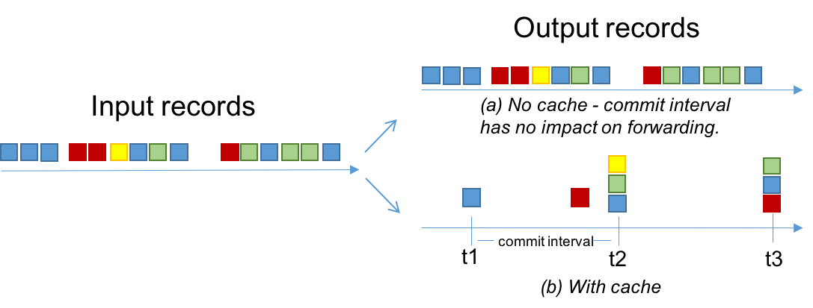

# Memory Management {#memory-management}

You can specify the total memory (RAM) size used for internal caching
and compacting of records. This caching happens before the records are
written to state stores or forwarded downstream to other nodes.

The record caches are implemented slightly different in the DSL and
Processor API.

**Table of Contents**

-   [Record caches in the DSL](#record-caches-in-the-dsl)
-   [Record caches in the Processor API](#record-caches-in-the-processor-api)
-   [RocksDB](#rocksdb)
-   [Other memory usage](#other-memory-usage)

## Record caches in the DSL {#record-caches-in-the-dsl}

You can specify the total memory (RAM) size of the record cache for an
instance of the processing topology. It is leveraged by the following
`KTable` instances:

-   Source `KTable`: `KTable` instances that are created via
    `StreamsBuilder#table()` or `StreamsBuilder#globalTable()`.
-   Aggregation `KTable`: instances of `KTable` that are created as a result of
    [aggregations](../dsl-api##streams-developer-guide-dsl-aggregating).

For such `KTable` instances, the record cache is used for:

-   Internal caching and compacting of output records before they are
    written by the underlying stateful [processor node](../../core-concepts#streams_processor_node) to its internal state stores.
-   Internal caching and compacting of output records before they are
    forwarded from the underlying stateful [processor node](../../core-concepts#streams_processor_node) to any of its downstream processor nodes.

Use the following example to understand the behaviors with and without
record caching. In this example, the input is a
`KStream<String, Integer>` with the records `<K, V>: <A, 1>, <D, 5>, <A, 20>, <A, 300>`. The focus in this example
is on the records with key == `A`.

-   An [aggregation](../dsl-api##streams-developer-guide-dsl-aggregating) computes the sum of record values, grouped by key, for
    the input and returns a `KTable<String,Integer>`.

    -   **Without caching**: a sequence of output records is emitted
        for key `A` that represent changes
        in the resulting aggregation table. The parentheses
        (`()`) denote changes, the left
        number is the new aggregate value and the right number is the
        old aggregate value: `<A, (1, null)>, <A, (21, 1)>, <A, (321, 21)>`{.docutils
        .literal}]{.pre}.
    -   **With caching**: a single output record is emitted for key
        `A` that would likely be compacted
        in the cache, leading to a single output record of
        `<A, (321, null)>`. This record is
        written to the aggregation's internal state store and
        forwarded to any downstream operations.

The cache size is specified through the
`cache.max.bytes.buffering` parameter, which
is a global setting per processing topology:

```java line-numbers
// Enable record cache of size 10 MB.
Properties props = new Properties();
props.put(StreamsConfig.CACHE_MAX_BYTES_BUFFERING_CONFIG, 10 * 1024 * 1024L);
```

This parameter controls the number of bytes allocated for caching.
Specifically, for a processor topology instance with `T` threads and `C` bytes
allocated for caching, each thread will have an even `C/T` bytes to construct its own cache and use as it sees fit
among its tasks. This means that there are as many caches as there are
threads, but no sharing of caches across threads happens.

The basic API for the cache is made of `put()` and `get()` calls. Records
are evicted using a simple LRU scheme after the cache size is reached.
The first time a keyed record `R1 = <K1, V1>`
finishes processing at a node, it is marked as dirty in the cache. Any
other keyed record `R2 = <K1, V2>` with the same key
`K1` that is processed on that node during
that time will overwrite `<K1, V1>`, this is referred to as
"being compacted". This has the same effect as [Kafka's log compaction](../../../design#compaction), 
but happens earlier, while the records are still in memory,
and within your client-side application, rather than on the server-side
(i.e. the Kafka broker). After flushing, `R2` is forwarded to the next processing node and then
written to the local state store.

The semantics of caching is that data is flushed to the state store and
forwarded to the next downstream processor node whenever the earliest of
`commit.interval.ms` or `cache.max.bytes.buffering` (cache pressure)
hits. Both `commit.interval.ms` and `cache.max.bytes.buffering` are global
parameters. As such, it is not possible to specify different parameters
for individual nodes.

Here are example settings for both parameters based on desired
scenarios.

-   To turn off caching the cache size can be set to zero:

    ```java line-numbers
    // Disable record cache
    Properties props = new Properties();
    props.put(StreamsConfig.CACHE_MAX_BYTES_BUFFERING_CONFIG, 0);
    ```

-   To enable caching but still have an upper bound on how long records
    will be cached, you can set the commit interval. In this example, it
    is set to 1000 milliseconds:

    ```java line-numbers
    Properties props = new Properties();
    // Enable record cache of size 10 MB.
    props.put(StreamsConfig.CACHE_MAX_BYTES_BUFFERING_CONFIG, 10 * 1024 * 1024L);
    // Set commit interval to 1 second.
    props.put(StreamsConfig.COMMIT_INTERVAL_MS_CONFIG, 1000);
    ```

The effect of these two configurations is described in the figure below.
The records are shown using 4 keys: blue, red, yellow, and green. Assume
the cache has space for only 3 keys.

-   When the cache is disabled (a), all of the input records will be
    output.

-   When the cache is enabled (b):

    -   Most records are output at the end of commit intervals (e.g.,
        at `t1` a single blue record is
        output, which is the final over-write of the blue key up to
        that time).
    -   Some records are output because of cache pressure (i.e. before
        the end of a commit interval). For example, see the red record
        before `t2`. With smaller cache
        sizes we expect cache pressure to be the primary factor that
        dictates when records are output. With large cache sizes, the
        commit interval will be the primary factor.
    -   The total number of records output has been reduced from 15 to 8.



## Record caches in the Processor API {#record-caches-in-the-processor-api}

You can specify the total memory (RAM) size of the record cache for an
instance of the processing topology. It is used for internal caching and
compacting of output records before they are written from a stateful
processor node to its state stores.

The record cache in the Processor API does not cache or compact any
output records that are being forwarded downstream. This means that all
downstream processor nodes can see all records, whereas the state stores
see a reduced number of records. This does not impact correctness of the
system, but is a performance optimization for the state stores. For
example, with the Processor API you can store a record in a state store
while forwarding a different value downstream.

Following from the example first shown in section 
[State Stores](../processor-api#streams-developer-guide-state-store), 
to disable caching, you can add the
`withCachingDisabled` call (note that caches
are enabled by default, however there is an explicit
`withCachingEnabled` call).

```java line-numbers
StoreBuilder countStoreBuilder =
  Stores.keyValueStoreBuilder(
    Stores.persistentKeyValueStore("Counts"),
    Serdes.String(),
    Serdes.Long())
  .withCachingEnabled();
```

## RocksDB {#rocksdb}

Each instance of RocksDB allocates off-heap memory for a block cache,
index and filter blocks, and memtable (write buffer). Critical configs
(for RocksDB version 4.1.0) include `block_cache_size`, `write_buffer_size` and
`max_write_buffer_number`. These can be
specified through the `rocksdb.config.setter` configuration.

Also, we recommend changing RocksDB\'s default memory allocator, because
the default allocator may lead to increased memory consumption. To
change the memory allocator to `jemalloc`, you need to set the
environment variable `LD_PRELOAD` before you start your Kafka Streams
application:

```shell {linenos=false} line-numbers
# example: install jemalloc (on Debian)
$ apt install -y libjemalloc-dev
# set LD_PRELOAD before you start your Kafka Streams application
$ export LD_PRELOAD="/usr/lib/x86_64-linux-gnu/libjemalloc.so”
      
```

As of 2.3.0 the memory usage across all instances can be bounded,
limiting the total off-heap memory of your Kafka Streams application. To
do so you must configure RocksDB to cache the index and filter blocks in
the block cache, limit the memtable memory through a shared
[WriteBufferManager](https://github.com/facebook/rocksdb/wiki/Write-Buffer-Manager) 
and count its memory against the block cache, and then pass
the same Cache object to each instance. 
See [RocksDB Memory Usage](https://github.com/facebook/rocksdb/wiki/Memory-usage-in-RocksDB) for details. 
An example RocksDBConfigSetter implementing this is shown below:

```java line-numbers
public static class BoundedMemoryRocksDBConfig implements RocksDBConfigSetter {

   private static org.rocksdb.Cache cache = new org.rocksdb.LRUCache(TOTAL_OFF_HEAP_MEMORY, -1, false, INDEX_FILTER_BLOCK_RATIO);1
   private static org.rocksdb.WriteBufferManager writeBufferManager = new org.rocksdb.WriteBufferManager(TOTAL_MEMTABLE_MEMORY, cache);

   @Override
   public void setConfig(final String storeName, final Options options, final Map<String, Object> configs) {

     BlockBasedTableConfig tableConfig = (BlockBasedTableConfig) options.tableFormatConfig();

      // These three options in combination will limit the memory used by RocksDB to the size passed to the block cache (TOTAL_OFF_HEAP_MEMORY)
     tableConfig.setBlockCache(cache);
     tableConfig.setCacheIndexAndFilterBlocks(true);
     options.setWriteBufferManager(writeBufferManager);

      // These options are recommended to be set when bounding the total memory
     tableConfig.setCacheIndexAndFilterBlocksWithHighPriority(true);2
     tableConfig.setPinTopLevelIndexAndFilter(true);
     tableConfig.setBlockSize(BLOCK_SIZE);3
     options.setMaxWriteBufferNumber(N_MEMTABLES);
     options.setWriteBufferSize(MEMTABLE_SIZE);

     options.setTableFormatConfig(tableConfig);
   }

   @Override
   public void close(final String storeName, final Options options) {
     // Cache and WriteBufferManager should not be closed here, as the same objects are shared by every store instance.
   }
}
```


1. `INDEX_FILTER_BLOCK_RATIO` can be used to set a fraction of the block cache to set aside 
    for "high priority" (aka index and filter) blocks, preventing them from being evicted by data blocks. 
    The boolean parameter in the cache constructor lets you control whether the cache should enforce a 
    strict memory limit by failing the read or iteration in the rare cases where it might go larger than its capacity. 
    See the full signature of the LRUCache constructor 
    [here](https://github.com/facebook/rocksdb/blob/master/java/src/main/java/org/rocksdb/LRUCache.java#L72).
2. This must be set in order for `INDEX_FILTER_BLOCK_RATIO` to take effect (see footnote 1) as described in the 
    [RocksDB docs](https://github.com/facebook/rocksdb/wiki/Block-Cache#caching-index-and-filter-blocks)
3. You may want to modify the default 
    [block size](https://github.com/apache/kafka/blob//streams/src/main/java/org/apache/kafka/streams/state/internals/RocksDBStore.java#L79) 
    per these instructions from the [RocksDB docs](https://github.com/facebook/rocksdb/wiki/Memory-usage-in-RocksDB#indexes-and-filter-blocks). 
    A larger block size means index blocks will be smaller, but the cached data blocks may contain more cold data that would otherwise be evicted.


Note:

While we recommend setting at least the above configs, the specific
options that yield the best performance are workload dependent and you
should consider experimenting with these to determine the best choices
for your specific use case. Keep in mind that the optimal configs for
one app may not apply to one with a different topology or input topic.
In addition to the recommended configs above, you may want to consider
using partitioned index filters as described by the 
[RocksDB docs](https://github.com/facebook/rocksdb/wiki/Partitioned-Index-Filters).

## Other memory usage {#other-memory-usage}

There are other modules inside Apache Kafka that allocate memory during
runtime. They include the following:

-   Producer buffering, managed by the producer config `buffer.memory`.
-   Consumer buffering, currently not strictly managed, but can be
    indirectly controlled by fetch size, i.e., `fetch.max.bytes` and `fetch.max.wait.ms`.
-   Both producer and consumer also have separate TCP send / receive
    buffers that are not counted as the buffering memory. These are
    controlled by the `send.buffer.bytes` / `receive.buffer.bytes` configs.
-   Deserialized objects buffering: after `consumer.poll()` returns records, they will be deserialized to
    extract timestamp and buffered in the streams space. Currently, this is only indirectly controlled by
    `buffered.records.per.partition`.

**Tip**

**Iterators should be closed explicitly to release resources:** Store
iterators (e.g., `KeyValueIterator` and
`WindowStoreIterator`) must be closed
explicitly upon completeness to release resources such as open file
handlers and in-memory read buffers, or use try-with-resources statement
(available since JDK7) for this Closeable class.

Otherwise, stream application's memory usage keeps increasing when
running until it hits an OOM.
