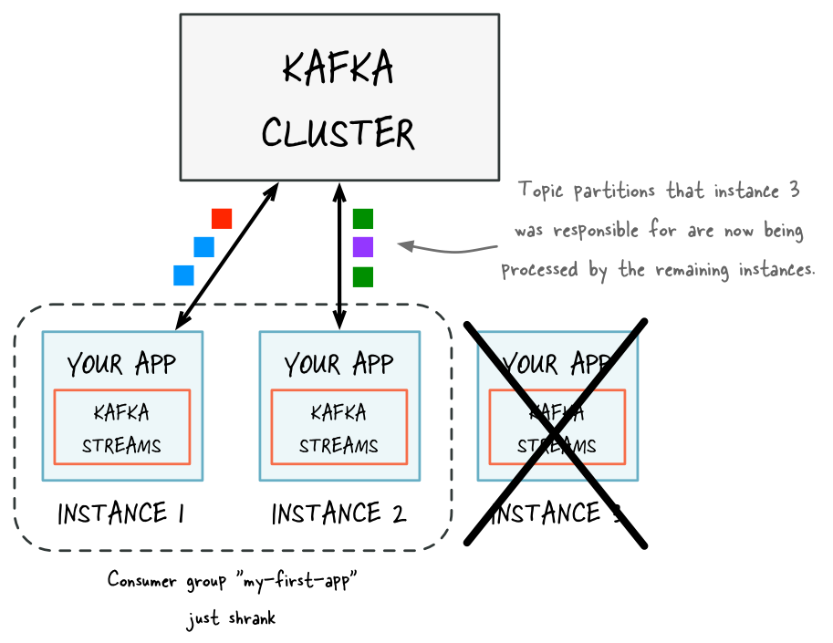

# Running Streams Applications {#running-streams-applications}

You can run Java applications that use the Kafka Streams library without
any additional configuration or requirements. Kafka Streams also
provides the ability to receive notification of the various states of
the application. The ability to monitor the runtime status is discussed
in [the monitoring guide](../../../operations#kafka_streams_monitoring).

**Table of Contents**

-   [Starting a Kafka Streams application](#starting-a-kafka-streams-application)
-   [Elastic scaling of your application](#elastic-scaling-of-your-application)
    -   [Adding capacity to your application](#adding-capacity-to-your-application)
    -   [Removing capacity from your application](#removing-capacity-from-your-application)
    -   [State restoration during workload rebalance](#state-restoration-during-workload-rebalance)
    -   [Determining how many application instances to run](#determining-how-many-application-instances-to-run)

## Starting a Kafka Streams application {#starting-a-kafka-streams-application}

You can package your Java application as a fat JAR file and then start
the application like this:

```shell {linenos=false} line-numbers
# Start the application in class `com.example.MyStreamsApp`
# from the fat JAR named `path-to-app-fatjar.jar`.
$ java -cp path-to-app-fatjar.jar com.example.MyStreamsApp
```

When you start your application you are launching a Kafka Streams
instance of your application. You can run multiple instances of your
application. A common scenario is that there are multiple instances of
your application running in parallel. For more information, see
[Parallelism Model](../architecture#streams_architecture_tasks).

When the application instance starts running, the defined processor
topology will be initialized as one or more stream tasks. If the
processor topology defines any state stores, these are also constructed
during the initialization period. For more information, see the 
[State restoration during workload rebalance](#streams-developer-guide-execution-scaling-state-restoration) section).

## Elastic scaling of your application {#elastic-scaling-of-your-application}

Kafka Streams makes your stream processing applications elastic and
scalable. You can add and remove processing capacity dynamically during
application runtime without any downtime or data loss. This makes your
applications resilient in the face of failures and for allows you to
perform maintenance as needed (e.g. rolling upgrades).

For more information about this elasticity, see the 
[Parallelism Model](../architecture#streams_architecture_tasks) section. 
Kafka Streams leverages the Kafka group management
functionality, which is built right into the 
[Kafka wire protocol](https://cwiki.apache.org/confluence/display/KAFKA/A+Guide+To+The+Kafka+Protocol). 
It is the foundation that enables the elasticity of Kafka
Streams applications: members of a group coordinate and collaborate
jointly on the consumption and processing of data in Kafka.
Additionally, Kafka Streams provides stateful processing and allows for
fault-tolerant state in environments where application instances may
come and go at any time.

### Adding capacity to your application {#adding-capacity-to-your-application}

If you need more processing capacity for your stream processing
application, you can simply start another instance of your stream
processing application, e.g. on another machine, in order to scale out.
The instances of your application will become aware of each other and
automatically begin to share the processing work. More specifically,
what will be handed over from the existing instances to the new
instances is (some of) the stream tasks that have been run by the
existing instances. Moving stream tasks from one instance to another
results in moving the processing work plus any internal state of these
stream tasks (the state of a stream task will be re-created in the
target instance by restoring the state from its corresponding changelog
topic).

The various instances of your application each run in their own JVM
process, which means that each instance can leverage all the processing
capacity that is available to their respective JVM process (minus the
capacity that any non-Kafka-Streams part of your application may be
using). This explains why running additional instances will grant your
application additional processing capacity. The exact capacity you will
be adding by running a new instance depends of course on the environment
in which the new instance runs: available CPU cores, available main
memory and Java heap space, local storage, network bandwidth, and so on.
Similarly, if you stop any of the running instances of your application,
then you are removing and freeing up the respective processing capacity.


> Before adding capacity: only a single instance of your Kafka Streams
application is running. At this point the corresponding Kafka consumer
group of your application contains only a single member (this instance).
All data is being read and processed by this single
instance.


> After adding capacity: now two additional instances of your Kafka
Streams application are running, and they have automatically joined the
application's Kafka consumer group for a total of three current members.
These three instances are automatically splitting the processing work
between each other. The splitting is based on the Kafka topic partitions
from which data is being read.

### Removing capacity from your application {#removing-capacity-from-your-application}

To remove processing capacity, you can stop running stream processing
application instances (e.g., shut down two of the four instances), it
will automatically leave the application's consumer group, and the
remaining instances of your application will automatically take over the
processing work. The remaining instances take over the stream tasks that
were run by the stopped instances. Moving stream tasks from one instance
to another results in moving the processing work plus any internal state
of these stream tasks. The state of a stream task is recreated in the
target instance from its changelog topic.



### State restoration during workload rebalance {#state-restoration-during-workload-rebalance}

When a task is migrated, the task processing state is fully restored
before the application instance resumes processing. This guarantees the
correct processing results. In Kafka Streams, state restoration is
usually done by replaying the corresponding changelog topic to
reconstruct the state store. To minimize changelog-based restoration
latency by using replicated local state stores, you can specify
`num.standby.replicas`. When a stream task
is initialized or re-initialized on the application instance, its state
store is restored like this:

-   If no local state store exists, the changelog is replayed from the
    earliest to the current offset. This reconstructs the local state
    store to the most recent snapshot.
-   If a local state store exists, the changelog is replayed from the
    previously checkpointed offset. The changes are applied and the
    state is restored to the most recent snapshot. This method takes
    less time because it is applying a smaller portion of the changelog.

For more information, see [Standby Replicas](../config-streams#num-standby-replicas).

As of version 2.6, Streams will now do most of a task\'s restoration in
the background through warmup replicas. These will be assigned to
instances that need to restore a lot of state for a task. A stateful
active task will only be assigned to an instance once its state is
within the configured [`acceptable.recovery.lag`](../config-streams#acceptable-recovery-lag), 
if one exists. This means that most of the time, a task
migration will **not** result in downtime for that task. It will remain
active on the instance that\'s already caught up, while the instance
that it\'s being migrated to works on restoring the state. Streams will
[regularly probe](../config-streams#probing-rebalance-interval-ms) 
for warmup tasks that have finished restoring and transition
them to active tasks when ready.

Note, the one exception to this task availability is if none of the
instances have a caught up version of that task. In that case, we have
no choice but to assign the active task to an instance that is not
caught up and will have to block further processing on restoration of
the task\'s state from the changelog. If high availability is important
for your application, you are highly recommended to enable standbys.

### Determining how many application instances to run {#determining-how-many-application-instances-to-run}

The parallelism of a Kafka Streams application is primarily determined
by how many partitions the input topics have. For example, if your
application reads from a single topic that has ten partitions, then you
can run up to ten instances of your applications. You can run further
instances, but these will be idle.

The number of topic partitions is the upper limit for the parallelism of
your Kafka Streams application and for the number of running instances
of your application.

To achieve balanced workload processing across application instances and
to prevent processing hotpots, you should distribute data and processing
workloads:

-   Data should be equally distributed across topic partitions. For
    example, if two topic partitions each have 1 million messages, this
    is better than a single partition with 2 million messages and none
    in the other.
-   Processing workload should be equally distributed across topic
    partitions. For example, if the time to process messages varies
    widely, then it is better to spread the processing-intensive
    messages across partitions rather than storing these messages within
    the same partition.
