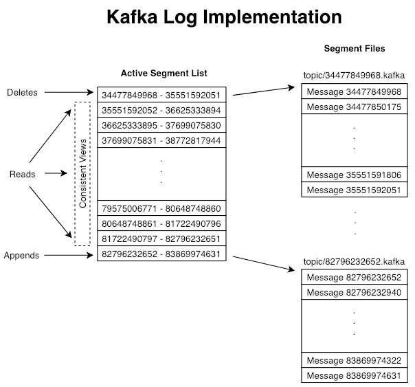

.. _implementation:

Implementation
==============

.. contents::
   :local:

`5.1 Network Layer <#networklayer>`__
-------------------------------------

The network layer is a fairly straight-forward NIO server, and will not
be described in great detail. The sendfile implementation is done by
giving the ``MessageSet`` interface a ``writeTo`` method. This allows
the file-backed message set to use the more efficient ``transferTo``
implementation instead of an in-process buffered write. The threading
model is a single acceptor thread and *N* processor threads which handle
a fixed number of connections each. This design has been pretty
thoroughly tested
`elsewhere <http://sna-projects.com/blog/2009/08/introducing-the-nio-socketserver-implementation>`__
and found to be simple to implement and fast. The protocol is kept quite
simple to allow for future implementation of clients in other languages.

`5.2 Messages <#messages>`__
----------------------------

Messages consist of a variable-length header, a variable length opaque
key byte array and a variable length opaque value byte array. The format
of the header is described in the following section. Leaving the key and
value opaque is the right decision: there is a great deal of progress
being made on serialization libraries right now, and any particular
choice is unlikely to be right for all uses. Needless to say a
particular application using Kafka would likely mandate a particular
serialization type as part of its usage. The ``RecordBatch`` interface
is simply an iterator over messages with specialized methods for bulk
reading and writing to an NIO ``Channel``.

`5.3 Message Format <#messageformat>`__
---------------------------------------

Messages (aka Records) are always written in batches. The technical term
for a batch of messages is a record batch, and a record batch contains
one or more records. In the degenerate case, we could have a record
batch containing a single record. Record batches and records have their
own headers. The format of each is described below for Kafka version
0.11.0 and later (message format version v2, or magic=2). `Click
here <https://cwiki.apache.org/confluence/display/KAFKA/A+Guide+To+The+Kafka+Protocol#AGuideToTheKafkaProtocol-Messagesets>`__
for details about message formats 0 and 1.

`5.3.1 Record Batch <#recordbatch>`__
~~~~~~~~~~~~~~~~~~~~~~~~~~~~~~~~~~~~~

The following is the on-disk format of a RecordBatch.

.. code:: bash

   baseOffset: int64
   batchLength: int32
   partitionLeaderEpoch: int32
   magic: int8 (current magic value is 2)
   crc: int32
   attributes: int16
       bit 0~2:
           0: no compression
           1: gzip
           2: snappy
           3: lz4
       bit 3: timestampType
       bit 4: isTransactional (0 means not transactional)
       bit 5: isControlBatch (0 means not a control batch)
       bit 6~15: unused
   lastOffsetDelta: int32
   firstTimestamp: int64
   maxTimestamp: int64
   producerId: int64
   producerEpoch: int16
   baseSequence: int32
   records: [Record]
        

Note that when compression is enabled, the compressed record data is
serialized directly following the count of the number of records.

The CRC covers the data from the attributes to the end of the batch
(i.e. all the bytes that follow the CRC). It is located after the magic
byte, which means that clients must parse the magic byte before deciding
how to interpret the bytes between the batch length and the magic byte.
The partition leader epoch field is not included in the CRC computation
to avoid the need to recompute the CRC when this field is assigned for
every batch that is received by the broker. The CRC-32C (Castagnoli)
polynomial is used for the computation.

On compaction: unlike the older message formats, magic v2 and above
preserves the first and last offset/sequence numbers from the original
batch when the log is cleaned. This is required in order to be able to
restore the producer's state when the log is reloaded. If we did not
retain the last sequence number, for example, then after a partition
leader failure, the producer might see an OutOfSequence error. The base
sequence number must be preserved for duplicate checking (the broker
checks incoming Produce requests for duplicates by verifying that the
first and last sequence numbers of the incoming batch match the last
from that producer). As a result, it is possible to have empty batches
in the log when all the records in the batch are cleaned but batch is
still retained in order to preserve a producer's last sequence number.
One oddity here is that the baseTimestamp field is not preserved during
compaction, so it will change if the first record in the batch is
compacted away.

`5.3.1.1 Control Batches <#controlbatch>`__
^^^^^^^^^^^^^^^^^^^^^^^^^^^^^^^^^^^^^^^^^^^

A control batch contains a single record called the control record.
Control records should not be passed on to applications. Instead, they
are used by consumers to filter out aborted transactional messages.

The key of a control record conforms to the following schema:

.. code:: bash

           version: int16 (current version is 0)
           type: int16 (0 indicates an abort marker, 1 indicates a commit)
        

The schema for the value of a control record is dependent on the type.
The value is opaque to clients.

`5.3.2 Record <#record>`__
~~~~~~~~~~~~~~~~~~~~~~~~~~

Record level headers were introduced in Kafka 0.11.0. The on-disk format
of a record with Headers is delineated below.

.. code:: bash

            length: varint
            attributes: int8
                bit 0~7: unused
            timestampDelta: varint
            offsetDelta: varint
            keyLength: varint
            key: byte[]
            valueLen: varint
            value: byte[]
            Headers => [Header]
        

`5.4.2.1 Record Header <#recordheader>`__
^^^^^^^^^^^^^^^^^^^^^^^^^^^^^^^^^^^^^^^^^

.. code:: bash

            headerKeyLength: varint
            headerKey: String
            headerValueLength: varint
            Value: byte[]
        

We use the same varint encoding as Protobuf. More information on the
latter can be found
`here <https://developers.google.com/protocol-buffers/docs/encoding#varints>`__.
The count of headers in a record is also encoded as a varint.

`5.4 Log <#log>`__
------------------

A log for a topic named "my_topic" with two partitions consists of two
directories (namely ``my_topic_0`` and ``my_topic_1``) populated with
data files containing the messages for that topic. The format of the log
files is a sequence of "log entries""; each log entry is a 4 byte
integer *N* storing the message length which is followed by the *N*
message bytes. Each message is uniquely identified by a 64-bit integer
*offset* giving the byte position of the start of this message in the
stream of all messages ever sent to that topic on that partition. The
on-disk format of each message is given below. Each log file is named
with the offset of the first message it contains. So the first file
created will be 00000000000.kafka, and each additional file will have an
integer name roughly *S* bytes from the previous file where *S* is the
max log file size given in the configuration.

The exact binary format for records is versioned and maintained as a
standard interface so record batches can be transferred between
producer, broker, and client without recopying or conversion when
desirable. The previous section included details about the on-disk
format of records.

The use of the message offset as the message id is unusual. Our original
idea was to use a GUID generated by the producer, and maintain a mapping
from GUID to offset on each broker. But since a consumer must maintain
an ID for each server, the global uniqueness of the GUID provides no
value. Furthermore, the complexity of maintaining the mapping from a
random id to an offset requires a heavy weight index structure which
must be synchronized with disk, essentially requiring a full persistent
random-access data structure. Thus to simplify the lookup structure we
decided to use a simple per-partition atomic counter which could be
coupled with the partition id and node id to uniquely identify a
message; this makes the lookup structure simpler, though multiple seeks
per consumer request are still likely. However once we settled on a
counter, the jump to directly using the offset seemed natural—both after
all are monotonically increasing integers unique to a partition. Since
the offset is hidden from the consumer API this decision is ultimately
an implementation detail and we went with the more efficient approach.

`Writes <#impl_writes>`__
~~~~~~~~~~~~~~~~~~~~~~~~~

The log allows serial appends which always go to the last file. This
file is rolled over to a fresh file when it reaches a configurable size
(say 1GB). The log takes two configuration parameters: *M*, which gives
the number of messages to write before forcing the OS to flush the file
to disk, and *S*, which gives a number of seconds after which a flush is
forced. This gives a durability guarantee of losing at most *M* messages
or *S* seconds of data in the event of a system crash.

`Reads <#impl_reads>`__
~~~~~~~~~~~~~~~~~~~~~~~

Reads are done by giving the 64-bit logical offset of a message and an
*S*-byte max chunk size. This will return an iterator over the messages
contained in the *S*-byte buffer. *S* is intended to be larger than any
single message, but in the event of an abnormally large message, the
read can be retried multiple times, each time doubling the buffer size,
until the message is read successfully. A maximum message and buffer
size can be specified to make the server reject messages larger than
some size, and to give a bound to the client on the maximum it needs to
ever read to get a complete message. It is likely that the read buffer
ends with a partial message, this is easily detected by the size
delimiting.

The actual process of reading from an offset requires first locating the
log segment file in which the data is stored, calculating the
file-specific offset from the global offset value, and then reading from
that file offset. The search is done as a simple binary search variation
against an in-memory range maintained for each file.

The log provides the capability of getting the most recently written
message to allow clients to start subscribing as of "right now". This is
also useful in the case the consumer fails to consume its data within
its SLA-specified number of days. In this case when the client attempts
to consume a non-existent offset it is given an OutOfRangeException and
can either reset itself or fail as appropriate to the use case.

The following is the format of the results sent to the consumer.

.. code:: bash

        MessageSetSend (fetch result)

        total length     : 4 bytes
        error code       : 2 bytes
        message 1        : x bytes
        ...
        message n        : x bytes
        

.. code:: bash

        MultiMessageSetSend (multiFetch result)

        total length       : 4 bytes
        error code         : 2 bytes
        messageSetSend 1
        ...
        messageSetSend n
        

`Deletes <#impl_deletes>`__
~~~~~~~~~~~~~~~~~~~~~~~~~~~

Data is deleted one log segment at a time. The log manager allows
pluggable delete policies to choose which files are eligible for
deletion. The current policy deletes any log with a modification time of
more than *N* days ago, though a policy which retained the last *N* GB
could also be useful. To avoid locking reads while still allowing
deletes that modify the segment list we use a copy-on-write style
segment list implementation that provides consistent views to allow a
binary search to proceed on an immutable static snapshot view of the log
segments while deletes are progressing.

`Guarantees <#impl_guarantees>`__
~~~~~~~~~~~~~~~~~~~~~~~~~~~~~~~~~

The log provides a configuration parameter *M* which controls the
maximum number of messages that are written before forcing a flush to
disk. On startup a log recovery process is run that iterates over all
messages in the newest log segment and verifies that each message entry
is valid. A message entry is valid if the sum of its size and offset are
less than the length of the file AND the CRC32 of the message payload
matches the CRC stored with the message. In the event corruption is
detected the log is truncated to the last valid offset.

Note that two kinds of corruption must be handled: truncation in which
an unwritten block is lost due to a crash, and corruption in which a
nonsense block is ADDED to the file. The reason for this is that in
general the OS makes no guarantee of the write order between the file
inode and the actual block data so in addition to losing written data
the file can gain nonsense data if the inode is updated with a new size
but a crash occurs before the block containing that data is written. The
CRC detects this corner case, and prevents it from corrupting the log
(though the unwritten messages are, of course, lost).

`5.5 Distribution <#distributionimpl>`__
----------------------------------------

`Consumer Offset Tracking <#impl_offsettracking>`__
~~~~~~~~~~~~~~~~~~~~~~~~~~~~~~~~~~~~~~~~~~~~~~~~~~~

The high-level consumer tracks the maximum offset it has consumed in
each partition and periodically commits its offset vector so that it can
resume from those offsets in the event of a restart. Kafka provides the
option to store all the offsets for a given consumer group in a
designated broker (for that group) called the *offset manager*. i.e.,
any consumer instance in that consumer group should send its offset
commits and fetches to that offset manager (broker). The high-level
consumer handles this automatically. If you use the simple consumer you
will need to manage offsets manually. This is currently unsupported in
the Java simple consumer which can only commit or fetch offsets in
ZooKeeper. If you use the Scala simple consumer you can discover the
offset manager and explicitly commit or fetch offsets to the offset
manager. A consumer can look up its offset manager by issuing a
GroupCoordinatorRequest to any Kafka broker and reading the
GroupCoordinatorResponse which will contain the offset manager. The
consumer can then proceed to commit or fetch offsets from the offsets
manager broker. In case the offset manager moves, the consumer will need
to rediscover the offset manager. If you wish to manage your offsets
manually, you can take a look at these `code samples that explain how to
issue OffsetCommitRequest and
OffsetFetchRequest <https://cwiki.apache.org/confluence/display/KAFKA/Committing+and+fetching+consumer+offsets+in+Kafka>`__.

When the offset manager receives an OffsetCommitRequest, it appends the
request to a special `compacted <#compaction>`__ Kafka topic named
*\__consumer_offsets*. The offset manager sends a successful offset
commit response to the consumer only after all the replicas of the
offsets topic receive the offsets. In case the offsets fail to replicate
within a configurable timeout, the offset commit will fail and the
consumer may retry the commit after backing off. (This is done
automatically by the high-level consumer.) The brokers periodically
compact the offsets topic since it only needs to maintain the most
recent offset commit per partition. The offset manager also caches the
offsets in an in-memory table in order to serve offset fetches quickly.

When the offset manager receives an offset fetch request, it simply
returns the last committed offset vector from the offsets cache. In case
the offset manager was just started or if it just became the offset
manager for a new set of consumer groups (by becoming a leader for a
partition of the offsets topic), it may need to load the offsets topic
partition into the cache. In this case, the offset fetch will fail with
an OffsetsLoadInProgress exception and the consumer may retry the
OffsetFetchRequest after backing off. (This is done automatically by the
high-level consumer.)

`Migrating offsets from ZooKeeper to Kafka <#offsetmigration>`__
^^^^^^^^^^^^^^^^^^^^^^^^^^^^^^^^^^^^^^^^^^^^^^^^^^^^^^^^^^^^^^^^

Kafka consumers in earlier releases store their offsets by default in
ZooKeeper. It is possible to migrate these consumers to commit offsets
into Kafka by following these steps:

#. Set ``offsets.storage=kafka`` and ``dual.commit.enabled=true`` in
   your consumer config.
#. Do a rolling bounce of your consumers and then verify that your
   consumers are healthy.
#. Set ``dual.commit.enabled=false`` in your consumer config.
#. Do a rolling bounce of your consumers and then verify that your
   consumers are healthy.

A roll-back (i.e., migrating from Kafka back to ZooKeeper) can also be
performed using the above steps if you set
``offsets.storage=zookeeper``.

`ZooKeeper Directories <#impl_zookeeper>`__
~~~~~~~~~~~~~~~~~~~~~~~~~~~~~~~~~~~~~~~~~~~

The following gives the ZooKeeper structures and algorithms used for
co-ordination between consumers and brokers.

`Notation <#impl_zknotation>`__
~~~~~~~~~~~~~~~~~~~~~~~~~~~~~~~

When an element in a path is denoted [xyz], that means that the value of
xyz is not fixed and there is in fact a ZooKeeper znode for each
possible value of xyz. For example /topics/[topic] would be a directory
named /topics containing a sub-directory for each topic name. Numerical
ranges are also given such as [0...5] to indicate the subdirectories 0,
1, 2, 3, 4. An arrow -> is used to indicate the contents of a znode. For
example /hello -> world would indicate a znode /hello containing the
value "world".

`Broker Node Registry <#impl_zkbroker>`__
~~~~~~~~~~~~~~~~~~~~~~~~~~~~~~~~~~~~~~~~~

.. code:: bash

        /brokers/ids/[0...N] --> {"jmx_port":...,"timestamp":...,"endpoints":[...],"host":...,"version":...,"port":...} (ephemeral node)
        

This is a list of all present broker nodes, each of which provides a
unique logical broker id which identifies it to consumers (which must be
given as part of its configuration). On startup, a broker node registers
itself by creating a znode with the logical broker id under
/brokers/ids. The purpose of the logical broker id is to allow a broker
to be moved to a different physical machine without affecting consumers.
An attempt to register a broker id that is already in use (say because
two servers are configured with the same broker id) results in an error.

Since the broker registers itself in ZooKeeper using ephemeral znodes,
this registration is dynamic and will disappear if the broker is
shutdown or dies (thus notifying consumers it is no longer available).

`Broker Topic Registry <#impl_zktopic>`__
~~~~~~~~~~~~~~~~~~~~~~~~~~~~~~~~~~~~~~~~~

.. code:: bash

        /brokers/topics/[topic]/partitions/[0...N]/state --> {"controller_epoch":...,"leader":...,"version":...,"leader_epoch":...,"isr":[...]} (ephemeral node)
        

Each broker registers itself under the topics it maintains and stores
the number of partitions for that topic.

`Consumers and Consumer Groups <#impl_zkconsumers>`__
~~~~~~~~~~~~~~~~~~~~~~~~~~~~~~~~~~~~~~~~~~~~~~~~~~~~~

Consumers of topics also register themselves in ZooKeeper, in order to
coordinate with each other and balance the consumption of data.
Consumers can also store their offsets in ZooKeeper by setting
``offsets.storage=zookeeper``. However, this offset storage mechanism
will be deprecated in a future release. Therefore, it is recommended to
`migrate offsets storage to Kafka <#offsetmigration>`__.

Multiple consumers can form a group and jointly consume a single topic.
Each consumer in the same group is given a shared group_id. For example
if one consumer is your foobar process, which is run across three
machines, then you might assign this group of consumers the id "foobar".
This group id is provided in the configuration of the consumer, and is
your way to tell the consumer which group it belongs to.

The consumers in a group divide up the partitions as fairly as possible,
each partition is consumed by exactly one consumer in a consumer group.

`Consumer Id Registry <#impl_zkconsumerid>`__
~~~~~~~~~~~~~~~~~~~~~~~~~~~~~~~~~~~~~~~~~~~~~

In addition to the group_id which is shared by all consumers in a group,
each consumer is given a transient, unique consumer_id (of the form
hostname:uuid) for identification purposes. Consumer ids are registered
in the following directory.

.. code:: bash

        /consumers/[group_id]/ids/[consumer_id] --> {"version":...,"subscription":{...:...},"pattern":...,"timestamp":...} (ephemeral node)
        

Each of the consumers in the group registers under its group and creates
a znode with its consumer_id. The value of the znode contains a map of
<topic, #streams>. This id is simply used to identify each of the
consumers which is currently active within a group. This is an ephemeral
node so it will disappear if the consumer process dies.

`Consumer Offsets <#impl_zkconsumeroffsets>`__
~~~~~~~~~~~~~~~~~~~~~~~~~~~~~~~~~~~~~~~~~~~~~~

Consumers track the maximum offset they have consumed in each partition.
This value is stored in a ZooKeeper directory if
``offsets.storage=zookeeper``.

.. code:: bash

        /consumers/[group_id]/offsets/[topic]/[partition_id] --> offset_counter_value (persistent node)
        

`Partition Owner registry <#impl_zkowner>`__
~~~~~~~~~~~~~~~~~~~~~~~~~~~~~~~~~~~~~~~~~~~~

Each broker partition is consumed by a single consumer within a given
consumer group. The consumer must establish its ownership of a given
partition before any consumption can begin. To establish its ownership,
a consumer writes its own id in an ephemeral node under the particular
broker partition it is claiming.

.. code:: bash

        /consumers/[group_id]/owners/[topic]/[partition_id] --> consumer_node_id (ephemeral node)
        

`Cluster Id <#impl_clusterid>`__
~~~~~~~~~~~~~~~~~~~~~~~~~~~~~~~~

The cluster id is a unique and immutable identifier assigned to a Kafka
cluster. The cluster id can have a maximum of 22 characters and the
allowed characters are defined by the regular expression
[a-zA-Z0-9_\-]+, which corresponds to the characters used by the
URL-safe Base64 variant with no padding. Conceptually, it is
auto-generated when a cluster is started for the first time.

Implementation-wise, it is generated when a broker with version 0.10.1
or later is successfully started for the first time. The broker tries to
get the cluster id from the ``/cluster/id`` znode during startup. If the
znode does not exist, the broker generates a new cluster id and creates
the znode with this cluster id.

`Broker node registration <#impl_brokerregistration>`__
~~~~~~~~~~~~~~~~~~~~~~~~~~~~~~~~~~~~~~~~~~~~~~~~~~~~~~~

The broker nodes are basically independent, so they only publish
information about what they have. When a broker joins, it registers
itself under the broker node registry directory and writes information
about its host name and port. The broker also register the list of
existing topics and their logical partitions in the broker topic
registry. New topics are registered dynamically when they are created on
the broker.

`Consumer registration algorithm <#impl_consumerregistration>`__
~~~~~~~~~~~~~~~~~~~~~~~~~~~~~~~~~~~~~~~~~~~~~~~~~~~~~~~~~~~~~~~~

When a consumer starts, it does the following:

#. Register itself in the consumer id registry under its group.
#. Register a watch on changes (new consumers joining or any existing
   consumers leaving) under the consumer id registry. (Each change
   triggers rebalancing among all consumers within the group to which
   the changed consumer belongs.)
#. Register a watch on changes (new brokers joining or any existing
   brokers leaving) under the broker id registry. (Each change triggers
   rebalancing among all consumers in all consumer groups.)
#. If the consumer creates a message stream using a topic filter, it
   also registers a watch on changes (new topics being added) under the
   broker topic registry. (Each change will trigger re-evaluation of the
   available topics to determine which topics are allowed by the topic
   filter. A new allowed topic will trigger rebalancing among all
   consumers within the consumer group.)
#. Force itself to rebalance within in its consumer group.

`Consumer rebalancing algorithm <#impl_consumerrebalance>`__
~~~~~~~~~~~~~~~~~~~~~~~~~~~~~~~~~~~~~~~~~~~~~~~~~~~~~~~~~~~~

The consumer rebalancing algorithms allows all the consumers in a group
to come into consensus on which consumer is consuming which partitions.
Consumer rebalancing is triggered on each addition or removal of both
broker nodes and other consumers within the same group. For a given
topic and a given consumer group, broker partitions are divided evenly
among consumers within the group. A partition is always consumed by a
single consumer. This design simplifies the implementation. Had we
allowed a partition to be concurrently consumed by multiple consumers,
there would be contention on the partition and some kind of locking
would be required. If there are more consumers than partitions, some
consumers won't get any data at all. During rebalancing, we try to
assign partitions to consumers in such a way that reduces the number of
broker nodes each consumer has to connect to.

Each consumer does the following during rebalancing:

.. code:: bash

        1. For each topic T that Ci subscribes to
        2.   let PT be all partitions producing topic T
        3.   let CG be all consumers in the same group as Ci that consume topic T
        4.   sort PT (so partitions on the same broker are clustered together)
        5.   sort CG
        6.   let i be the index position of Ci in CG and let N = size(PT)/size(CG)
        7.   assign partitions from i*N to (i+1)*N - 1 to consumer Ci
        8.   remove current entries owned by Ci from the partition owner registry
        9.   add newly assigned partitions to the partition owner registry
                (we may need to re-try this until the original partition owner releases its ownership)
        

When rebalancing is triggered at one consumer, rebalancing should be
triggered in other consumers within the same group about the same time.

