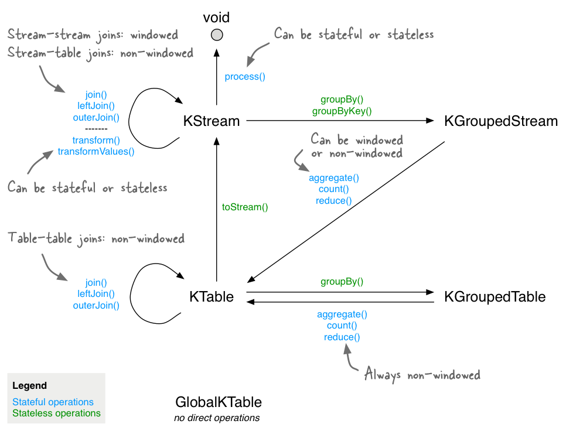
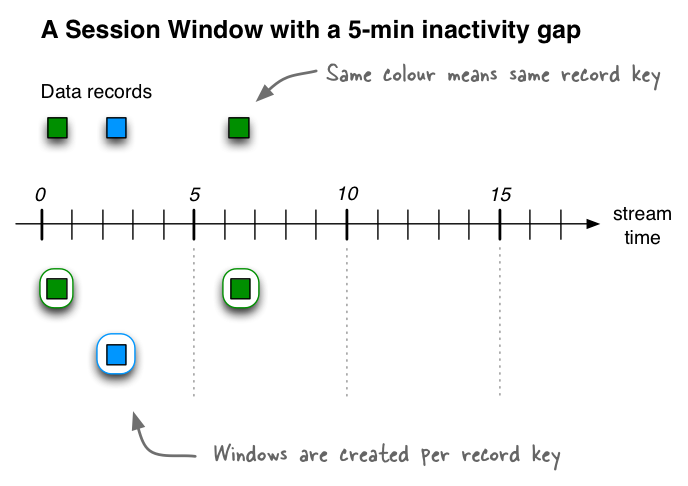
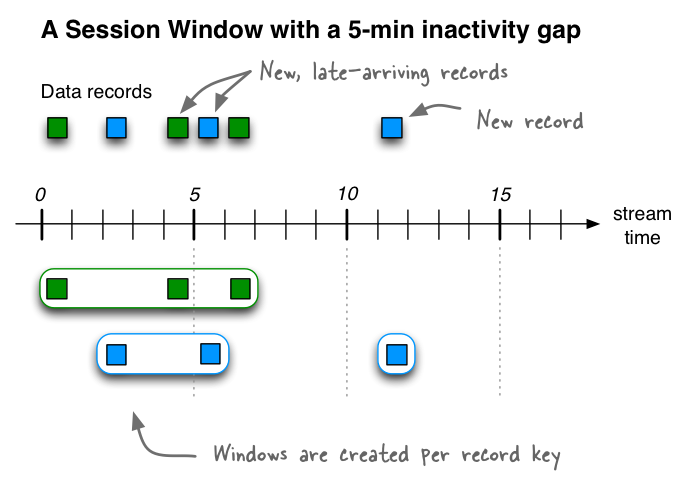

.. _streams_developer-guide_dsl:

`Streams DSL <#streams-dsl>`__
==============================

The Kafka Streams DSL (Domain Specific Language) is built on top of the
Streams Processor API. It is the recommended for most users, especially
beginners. Most data processing operations can be expressed in just a
few lines of DSL code.

**Table of Contents**

.. contents::
   :local:

`Overview <#overview>`__
------------------------

In comparison to the `Processor
API <processor-api.html#streams-developer-guide-processor-api>`__, only
the DSL supports:

-  Built-in abstractions for `streams and
   tables <../concepts.html#streams-concepts-duality>`__ in the form of
   `KStream <../concepts.html#streams-concepts-kstream>`__,
   `KTable <../concepts.html#streams-concepts-ktable>`__, and
   `GlobalKTable <../concepts.html#streams-concepts-globalktable>`__.
   Having first-class support for streams and tables is crucial because,
   in practice, most use cases require not just either streams or
   databases/tables, but a combination of both. For example, if your use
   case is to create a customer 360-degree view that is updated in
   real-time, what your application will be doing is transforming many
   input *streams* of customer-related events into an output *table*
   that contains a continuously updated 360-degree view of your
   customers.
-  Declarative, functional programming style with `stateless
   transformations <#streams-developer-guide-dsl-transformations-stateless>`__
   (e.g. ``map`` and ``filter``) as well as `stateful
   transformations <#streams-developer-guide-dsl-transformations-stateful>`__
   such as `aggregations <#streams-developer-guide-dsl-aggregating>`__
   (e.g. ``count`` and ``reduce``),
   `joins <#streams-developer-guide-dsl-joins>`__ (e.g. ``leftJoin``),
   and `windowing <#streams-developer-guide-dsl-windowing>`__ (e.g.
   `session windows <#windowing-session>`__).

With the DSL, you can define `processor
topologies <../concepts.html#streams-concepts-processor-topology>`__
(i.e., the logical processing plan) in your application. The steps to
accomplish this are:

#. Specify `one or more input streams that are read from Kafka
   topics <#streams-developer-guide-dsl-sources>`__.
#. Compose
   `transformations <#streams-developer-guide-dsl-transformations>`__ on
   these streams.
#. Write the `resulting output streams back to Kafka
   topics <#streams-developer-guide-dsl-destinations>`__, or expose the
   processing results of your application directly to other applications
   through `interactive
   queries <interactive-queries.html#streams-developer-guide-interactive-queries>`__
   (e.g., via a REST API).

After the application is run, the defined processor topologies are
continuously executed (i.e., the processing plan is put into action). A
step-by-step guide for writing a stream processing application using the
DSL is provided below.

For a complete list of available API functionality, see also the
:javadoc:`Kafka Streams Javadocs|org/apache/kafka/streams/KafkaStreams.html`.

.. contents:: Table of Contents
   :local:
    :depth: 3

.. _streams_developer-guide_dsl_sources:

`Creating source streams from Kafka <#creating-source-streams-from-kafka>`__
----------------------------------------------------------------------------

You can easily read data from Kafka topics into your application. The
following operations are supported.

+--------------------------------+-------------------------------------------------------------------------------------------------------------------+
| Reading from Kafka             | Description                                                                                                       |
+================================+===================================================================================================================+
| **Stream**                     | Creates a :ref:`KStream <streams_concepts_kstream>` from the specified Kafka input topics and interprets the data |
|                                | as a :ref:`record stream <streams_concepts_kstream>`.                                                             |
|                                | A ``KStream`` represents a *partitioned* record stream.                                                           |
|                                | :streams-apidocs-streamsbuilder:`(details)|#stream(java.lang.String)`                                             |
| - *input topics* → KStream     |                                                                                                                   |
|                                | In the case of a KStream, the local KStream instance of every application instance will                           |
|                                | be populated with data from only **a subset** of the partitions of the input topic.  Collectively, across         |
|                                | all application instances, all input topic partitions are read and processed.                                     |
|                                |                                                                                                                   |
|                                | .. literalinclude:: api-dsl-stream.java                                                                           |
|                                |    :language: java                                                                                                |
|                                |                                                                                                                   |
|                                | If you do not specify SerDes explicitly, the default SerDes from the                                              |
|                                | :ref:`configuration <streams_developer-guide_configuration>` are used.                                            |
|                                |                                                                                                                   |
|                                | You **must specify SerDes explicitly** if the key or value types of the records in the Kafka input                |
|                                | topics do not match the configured default SerDes. For information about configuring default SerDes, available    |
|                                | SerDes, and implementing your own custom SerDes see :ref:`streams_developer-guide_serdes`.                        |
|                                |                                                                                                                   |
|                                | Several variants of ``stream`` exist, for example to specify a regex pattern for input topics to read from).      |
+--------------------------------+-------------------------------------------------------------------------------------------------------------------+
| **Table**                      | Reads the specified Kafka input topic into a :ref:`KTable <streams_concepts_ktable>`.  The topic is               |
|                                | interpreted as a changelog stream, where records with the same key are interpreted as UPSERT aka INSERT/UPDATE    |
|                                | (when the record value is not ``null``) or as DELETE (when the value is ``null``) for that key.                   |
|                                | :streams-apidocs-streamsbuilder:`(details)|#table-java.lang.String(java.lang.String)`                             |
| - *input topic* → KTable       |                                                                                                                   |
|                                | In the case of a KTable, the local KTable instance of every application instance will                             |
|                                | be populated with data from only **a subset** of the partitions of the input topic.  Collectively, across         |
|                                | all application instances, all input topic partitions are read and processed.                                     |
|                                |                                                                                                                   |
|                                | You must provide a name for the table (more precisely, for the internal                                           |
|                                | :ref:`state store <streams_architecture_state>` that backs the table).  This is required for                      |
|                                | supporting :ref:`interactive queries <streams_developer-guide_interactive-queries>` against the table. When a     |
|                                | name is not provided the table will not queryable and an internal name will be provided for the state store.      |
|                                |                                                                                                                   |
|                                | If you do not specify SerDes explicitly, the default SerDes from the                                              |
|                                | :ref:`configuration <streams_developer-guide_configuration>` are used.                                            |
|                                |                                                                                                                   |
|                                | You **must specify SerDes explicitly** if the key or value types of the records in the Kafka input                |
|                                | topics do not match the configured default SerDes. For information about configuring default SerDes, available    |
|                                | SerDes, and implementing your own custom SerDes see :ref:`streams_developer-guide_serdes`.                        |
|                                |                                                                                                                   |
|                                | Several variants of ``table`` exist, for example to specify the ``auto.offset.reset`` policy to be used when      |
|                                | reading from the input topic.                                                                                     |
|                                |                                                                                                                   |
+--------------------------------+-------------------------------------------------------------------------------------------------------------------+
| **Global Table**               | Reads the specified Kafka input topic into a :ref:`GlobalKTable <streams_concepts_globalktable>`.  The topic is   |
|                                | interpreted as a changelog stream, where records with the same key are interpreted as UPSERT aka INSERT/UPDATE    |
|                                | (when the record value is not ``null``) or as DELETE (when the value is ``null``) for that key.                   |
|                                | :streams-apidocs-streamsbuilder:`(details)|#globalTable-java.lang.String(java.lang.String)`                       |
| - *input topic* → GlobalKTable |                                                                                                                   |
|                                | In the case of a GlobalKTable, the local GlobalKTable instance of every application instance will                 |
|                                | be populated with data from all input topic partitions.  Collectively, across                                     |
|                                | all application instances, all input topic partitions are consumed by all instances of the application.           |
|                                |                                                                                                                   |
|                                | You must provide a name for the table (more precisely, for the internal                                           |
|                                | :ref:`state store <streams_architecture_state>` that backs the table).  This is required for                      |
|                                | supporting :ref:`interactive queries <streams_developer-guide_interactive-queries>` against the table. When a     |
|                                | name is not provided the table will not queryable and an internal name will be provided for the state store.      |
|                                |                                                                                                                   |
|                                | .. literalinclude:: api-dsl-globalTable.java                                                                      |
|                                |    :language: java                                                                                                |
|                                |                                                                                                                   |
|                                | You **must specify SerDes explicitly** if the key or value types of the records in the Kafka input                |
|                                | topics do not match the configured default SerDes. For information about configuring default SerDes, available    |
|                                | SerDes, and implementing your own custom SerDes see :ref:`streams_developer-guide_serdes`.                        |
|                                |                                                                                                                   |
|                                | Several variants of ``globalTable`` exist to e.g. specify explicit SerDes.                                        |
+--------------------------------+-------------------------------------------------------------------------------------------------------------------+

`Transform a stream <#transform-a-stream>`__
--------------------------------------------

The KStream and KTable interfaces support a variety of transformation
operations. Each of these operations can be translated into one or more
connected processors into the underlying processor topology. Since
KStream and KTable are strongly typed, all of these transformation
operations are defined as generic functions where users could specify
the input and output data types.

Some KStream transformations may generate one or more KStream objects,
for example: - ``filter`` and ``map`` on a KStream will generate another
KStream - ``branch`` on KStream can generate multiple KStreams

Some others may generate a KTable object, for example an aggregation of
a KStream also yields a KTable. This allows Kafka Streams to
continuously update the computed value upon arrivals of `late
records <../concepts.html#streams-concepts-aggregations>`__ after it has
already been produced to the downstream transformation operators.

All KTable transformation operations can only generate another KTable.
However, the Kafka Streams DSL does provide a special function that
converts a KTable representation into a KStream. All of these
transformation methods can be chained together to compose a complex
processor topology.

These transformation operations are described in the following
subsections:

-  `Stateless
   transformations <#streams-developer-guide-dsl-transformations-stateless>`__
-  `Stateful
   transformations <#streams-developer-guide-dsl-transformations-stateful>`__

`Stateless transformations <#stateless-transformations>`__
----------------------------------------------------------

Stateless transformations do not require state for processing and they
do not require a state store associated with the stream processor. Kafka
0.11.0 and later allows you to materialize the result from a stateless
``KTable`` transformation. This allows the result to be queried through
`interactive
queries <interactive-queries.html#streams-developer-guide-interactive-queries>`__.
To materialize a ``KTable``, each of the below stateless operations `can
be
augmented <interactive-queries.html#streams-developer-guide-interactive-queries-local-key-value-stores>`__
with an optional ``queryableStoreName`` argument.

+--------------------------------+-------------------------------------------------------------------------------------------------------------------+
| Transformation                 | Description                                                                                                       |
+================================+===================================================================================================================+
| **Branch**                     | Branch (or split) a ``KStream`` based on the supplied predicates into one or more ``KStream`` instances.          |
|                                | (:streams-apidocs-kstream:`details|#branch-org.apache.kafka.streams.kstream.Predicate...-`)                       |
| - KStream → KStream[]          |                                                                                                                   |
|                                | Predicates are evaluated in order.  A record is placed to one and only one output stream on the first match:      |
|                                | if the n-th predicate evaluates to true, the record is placed to n-th stream.  If no predicate matches, the       |
|                                | the record is dropped.                                                                                            |
|                                |                                                                                                                   |
|                                | Branching is useful, for example, to route records to different downstream topics.                                |
|                                |                                                                                                                   |
|                                | .. literalinclude:: api-dsl-branch.java                                                                           |
|                                |    :language: java                                                                                                |
+--------------------------------+-------------------------------------------------------------------------------------------------------------------+
| **Filter**                     | Evaluates a boolean function for each element and retains those for which the function returns true.              |
|                                | (:streams-apidocs-kstream:`KStream details|#filter-org.apache.kafka.streams.kstream.Predicate-`,                  |
|                                | :streams-apidocs-ktable:`KTable details|#filter-org.apache.kafka.streams.kstream.Predicate-`)                     |
| - KStream → KStream            |                                                                                                                   |
| - KTable → KTable              |                                                                                                                   |
|                                | .. literalinclude:: api-dsl-filter.java                                                                           |
|                                |    :language: java                                                                                                |
+--------------------------------+-------------------------------------------------------------------------------------------------------------------+
| **Inverse Filter**             | Evaluates a boolean function for each element and drops those for which the function returns true.                |
|                                | (:streams-apidocs-kstream:`KStream details|#filterNot-org.apache.kafka.streams.kstream.Predicate-`,               |
|                                | :streams-apidocs-ktable:`KTable details|#filterNot-org.apache.kafka.streams.kstream.Predicate-`)                  |
| - KStream → KStream            |                                                                                                                   |
| - KTable → KTable              |                                                                                                                   |
|                                | .. literalinclude:: api-dsl-filterNot.java                                                                        |
|                                |    :language: java                                                                                                |
+--------------------------------+-------------------------------------------------------------------------------------------------------------------+
| **FlatMap**                    | Takes one record and produces zero, one, or more records.  You can modify the record keys and values, including   |
|                                | their types.                                                                                                      |
|                                | (:streams-apidocs-kstream:`details|#flatMap-org.apache.kafka.streams.kstream.KeyValueMapper-`)                    |
| - KStream → KStream            |                                                                                                                   |
|                                | **Marks the stream for data re-partitioning:**                                                                    |
|                                | Applying a grouping or a join after ``flatMap`` will result in re-partitioning of the records.                    |
|                                | If possible use ``flatMapValues`` instead, which will not cause data re-partitioning.                             |
|                                |                                                                                                                   |
|                                | .. literalinclude:: api-dsl-flatMap.java                                                                          |
|                                |    :language: java                                                                                                |
+--------------------------------+-------------------------------------------------------------------------------------------------------------------+
| **FlatMap (values only)**      | Takes one record and produces zero, one, or more records, while retaining the key of the original record.         |
|                                | You can modify the record values and the value type.                                                              |
|                                | (:streams-apidocs-kstream:`details|#flatMapValues-org.apache.kafka.streams.kstream.ValueMapper-`)                 |
| - KStream → KStream            |                                                                                                                   |
|                                | ``flatMapValues`` is preferable to ``flatMap`` because it will not cause data re-partitioning.  However, you      |
|                                | cannot modify the key or key type like ``flatMap`` does.                                                          |
|                                |                                                                                                                   |
|                                | .. literalinclude:: api-dsl-flatMapValues.java                                                                    |
|                                |    :language: java                                                                                                |
+--------------------------------+-------------------------------------------------------------------------------------------------------------------+
| **Foreach**                    | **Terminal operation.**  Performs a stateless action on each record.                                              |
|                                | (:streams-apidocs-kstream:`details|#foreach-org.apache.kafka.streams.kstream.ForeachAction-`)                     |
|                                |                                                                                                                   |
| - KStream → void               |                                                                                                                   |
|                                |                                                                                                                   |
|                                | You would use ``foreach`` to cause *side effects* based on the input data (similar to ``peek``) and then *stop*   |
|                                | *further processing* of the input data (unlike ``peek``, which is not a terminal operation).                      |
|                                |                                                                                                                   |
|                                | **Note on processing guarantees:** Any side effects of an action (such as writing to external systems) are not    |
|                                | trackable by Kafka, which means they will typically not benefit from  Kafka's processing guarantees.              |
| - KStream → void               |                                                                                                                   |
| - KTable → void                |                                                                                                                   |
|                                | .. literalinclude:: api-dsl-foreach.java                                                                          |
|                                |    :language: java                                                                                                |
+--------------------------------+-------------------------------------------------------------------------------------------------------------------+
| **GroupByKey**                 | Groups the records by the existing key.                                                                           |
|                                | (:streams-apidocs-kstream:`details|#groupByKey--`)                                                                |
| - KStream → KGroupedStream     |                                                                                                                   |
|                                | Grouping is a prerequisite for :ref:`aggregating a stream or a table <streams_developer-guide_dsl_aggregating>`   |
|                                | and ensures that data is properly partitioned ("keyed") for subsequent operations.                                |
|                                |                                                                                                                   |
|                                | **When to set explicit SerDes:**                                                                                  |
|                                | Variants of ``groupByKey`` exist to override the configured default SerDes of your application, which **you**     |
|                                | **must do** if the key and/or value types of the resulting ``KGroupedStream`` do not match the configured default |
|                                | SerDes.                                                                                                           |
|                                |                                                                                                                   |
|                                | .. note::                                                                                                         |
|                                |   **Grouping vs. Windowing:**                                                                                     |
|                                |   A related operation is :ref:`windowing <streams_developer-guide_dsl_windowing>`, which lets you control how to  |
|                                |   "sub-group" the grouped records *of the same key* into so-called *windows* for stateful operations such as      |
|                                |   windowed :ref:`aggregations <streams_developer-guide_dsl_aggregating>` or                                       |
|                                |   windowed :ref:`joins <streams_developer-guide_dsl_joins>`.                                                      |
|                                |                                                                                                                   |
|                                | **Causes data re-partitioning if and only if the stream was marked for re-partitioning.**                         |
|                                | ``groupByKey`` is preferable to ``groupBy`` because it re-partitions data only if the stream was already marked   |
|                                | for re-partitioning. However, ``groupByKey`` does not allow you to modify the key or key type like ``groupBy``    |
|                                | does.                                                                                                             |
|                                |                                                                                                                   |
|                                | .. literalinclude:: api-dsl-groupByKey.java                                                                       |
|                                |    :language: java                                                                                                |
+--------------------------------+-------------------------------------------------------------------------------------------------------------------+
| **GroupBy**                    | Groups the records by a *new* key, which may be of a different key type.                                          |
|                                | When grouping a table, you may also specify a new value and value type.                                           |
|                                | ``groupBy`` is a shorthand for ``selectKey(...).groupByKey()``.                                                   |
|                                | (:streams-apidocs-kstream:`KStream details|#groupBy-org.apache.kafka.streams.kstream.KeyValueMapper-`,            |
|                                | :streams-apidocs-ktable:`KTable details|#groupBy-org.apache.kafka.streams.kstream.KeyValueMapper-`)               |
| - KStream → KGroupedStream     |                                                                                                                   |
| - KTable → KGroupedTable       |                                                                                                                   |
|                                | Grouping is a prerequisite for :ref:`aggregating a stream or a table <streams_developer-guide_dsl_aggregating>`   |
|                                | and ensures that data is properly partitioned ("keyed") for subsequent operations.                                |
|                                |                                                                                                                   |
|                                | **When to set explicit SerDes:**                                                                                  |
|                                | Variants of ``groupBy`` exist to override the configured default SerDes of your application, which **you must**   |
|                                | **do** if the key and/or value types of the resulting ``KGroupedStream`` or ``KGroupedTable`` do not match the    |
|                                | configured default SerDes.                                                                                        |
|                                |                                                                                                                   |
|                                | .. note::                                                                                                         |
|                                |   **Grouping vs. Windowing:**                                                                                     |
|                                |   A related operation is :ref:`windowing <streams_developer-guide_dsl_windowing>`, which lets you control how to  |
|                                |   "sub-group" the grouped records *of the same key* into so-called *windows* for stateful operations such as      |
|                                |   windowed :ref:`aggregations <streams_developer-guide_dsl_aggregating>` or                                       |
|                                |   windowed :ref:`joins <streams_developer-guide_dsl_joins>`.                                                      |
|                                |                                                                                                                   |
|                                | **Always causes data re-partitioning:**  ``groupBy`` always causes data re-partitioning.                          |
|                                | If possible use ``groupByKey`` instead, which will re-partition data only if required.                            |
|                                |                                                                                                                   |
|                                | .. literalinclude:: api-dsl-groupBy.java                                                                          |
|                                |    :language: java                                                                                                |
+--------------------------------+-------------------------------------------------------------------------------------------------------------------+
| **Map**                        | Takes one record and produces one record.  You can modify the record key and value, including their types.        |
|                                | (:streams-apidocs-kstream:`details|#map-org.apache.kafka.streams.kstream.KeyValueMapper-`)                        |
| - KStream → KStream            |                                                                                                                   |
|                                | **Marks the stream for data re-partitioning:**                                                                    |
|                                | Applying a grouping or a join after ``map`` will result in re-partitioning of the records.                        |
|                                | If possible use ``mapValues`` instead, which will not cause data re-partitioning.                                 |
|                                |                                                                                                                   |
|                                | .. literalinclude:: api-dsl-map.java                                                                              |
|                                |    :language: java                                                                                                |
+--------------------------------+-------------------------------------------------------------------------------------------------------------------+
| **Map (values only)**          | Takes one record and produces one record, while retaining the key of the original record.                         |
|                                | You can modify the record value and the value type.                                                               |
|                                | (:streams-apidocs-kstream:`KStream details|#mapValues-org.apache.kafka.streams.kstream.ValueMapper-`,             |
|                                | :streams-apidocs-ktable:`KTable details|#mapValues-org.apache.kafka.streams.kstream.ValueMapper-`)                |
|                                |                                                                                                                   |
|                                | ``mapValues`` is preferable to ``map`` because it will not cause data re-partitioning.  However, it does not      |
|                                | allow you to modify the key or key type like ``map`` does.                                                        |
| - KStream → KStream            |                                                                                                                   |
| - KTable → KTable              |                                                                                                                   |
|                                | .. literalinclude:: api-dsl-mapValues.java                                                                        |
|                                |    :language: java                                                                                                |
+--------------------------------+-------------------------------------------------------------------------------------------------------------------+
| **Peek**                       | Performs a stateless action on each record, and returns an unchanged stream.                                      |
|                                | (:streams-apidocs-kstream:`details|#peek-org.apache.kafka.streams.kstream.ForeachAction-`)                        |
| - KStream → KStream            |                                                                                                                   |
|                                | You would use ``peek`` to cause *side effects* based on the input data (similar to ``foreach``) and *continue*    |
|                                | *processing* the input data (unlike ``foreach``, which is a terminal operation).  ``peek`` returns the input      |
|                                | stream as-is;  if you need to modify the input stream, use ``map`` or ``mapValues`` instead.                      |
|                                |                                                                                                                   |
|                                | ``peek`` is helpful for use cases such as logging or tracking metrics or for debugging and troubleshooting.       |
|                                |                                                                                                                   |
|                                | **Note on processing guarantees:** Any side effects of an action (such as writing to external systems) are not    |
|                                | trackable by Kafka, which means they will typically not benefit from Kafka's processing guarantees.               |
|                                |                                                                                                                   |
|                                | .. literalinclude:: api-dsl-peek.java                                                                             |
|                                |    :language: java                                                                                                |
+--------------------------------+-------------------------------------------------------------------------------------------------------------------+
| **Print**                      | **Terminal operation.**  Prints the records to ``System.out``.  See Javadocs for serde and ``toString()``         |
|                                | caveats.                                                                                                          |
|                                | (:streams-apidocs-kstream:`details|#print--`)                                                                     |
|                                |                                                                                                                   |
| - KStream → void               | Calling ``print()`` is the same as calling ``foreach((key, value) -> System.out.println(key + ", " + value))``    |
|                                |                                                                                                                   |
|                                | .. literalinclude:: api-dsl-print.java                                                                            |
|                                |    :language: java                                                                                                |
+--------------------------------+-------------------------------------------------------------------------------------------------------------------+
| **SelectKey**                  | Assigns a new key -- possibly of a new key type -- to each record.                                                |
|                                | (:streams-apidocs-kstream:`details|#selectKey-org.apache.kafka.streams.kstream.KeyValueMapper-`)                  |
|                                |                                                                                                                   |
|                                | Calling ``selectKey(mapper)`` is the same as calling ``map((key, value) -> mapper(key, value), value)``.          |
|                                |                                                                                                                   |
|                                | **Marks the stream for data re-partitioning:**                                                                    |
|                                | Applying a grouping or a join after ``selectKey`` will result in re-partitioning of the records.                  |
| - KStream → KStream            |                                                                                                                   |
|                                | .. literalinclude:: api-dsl-selectKey.java                                                                        |
|                                |    :language: java                                                                                                |
+--------------------------------+-------------------------------------------------------------------------------------------------------------------+
| **Table to Stream**            | Get the changelog stream of this table.                                                                           |
|                                | (:streams-apidocs-ktable:`details|#toStream--`)                                                                   |
| - KTable → KStream             |                                                                                                                   |
|                                | .. literalinclude:: api-dsl-toStream.java                                                                         |
|                                |    :language: java                                                                                                |
+--------------------------------+-------------------------------------------------------------------------------------------------------------------+

`Stateful transformations <#stateful-transformations>`__
--------------------------------------------------------

Stateful transformations depend on state for processing inputs and
producing outputs and require a `state
store <../architecture.html#streams-architecture-state>`__ associated
with the stream processor. For example, in aggregating operations, a
windowing state store is used to collect the latest aggregation results
per window. In join operations, a windowing state store is used to
collect all of the records received so far within the defined window
boundary.

Note, that state stores are fault-tolerant. In case of failure, Kafka
Streams guarantees to fully restore all state stores prior to resuming
the processing. See `Fault
Tolerance <../architecture.html#streams-architecture-fault-tolerance>`__
for further information.

Available stateful transformations in the DSL include:

-  `Aggregating <#streams-developer-guide-dsl-aggregating>`__
-  `Joining <#streams-developer-guide-dsl-joins>`__
-  `Windowing <#streams-developer-guide-dsl-windowing>`__ (as part of
   aggregations and joins)
-  `Applying custom processors and
   transformers <#streams-developer-guide-dsl-process>`__, which may be
   stateful, for Processor API integration

The following diagram shows their relationships:

Here is an example of a stateful application: the WordCount algorithm.

WordCount example in Java 8+, using lambda expressions:

.. code:: bash

    // Assume the record values represent lines of text.  For the sake of this example, you can ignore
    // whatever may be stored in the record keys.
    KStream<String, String> textLines = ...;

    KStream<String, Long> wordCounts = textLines
        // Split each text line, by whitespace, into words.  The text lines are the record
        // values, i.e. you can ignore whatever data is in the record keys and thus invoke
        // `flatMapValues` instead of the more generic `flatMap`.
        .flatMapValues(value -> Arrays.asList(value.toLowerCase().split("\\W+")))
        // Group the stream by word to ensure the key of the record is the word.
        .groupBy((key, word) -> word)
        // Count the occurrences of each word (record key).
        //
        // This will change the stream type from `KGroupedStream<String, String>` to
        // `KTable<String, Long>` (word -> count).
        .count()
        // Convert the `KTable<String, Long>` into a `KStream<String, Long>`.
        .toStream();

WordCount example in Java 7:

.. code:: bash

    // Code below is equivalent to the previous Java 8+ example above.
    KStream<String, String> textLines = ...;

    KStream<String, Long> wordCounts = textLines
        .flatMapValues(new ValueMapper<String, Iterable<String>>() {
            @Override
            public Iterable<String> apply(String value) {
                return Arrays.asList(value.toLowerCase().split("\\W+"));
            }
        })
        .groupBy(new KeyValueMapper<String, String, String>>() {
            @Override
            public String apply(String key, String word) {
                return word;
            }
        })
        .count()
        .toStream();

`Aggregating <#aggregating>`__
------------------------------

After records are
`grouped <#streams-developer-guide-dsl-transformations-stateless>`__ by
key via ``groupByKey`` or ``groupBy`` – and thus represented as either a
``KGroupedStream`` or a ``KGroupedTable``, they can be aggregated via an
operation such as ``reduce``. Aggregations are key-based operations,
which means that they always operate over records (notably record
values) of the same key. You can perform aggregations on
`windowed <#streams-developer-guide-dsl-windowing>`__ or non-windowed
data.

+--------------------------------+-------------------------------------------------------------------------------------------------------------------+
| Transformation                 | Description                                                                                                       |
+================================+===================================================================================================================+
| **Aggregate**                  | **Rolling aggregation.** Aggregates the values of (non-windowed) records by the grouped key.                      |
|                                | Aggregating is a generalization of ``reduce`` and allows, for example, the aggregate value to have a different    |
|                                | type than the input values.                                                                                       |
|                                | (:streams-apidocs-kgroupedstream:`KGroupedStream details|`,                                                       |
|                                | :streams-apidocs-kgroupedtable:`KGroupedTable details|`)                                                          |
| - KGroupedStream → KTable      |                                                                                                                   |
| - KGroupedTable → KTable       |                                                                                                                   |
|                                | When aggregating a *grouped stream*, you must provide an initializer (e.g., ``aggValue = 0``) and an "adder"      |
|                                | aggregator (e.g., ``aggValue + curValue``).  When aggregating a *grouped table*, you must provide a               |
|                                | "subtractor" aggregator (think: ``aggValue - oldValue``).                                                         |
|                                |                                                                                                                   |
|                                | Several variants of ``aggregate`` exist, see Javadocs for details.                                                |
|                                |                                                                                                                   |
|                                | .. literalinclude:: api-dsl-aggregate.java                                                                        |
|                                |    :language: java                                                                                                |
|                                |                                                                                                                   |
|                                | Detailed behavior of ``KGroupedStream``:                                                                          |
|                                |                                                                                                                   |
|                                | - Input records with ``null`` keys are ignored.                                                                   |
|                                | - When a record key is received for the first time, the initializer is called (and called before the adder).      |
|                                | - Whenever a record with a non-``null`` value is received, the adder is called.                                   |
|                                |                                                                                                                   |
|                                | Detailed behavior of ``KGroupedTable``:                                                                           |
|                                |                                                                                                                   |
|                                | - Input records with ``null`` keys are ignored.                                                                   |
|                                | - When a record key is received for the first time, the initializer is called (and called before the adder        |
|                                |   and subtractor).  Note that, in contrast to ``KGroupedStream``, over time the initializer may be called         |
|                                |   more than once for a key as a result of having received input tombstone records for that key (see below).       |
|                                | - When the first non-``null`` value is received for a key (e.g.,  INSERT), then only the adder is called.         |
|                                | - When subsequent non-``null`` values are received for a key (e.g.,  UPDATE), then (1) the subtractor is          |
|                                |   called with the old value as stored in the table and (2) the adder is called with the new value of the          |
|                                |   input record that was just received.  The order of execution for the subtractor and adder is not defined.       |
|                                | - When a tombstone record -- i.e. a record with a ``null`` value -- is received for a key (e.g.,  DELETE),        |
|                                |   then only the subtractor is called.  Note that, whenever the subtractor returns a ``null`` value itself,        |
|                                |   then the corresponding key is removed from the resulting ``KTable``.  If that happens, any next input           |
|                                |   record for that key will trigger the initializer again.                                                         |
|                                |                                                                                                                   |
|                                | See the example at the bottom of this section for a visualization of the aggregation semantics.                   |
+--------------------------------+-------------------------------------------------------------------------------------------------------------------+
| **Aggregate (windowed)**       | **Windowed aggregation.**                                                                                         |
|                                | Aggregates the values of records, :ref:`per window <streams_developer-guide_dsl_windowing>`, by the grouped key.  |
|                                | Aggregating is a generalization of ``reduce`` and allows, for example, the aggregate value to have a different    |
|                                | type than the input values.                                                                                       |
|                                | (:streams-apidocs-timewindowedkstream:`TimeWindowedKStream details|`,                                             |
|                                | :streams-apidocs-sessionwindowedkstream:`SessionWindowedKStream details|`)                                        |
| - KGroupedStream → KTable      |                                                                                                                   |
|                                | You must provide an initializer (e.g.,  ``aggValue = 0``), "adder" aggregator (e.g.,  ``aggValue + curValue``),   |
|                                | and a window.  When windowing based on sessions, you must additionally provide a "session merger" aggregator      |
|                                | (e.g.,  ``mergedAggValue = leftAggValue + rightAggValue``).                                                       |
|                                |                                                                                                                   |
|                                | The windowed ``aggregate`` turns a ``TimeWindowedKStream<K, V>`` or ``SessionWindowdKStream<K, V>``               |
|                                | into a windowed ``KTable<Windowed<K>, V>``.                                                                       |
|                                |                                                                                                                   |
|                                | Several variants of ``aggregate`` exist, see Javadocs for details.                                                |
|                                |                                                                                                                   |
|                                | .. literalinclude:: api-dsl-aggregateWindowed.java                                                                |
|                                |    :language: java                                                                                                |
|                                |                                                                                                                   |
|                                | Detailed behavior:                                                                                                |
|                                |                                                                                                                   |
|                                | - The windowed aggregate behaves similar to the rolling aggregate described above.  The additional twist is that  |
|                                |   the behavior applies *per window*.                                                                              |
|                                | - Input records with ``null`` keys are ignored in general.                                                        |
|                                | - When a record key is received for the first time for a given window, the initializer is called (and called      |
|                                |   before the adder).                                                                                              |
|                                | - Whenever a record with a non-``null`` value is received for a given window, the adder is called.                |
|                                |   (Note: As a result of a known bug in Kafka 0.11.0.0, the adder is currently also called for ``null`` values.    |
|                                |   You can work around this, for example, by manually filtering out ``null`` values prior to grouping the stream.) |
|                                | - When using session windows: the session merger is called whenever two sessions are being merged.                |
|                                |                                                                                                                   |
|                                | See the example at the bottom of this section for a visualization of the aggregation semantics.                   |
+--------------------------------+-------------------------------------------------------------------------------------------------------------------+
| **Count**                      | **Rolling aggregation.** Counts the number of records by the grouped key.                                         |
|                                | (:streams-apidocs-kgroupedstream:`KGroupedStream details|`,                                                       |
|                                | :streams-apidocs-kgroupedtable:`KGroupedTable details|`)                                                          |
| - KGroupedStream → KTable      |                                                                                                                   |
| - KGroupedTable → KTable       |                                                                                                                   |
|                                | Several variants of ``count`` exist, see Javadocs for details.                                                    |
|                                |                                                                                                                   |
|                                | .. literalinclude:: api-dsl-count.java                                                                            |
|                                |    :language: java                                                                                                |
|                                |                                                                                                                   |
|                                | Detailed behavior for ``KGroupedStream``:                                                                         |
|                                |                                                                                                                   |
|                                | - Input records with ``null`` keys or values are ignored.                                                         |
|                                |                                                                                                                   |
|                                | Detailed behavior for ``KGroupedTable``:                                                                          |
|                                |                                                                                                                   |
|                                | - Input records with ``null`` keys are ignored.  Records with ``null`` values are not ignored but interpreted     |
|                                |   as "tombstones" for the corresponding key, which indicate the deletion of the key from the table.               |
+--------------------------------+-------------------------------------------------------------------------------------------------------------------+
| **Count (windowed)**           | **Windowed aggregation.**                                                                                         |
|                                | Counts the number of records, :ref:`per window <streams_developer-guide_dsl_windowing>`, by the grouped key.      |
|                                | (:streams-apidocs-timewindowedkstream:`TimeWindowedKStream details|`,                                             |
|                                | :streams-apidocs-sessionwindowedkstream:`SessionWindowedKStream details|`)                                        |
| - KGroupedStream → KTable      |                                                                                                                   |
|                                | The windowed ``count`` turns a ``TimeWindowedKStream<K, V>`` or ``SessionWindowedKStream<K, V>``                  |
|                                | into a windowed ``KTable<Windowed<K>, V>``.                                                                       |
|                                |                                                                                                                   |
|                                | Several variants of ``count`` exist, see Javadocs for details.                                                    |
|                                |                                                                                                                   |
|                                | .. literalinclude:: api-dsl-countWindowed.java                                                                    |
|                                |    :language: java                                                                                                |
|                                |                                                                                                                   |
|                                | Detailed behavior:                                                                                                |
|                                |                                                                                                                   |
|                                | - Input records with ``null`` keys or values are ignored.                                                         |
|                                |   (Note: As a result of a known bug in Kafka 0.11.0.0, records with ``null`` values are not ignored yet.          |
|                                |   You can work around this, for example, by manually filtering out ``null`` values prior to grouping the stream.) |
+--------------------------------+-------------------------------------------------------------------------------------------------------------------+
| **Reduce**                     | **Rolling aggregation.** Combines the values of (non-windowed) records by the grouped key.                        |
|                                | The current record value is combined with the last reduced value, and a new reduced value is returned.            |
|                                | The result value type cannot be changed, unlike ``aggregate``.                                                    |
|                                | (:streams-apidocs-kgroupedstream:`KGroupedStream details|`,                                                       |
|                                | :streams-apidocs-kgroupedtable:`KGroupedTable details|`)                                                          |
| - KGroupedStream → KTable      |                                                                                                                   |
| - KGroupedTable → KTable       |                                                                                                                   |
|                                | When reducing a *grouped stream*, you must provide an "adder" reducer (e.g.,  ``aggValue + curValue``).           |
|                                | When reducing a *grouped table*, you must additionally provide a "subtractor" reducer (e.g.,                      |
|                                | ``aggValue - oldValue``).                                                                                         |
|                                |                                                                                                                   |
|                                | Several variants of ``reduce`` exist, see Javadocs for details.                                                   |
|                                |                                                                                                                   |
|                                | .. literalinclude:: api-dsl-reduce.java                                                                           |
|                                |    :language: java                                                                                                |
|                                |                                                                                                                   |
|                                | Detailed behavior for ``KGroupedStream``:                                                                         |
|                                |                                                                                                                   |
|                                | - Input records with ``null`` keys are ignored in general.                                                        |
|                                | - When a record key is received for the first time, then the value of that record is used as the initial          |
|                                |   aggregate value.                                                                                                |
|                                | - Whenever a record with a non-``null`` value is received, the adder is called.                                   |
|                                |                                                                                                                   |
|                                | Detailed behavior for ``KGroupedTable``:                                                                          |
|                                |                                                                                                                   |
|                                | - Input records with ``null`` keys are ignored in general.                                                        |
|                                | - When a record key is received for the first time, then the value of that record is used as the initial          |
|                                |   aggregate value.                                                                                                |
|                                |   Note that, in contrast to ``KGroupedStream``, over time this initialization step may happen more than once      |
|                                |   for a key as a result of having received input tombstone records for that key (see below).                      |
|                                | - When the first non-``null`` value is received for a key (e.g.,  INSERT), then only the adder is called.         |
|                                | - When subsequent non-``null`` values are received for a key (e.g.,  UPDATE), then (1) the subtractor is          |
|                                |   called with the old value as stored in the table and (2) the adder is called with the new value of the          |
|                                |   input record that was just received.  The order of execution for the subtractor and adder is not defined.       |
|                                | - When a tombstone record -- i.e. a record with a ``null`` value -- is received for a key (e.g.,  DELETE),        |
|                                |   then only the subtractor is called.  Note that, whenever the subtractor returns a ``null`` value itself,        |
|                                |   then the corresponding key is removed from the resulting ``KTable``.  If that happens, any next input           |
|                                |   record for that key will re-initialize its aggregate value.                                                     |
|                                |                                                                                                                   |
|                                | See the example at the bottom of this section for a visualization of the aggregation semantics.                   |
+--------------------------------+-------------------------------------------------------------------------------------------------------------------+
| **Reduce (windowed)**          | **Windowed aggregation.**                                                                                         |
|                                | Combines the values of records, :ref:`per window <streams_developer-guide_dsl_windowing>`, by the grouped key.    |
|                                | The current record value is combined with the last reduced value, and a new reduced value is returned.            |
|                                | Records with ``null`` key or value are ignored.                                                                   |
|                                | The result value type cannot be changed, unlike ``aggregate``.                                                    |
|                                | (:streams-apidocs-timewindowedkstream:`TimeWindowedKStream details|`,                                             |
|                                | :streams-apidocs-sessionwindowedkstream:`SessionWindowedKStream details|`)                                        |
| - KGroupedStream → KTable      |                                                                                                                   |
|                                | The windowed ``reduce`` turns a turns a ``TimeWindowedKStream<K, V>`` or a ``SessionWindowedKStream<K, V>``       |
|                                | into a windowed ``KTable<Windowed<K>, V>``.                                                                       |
|                                |                                                                                                                   |
|                                | Several variants of ``reduce`` exist, see Javadocs for details.                                                   |
|                                |                                                                                                                   |
|                                | .. literalinclude:: api-dsl-reduceWindowed.java                                                                   |
|                                |    :language: java                                                                                                |
|                                |                                                                                                                   |
|                                | Detailed behavior:                                                                                                |
|                                |                                                                                                                   |
|                                | - The windowed reduce behaves similar to the rolling reduce described above.  The additional twist is that the    |
|                                |   behavior applies *per window*.                                                                                  |
|                                | - Input records with ``null`` keys are ignored in general.                                                        |
|                                | - When a record key is received for the first time for a given window, then the value of that record is used as   |
|                                |   the initial aggregate value.                                                                                    |
|                                | - Whenever a record with a non-``null`` value is received for a given window, the adder is called.                |
|                                |   (Note: As a result of a known bug in Kafka 0.11.0.0, the adder is currently also called for ``null`` values.    |
|                                |   You can work around this, for example, by manually filtering out ``null`` values prior to grouping the stream.) |
|                                |                                                                                                                   |
|                                | See the example at the bottom of this section for a visualization of the aggregation semantics.                   |
+--------------------------------+-------------------------------------------------------------------------------------------------------------------+

**Example of semantics for stream aggregations:** A ``KGroupedStream`` →
``KTable`` example is shown below. The streams and the table are
initially empty. Bold font is used in the column for “KTable
``aggregated``\ ” to highlight changed state. An entry such as
``(hello, 1)`` denotes a record with key ``hello`` and value ``1``. To
improve the readability of the semantics table you can assume that all
records are processed in timestamp order.

.. source:: code

    // Key: word, value: count
    KStream<String, Integer> wordCounts = ...;

    KGroupedStream<String, Integer> groupedStream = wordCounts
        .groupByKey(Serialized.with(Serdes.String(), Serdes.Integer()));

    KTable<String, Integer> aggregated = groupedStream.aggregate(
        () -> 0, /* initializer */
        (aggKey, newValue, aggValue) -> aggValue + newValue, /* adder */
        Materialized.<String, Long, KeyValueStore<Bytes, byte[]>as("aggregated-stream-store" /* state store name */)
          .withKeySerde(Serdes.String()) /* key serde */
          .withValueSerde(Serdes.Integer()); /* serde for aggregate value */

.. note::

   **Impact of record caches**: For illustration purposes, the column
   “KTable ``aggregated``\ ” below shows the table’s state changes over
   time in a very granular way. In practice, you would observe state
   changes in such a granular way only when `record
   caches <memory-mgmt.html#streams-developer-guide-memory-management-record-cache>`__
   are disabled (default: enabled). When record caches are enabled, what
   might happen for example is that the output results of the rows with
   timestamps 4 and 5 would be
   `compacted <memory-mgmt.html#streams-developer-guide-memory-management-record-cache>`__,
   and there would only be a single state update for the key ``kafka`` in
   the KTable (here: from ``(kafka 1)`` directly to ``(kafka, 3)``.
   Typically, you should only disable record caches for testing or
   debugging purposes – under normal circumstances it is better to leave
   record caches enabled.

+-----------+-----------------+---------------+------------------+-------------------+-----------------------+
|           | KStream ``wordCounts``          | KGroupedStream ``groupedStream``     | KTable ``aggregated`` |
+-----------+-----------------+---------------+------------------+-------------------+-----------------------+
| Timestamp | Input record    | Grouping      | Initializer      | Adder             | State                 |
+===========+=================+===============+==================+===================+=======================+
|  1        | (hello, 1)      | (hello, 1)    | 0 (for hello)    | (hello, 0 + 1)    | | **(hello, 1)**      |
+-----------+-----------------+---------------+------------------+-------------------+-----------------------+
|  2        | (kafka, 1)      | (kafka, 1)    | 0 (for kafka)    | (kafka, 0 + 1)    | | (hello, 1)          |
|           |                 |               |                  |                   | | **(kafka, 1)**      |
+-----------+-----------------+---------------+------------------+-------------------+-----------------------+
|  3        | (streams, 1)    | (streams, 1)  | 0 (for streams)  | (streams, 0 + 1)  | | (hello, 1)          |
|           |                 |               |                  |                   | | (kafka, 1)          |
|           |                 |               |                  |                   | | **(streams, 1)**    |
+-----------+-----------------+---------------+------------------+-------------------+-----------------------+
|  4        | (kafka, 1)      | (kafka, 1)    |                  | (kafka, 1 + 1)    | | (hello, 1)          |
|           |                 |               |                  |                   | | (kafka, **2**)      |
|           |                 |               |                  |                   | | (streams, 1)        |
+-----------+-----------------+---------------+------------------+-------------------+-----------------------+
|  5        | (kafka, 1)      | (kafka, 1)    |                  | (kafka, 2 + 1)    | | (hello, 1)          |
|           |                 |               |                  |                   | | (kafka, **3**)      |
|           |                 |               |                  |                   | | (streams, 1)        |
+-----------+-----------------+---------------+------------------+-------------------+-----------------------+
|  6        | (streams, 1)    | (streams, 1)  |                  | (streams, 1 + 1)  | | (hello, 1)          |
|           |                 |               |                  |                   | | (kafka, 3)          |
|           |                 |               |                  |                   | | (streams, **2**)    |
+-----------+-----------------+---------------+------------------+-------------------+-----------------------+

**Example of semantics for table aggregations:** A ``KGroupedTable`` →
``KTable`` example is shown below. The tables are initially empty. Bold
font is used in the column for “KTable ``aggregated``\ ” to highlight
changed state. An entry such as ``(hello, 1)`` denotes a record with key
``hello`` and value ``1``. To improve the readability of the semantics
table you can assume that all records are processed in timestamp order.

.. code:: bash

    // Key: username, value: user region (abbreviated to "E" for "Europe", "A" for "Asia")
    KTable<String, String> userProfiles = ...;

    // Re-group `userProfiles`.  Don't read too much into what the grouping does:
    // its prime purpose in this example is to show the *effects* of the grouping
    // in the subsequent aggregation.
    KGroupedTable<String, Integer> groupedTable = userProfiles
        .groupBy((user, region) -> KeyValue.pair(region, user.length()), Serdes.String(), Serdes.Integer());

    KTable<String, Integer> aggregated = groupedTable.aggregate(
        () -> 0, /* initializer */
        (aggKey, newValue, aggValue) -> aggValue + newValue, /* adder */
        (aggKey, oldValue, aggValue) -> aggValue - oldValue, /* subtractor */
        Materialized.<String, Long, KeyValueStore<Bytes, byte[]>as("aggregated-table-store" /* state store name */)
          .withKeySerde(Serdes.String()) /* key serde */
          .withValueSerde(Serdes.Integer()); /* serde for aggregate value */

.. note::

   **Impact of record caches**: For illustration purposes, the column
   “KTable ``aggregated``\ ” below shows the table’s state changes over
   time in a very granular way. In practice, you would observe state
   changes in such a granular way only when `record
   caches <memory-mgmt.html#streams-developer-guide-memory-management-record-cache>`__
   are disabled (default: enabled). When record caches are enabled, what
   might happen for example is that the output results of the rows with
   timestamps 4 and 5 would be
   `compacted <memory-mgmt.html#streams-developer-guide-memory-management-record-cache>`__,
   and there would only be a single state update for the key ``kafka`` in
   the KTable (here: from ``(kafka 1)`` directly to ``(kafka, 3)``.
   Typically, you should only disable record caches for testing or
   debugging purposes – under normal circumstances it is better to leave
   record caches enabled.

+-----------+-----------------+------------------+-------------+-------------+--------------+--------------+-----------------------+
|           | KTable ``userProfiles``                          | KGroupedTable ``groupedTable``            | KTable ``aggregated`` |
+-----------+-----------------+------------------+-------------+-------------+--------------+--------------+-----------------------+
| Timestamp | Input record    | Interpreted as   | Grouping    | Initializer | Adder        | Subtractor   | State                 |
+===========+=================+==================+=============+=============+==============+==============+=======================+
|  1        | (alice, E)      | INSERT alice     | (E, 5)      | 0 (for E)   | (E, 0 + 5)   |              | | **(E, 5)**          |
+-----------+-----------------+------------------+-------------+-------------+--------------+--------------+-----------------------+
|  2        | (bob, A)        | INSERT bob       | (A, 3)      | 0 (for A)   | (A, 0 + 3)   |              | | **(A, 3)**          |
|           |                 |                  |             |             |              |              | | (E, 5)              |
+-----------+-----------------+------------------+-------------+-------------+--------------+--------------+-----------------------+
|  3        | (charlie, A)    | INSERT charlie   | (A, 7)      |             | (A, 3 + 7)   |              | | (A, **10**)         |
|           |                 |                  |             |             |              |              | | (E, 5)              |
+-----------+-----------------+------------------+-------------+-------------+--------------+--------------+-----------------------+
|  4        | (alice, A)      | UPDATE alice     | (A, 5)      |             | (A, 10 + 5)  | (E, 5 - 5)   | | (A, **15**)         |
|           |                 |                  |             |             |              |              | | (E, **0**)          |
+-----------+-----------------+------------------+-------------+-------------+--------------+--------------+-----------------------+
|  5        | (charlie, null) | DELETE charlie   | (null, 7)   |             |              | (A, 15 - 7)  | | (A, **8**)          |
|           |                 |                  |             |             |              |              | | (E, 0)              |
+-----------+-----------------+------------------+-------------+-------------+--------------+--------------+-----------------------+
|  6        | (null, E)       | *ignored*        |             |             |              |              | | (A, 8)              |
|           |                 |                  |             |             |              |              | | (E, 0)              |
+-----------+-----------------+------------------+-------------+-------------+--------------+--------------+-----------------------+
|  7        | (bob, E)        | UPDATE bob       | (E, 3)      |             | (E, 0 + 3)   | (A, 8 - 3)   | | (A, **5**)          |
|           |                 |                  |             |             |              |              | | (E, **3**)          |
+-----------+-----------------+------------------+-------------+-------------+--------------+--------------+-----------------------+

`Joining <#joining>`__
----------------------

Streams and tables can also be joined. Many stream processing
applications in practice are coded as streaming joins. For example,
applications backing an online shop might need to access multiple,
updating database tables (e.g. sales prices, inventory, customer
information) in order to enrich a new data record (e.g. customer
transaction) with context information. That is, scenarios where you need
to perform table lookups at very large scale and with a low processing
latency. Here, a popular pattern is to make the information in the
databases available in Kafka through so-called *change data capture* in
combination with `Kafka’s Connect
API <../../connect/index.html#kafka-connect>`__, and then implementing
applications that leverage the Streams API to perform very fast and
efficient local joins of such tables and streams, rather than requiring
the application to make a query to a remote database over the network
for each record. In this example, the KTable concept in Kafka Streams
would enable you to track the latest state (e.g., snapshot) of each
table in a local state store, thus greatly reducing the processing
latency as well as reducing the load of the remote databases when doing
such streaming joins.

The following join operations are supported, see also the diagram in the
`overview
section <#streams-developer-guide-dsl-transformations-stateful-overview>`__
of `Stateful
Transformations <#streams-developer-guide-dsl-transformations-stateful>`__.
Depending on the operands, joins are either
`windowed <#streams-developer-guide-dsl-windowing>`__ joins or
non-windowed joins.

+-------------------------+--------------+---------------+---------------+---------------+
| Join operands           | Type         | (INNER) JOIN  | LEFT JOIN     | OUTER JOIN    |
+=========================+==============+===============+===============+===============+
| KStream-to-KStream      | Windowed     | Supported     | Supported     | Supported     |
+-------------------------+--------------+---------------+---------------+---------------+
| KTable-to-KTable        | Non-windowed | Supported     | Supported     | Supported     |
+-------------------------+--------------+---------------+---------------+---------------+
| KStream-to-KTable       | Non-windowed | Supported     | Supported     | Not Supported |
+-------------------------+--------------+---------------+---------------+---------------+
| KStream-to-GlobalKTable | Non-windowed | Supported     | Supported     | Not Supported |
+-------------------------+--------------+---------------+---------------+---------------+
| KTable-to-GlobalKTable  | N/A          | Not Supported | Not Supported | Not Supported |
+-------------------------+--------------+---------------+---------------+---------------+

Each case is explained in more detail in the subsequent sections.

`Join co-partitioning <#join-co-partitioning-requirements>`__
-------------------------------------------------------------

Input data must be co-partitioned when joining. This ensures that input
records with the same key, from both sides of the join, are delivered to
the same stream task during processing. **It is the responsibility of
the user to ensure data co-partitioning when joining**.

.. tip::

   If possible, consider using `global
   tables <../concepts.html#streams-concepts-globalktable>`__
   (``GlobalKTable``) for joining because they do not require data
   co-partitioning.

The requirements for data co-partitioning are:

-  The input topics of the join (left side and right side) must have the
   **same number of partitions**.
-  All applications that *write* to the input topics must have the
   **same partitioning strategy** so that records with the same key are
   delivered to same partition number. In other words, the keyspace of
   the input data must be distributed across partitions in the same
   manner. This means that, for example, applications that use Kafka’s
   `Java Producer API <../../clients/index.html#kafka-clients>`__ must
   use the same partitioner (cf. the producer setting
   ``"partitioner.class"`` aka
   ``ProducerConfig.PARTITIONER_CLASS_CONFIG``), and applications that
   use the Kafka’s Streams API must use the same ``StreamPartitioner``
   for operations such as ``KStream#to()``. The good news is that, if
   you happen to use the default partitioner-related settings across all
   applications, you do not need to worry about the partitioning
   strategy.

Why is data co-partitioning required? Because
`KStream-KStream <#streams-developer-guide-dsl-joins-kstream-kstream>`__,
`KTable-KTable <#streams-developer-guide-dsl-joins-ktable-ktable>`__,
and
`KStream-KTable <#streams-developer-guide-dsl-joins-kstream-ktable>`__
joins are performed based on the keys of records (e.g.,
``leftRecord.key == rightRecord.key``), it is required that the input
streams/tables of a join are co-partitioned by key.

The only exception are `KStream-GlobalKTable
joins <#streams-developer-guide-dsl-joins-kstream-globalktable>`__.
Here, co-partitioning is it not required because *all* partitions of the
``GlobalKTable``\ ‘s underlying changelog stream are made available to
each ``KafkaStreams`` instance, i.e. each instance has a full copy of
the changelog stream. Further, a ``KeyValueMapper`` allows for non-key
based joins from the ``KStream`` to the ``GlobalKTable``.

.. note::

   **Kafka Streams partly verifies the co-partitioning requirement:**
   During the partition assignment step, i.e. at runtime, Kafka Streams
   verifies whether the number of partitions for both sides of a join are
   the same. If they are not, a ``TopologyBuilderException`` (runtime
   exception) is being thrown. Note that Kafka Streams cannot verify
   whether the partitioning strategy matches between the input
   streams/tables of a join – it is up to the user to ensure that this is
   the case.

**Ensuring data co-partitioning:** If the inputs of a join are not
co-partitioned yet, you must ensure this manually. You may follow a
procedure such as outlined below.

#. Identify the input KStream/KTable in the join whose underlying Kafka
   topic has the smaller number of partitions. Let’s call this
   stream/table “SMALLER”, and the other side of the join “LARGER”. To
   learn about the number of partitions of a Kafka topic you can use,
   for example, the CLI tool ``bin/kafka-topics`` with the
   ``--describe`` option.

#. Pre-create a new Kafka topic for “SMALLER” that has the same number
   of partitions as “LARGER”. Let’s call this new topic
   “repartitioned-topic-for-smaller”. Typically, you’d use the CLI tool
   ``bin/kafka-topics`` with the ``--create`` option for this.

#. Within your application, re-write the data of “SMALLER” into the new
   Kafka topic. You must ensure that, when writing the data with ``to``
   or ``through``, the same partitioner is used as for “LARGER”.

       -  If “SMALLER” is a KStream:
          ``KStream#to("repartitioned-topic-for-smaller")``.
       -  If “SMALLER” is a KTable:
          ``KTable#to("repartitioned-topic-for-smaller")``.

#. Within your application, re-read the data in
   “repartitioned-topic-for-smaller” into a new KStream/KTable.

       -  If “SMALLER” is a KStream:
          ``StreamsBuilder#stream("repartitioned-topic-for-smaller")``.
       -  If “SMALLER” is a KTable:
          ``StreamsBuilder#table("repartitioned-topic-for-smaller")``.

       .. raw:: html

          

#. Within your application, perform the join between “LARGER” and the
   new stream/table.

`KStream-KStream <#kstream-kstream-join>`__
-------------------------------------------

KStream-KStream joins are always `windowed <#windowing-sliding>`__
joins, because otherwise the size of the internal state store used to
perform the join – e.g., a `sliding window <#windowing-sliding>`__ or
“buffer” – would grow indefinitely. For stream-stream joins it’s
important to highlight that a new input record on one side will produce
a join output *for each* matching record on the other side, and there
can be *multiple* such matching records in a given join window (cf. the
row with timestamp 15 in the join semantics table below, for example).

Join output records are effectively created as follows, leveraging the
user-supplied ``ValueJoiner``:

.. code:: bash

    KeyValue<K, LV> leftRecord = ...;
    KeyValue<K, RV> rightRecord = ...;
    ValueJoiner<LV, RV, JV> joiner = ...;

    KeyValue<K, JV> joinOutputRecord = KeyValue.pair(
        leftRecord.key, /* by definition, leftRecord.key == rightRecord.key */
        joiner.apply(leftRecord.value, rightRecord.value)
      );

+--------------------------------+-------------------------------------------------------------------------------------------------------------------------------------------------------------------------------------+
| Transformation                 | Description                                                                                                                                                                         |
+================================+=====================================================================================================================================================================================+
| **Inner Join (windowed)**      | Performs an INNER JOIN of this stream with another stream.                                                                                                                          |
|                                | Even though this operation is windowed, the joined stream will be of type ``KStream<K, ...>`` rather than ``KStream<Windowed<K>, ...>``.                                            |
|                                | :streams-apidocs-kstream:`(details)|#join-org.apache.kafka.streams.kstream.KStream-org.apache.kafka.streams.kstream.ValueJoiner-org.apache.kafka.streams.kstream.JoinWindows-`      |
| - (KStream, KStream)           |                                                                                                                                                                                     |
|   → KStream                    |                                                                                                                                                                                     |
|                                | **Data must be co-partitioned**: The input data for both sides must be :ref:`co-partitioned <streams_developer-guide_dsl_joins-co-partitioning>`.                                   |
|                                |                                                                                                                                                                                     |
|                                | **Causes data re-partitioning of a stream if and only if the stream was marked for re-partitioning (if both are marked, both are re-partitioned).**                                 |
|                                |                                                                                                                                                                                     |
|                                | Several variants of ``join`` exists, see the Javadocs for details.                                                                                                                  |
|                                |                                                                                                                                                                                     |
|                                | .. literalinclude:: api-dsl-join-stream-stream-innerJoin.java                                                                                                                       |
|                                |    :language: java                                                                                                                                                                  |
|                                |                                                                                                                                                                                     |
|                                | Detailed behavior:                                                                                                                                                                  |
|                                |                                                                                                                                                                                     |
|                                | - The join is *key-based*, i.e. with the join predicate ``leftRecord.key == rightRecord.key``, and *window-based*, i.e. two input records are joined if and only if their           |
|                                |   timestamps are "close" to each other as defined by the user-supplied ``JoinWindows``, i.e. the window defines an additional join predicate over the record timestamps.            |
|                                | - The join will be triggered under the conditions listed below whenever new input is received.  When it is triggered, the user-supplied ``ValueJoiner`` will be called to produce   |
|                                |   join output records.                                                                                                                                                              |
|                                |                                                                                                                                                                                     |
|                                |     - Input records with a ``null`` key or a ``null`` value are ignored and do not trigger the join.                                                                                |
|                                |                                                                                                                                                                                     |
|                                | See the semantics overview at the bottom of this section for a detailed description.                                                                                                |
+--------------------------------+-------------------------------------------------------------------------------------------------------------------------------------------------------------------------------------+
| **Left Join (windowed)**       | Performs a LEFT JOIN of this stream with another stream.                                                                                                                            |
|                                | Even though this operation is windowed, the joined stream will be of type ``KStream<K, ...>`` rather than ``KStream<Windowed<K>, ...>``.                                            |
|                                | :streams-apidocs-kstream:`(details)|#leftJoin-org.apache.kafka.streams.kstream.KStream-org.apache.kafka.streams.kstream.ValueJoiner-org.apache.kafka.streams.kstream.JoinWindows-`  |
| - (KStream, KStream)           |                                                                                                                                                                                     |
|   → KStream                    |                                                                                                                                                                                     |
|                                | **Data must be co-partitioned**: The input data for both sides must be :ref:`co-partitioned <streams_developer-guide_dsl_joins-co-partitioning>`.                                   |
|                                |                                                                                                                                                                                     |
|                                | **Causes data re-partitioning of a stream if and only if the stream was marked for re-partitioning (if both are marked, both are re-partitioned).**                                 |
|                                |                                                                                                                                                                                     |
|                                | Several variants of ``leftJoin`` exists, see the Javadocs for details.                                                                                                              |
|                                |                                                                                                                                                                                     |
|                                | .. literalinclude:: api-dsl-join-stream-stream-leftJoin.java                                                                                                                        |
|                                |    :language: java                                                                                                                                                                  |
|                                |                                                                                                                                                                                     |
|                                | Detailed behavior:                                                                                                                                                                  |
|                                |                                                                                                                                                                                     |
|                                | - The join is *key-based*, i.e. with the join predicate ``leftRecord.key == rightRecord.key``, and *window-based*, i.e. two input records are joined if and only if their           |
|                                |   timestamps are "close" to each other as defined by the user-supplied ``JoinWindows``, i.e. the window defines an additional join predicate over the record timestamps.            |
|                                | - The join will be triggered under the conditions listed below whenever new input is received.  When it is triggered, the user-supplied ``ValueJoiner`` will be called to produce   |
|                                |   join output records.                                                                                                                                                              |
|                                |                                                                                                                                                                                     |
|                                |     - Input records with a ``null`` key or a ``null`` value are ignored and do not trigger the join.                                                                                |
|                                |                                                                                                                                                                                     |
|                                | - For each input record on the left side that does not have any match on the right side, the ``ValueJoiner`` will be called with ``ValueJoiner#apply(leftRecord.value, null)``;     |
|                                |   this explains the row with timestamp=3 in the table below, which lists ``[A, null]`` in the LEFT JOIN column.                                                                     |
|                                |                                                                                                                                                                                     |
|                                | See the semantics overview at the bottom of this section for a detailed description.                                                                                                |
+--------------------------------+-------------------------------------------------------------------------------------------------------------------------------------------------------------------------------------+
| **Outer Join (windowed)**      | Performs an OUTER JOIN of this stream with another stream.                                                                                                                          |
|                                | Even though this operation is windowed, the joined stream will be of type ``KStream<K, ...>`` rather than ``KStream<Windowed<K>, ...>``.                                            |
|                                | :streams-apidocs-kstream:`(details)|#outerJoin-org.apache.kafka.streams.kstream.KStream-org.apache.kafka.streams.kstream.ValueJoiner-org.apache.kafka.streams.kstream.JoinWindows-` |
| - (KStream, KStream)           |                                                                                                                                                                                     |
|   → KStream                    |                                                                                                                                                                                     |
|                                | **Data must be co-partitioned**: The input data for both sides must be :ref:`co-partitioned <streams_developer-guide_dsl_joins-co-partitioning>`.                                   |
|                                |                                                                                                                                                                                     |
|                                | **Causes data re-partitioning of a stream if and only if the stream was marked for re-partitioning (if both are marked, both are re-partitioned).**                                 |
|                                |                                                                                                                                                                                     |
|                                | Several variants of ``outerJoin`` exists, see the Javadocs for details.                                                                                                             |
|                                |                                                                                                                                                                                     |
|                                | .. literalinclude:: api-dsl-join-stream-stream-outerJoin.java                                                                                                                       |
|                                |    :language: java                                                                                                                                                                  |
|                                |                                                                                                                                                                                     |
|                                | Detailed behavior:                                                                                                                                                                  |
|                                |                                                                                                                                                                                     |
|                                | - The join is *key-based*, i.e. with the join predicate ``leftRecord.key == rightRecord.key``, and *window-based*, i.e. two input records are joined if and only if their           |
|                                |   timestamps are "close" to each other as defined by the user-supplied ``JoinWindows``, i.e. the window defines an additional join predicate over the record timestamps.            |
|                                | - The join will be triggered under the conditions listed below whenever new input is received.  When it is triggered, the user-supplied ``ValueJoiner`` will be called to produce   |
|                                |   join output records.                                                                                                                                                              |
|                                |                                                                                                                                                                                     |
|                                |     - Input records with a ``null`` key or a ``null`` value are ignored and do not trigger the join.                                                                                |
|                                |                                                                                                                                                                                     |
|                                | - For each input record on one side that does not have any match on the other side, the ``ValueJoiner`` will be called with ``ValueJoiner#apply(leftRecord.value, null)`` or        |
|                                |   ``ValueJoiner#apply(null, rightRecord.value)``, respectively; this explains the row with timestamp=3 in the table below, which lists ``[A, null]`` in the OUTER JOIN column       |
|                                |   (unlike LEFT JOIN, ``[null, x]`` is possible, too, but no such example is shown in the table).                                                                                    |
|                                |                                                                                                                                                                                     |
|                                | See the semantics overview at the bottom of this section for a detailed description.                                                                                                |
+--------------------------------+-------------------------------------------------------------------------------------------------------------------------------------------------------------------------------------+

**Semantics of stream-stream joins:** The semantics of the various
stream-stream join variants are explained below. To improve the
readability of the table, assume that (1) all records have the same key
(and thus the key in the table is omitted), (2) all records belong to a
single join window, and (3) all records are processed in timestamp
order. The columns INNER JOIN, LEFT JOIN, and OUTER JOIN denote what is
passed as arguments to the user-supplied
:javadoc:`ValueJoiner|org/apache/kafka/streams/kstream/ValueJoiner.html`
for the ``join``, ``leftJoin``, and ``outerJoin`` methods, respectively,
whenever a new input record is received on either side of the join. An
empty table cell denotes that the ``ValueJoiner`` is not called at all.

+--------------------------------------------------------+--------+--------+--------------+--------------+--------------+
| Timestamp                                              | Left   | Right  | (INNER) JOIN | LEFT JOIN    | OUTER JOIN   |
|                                                        | (KStre | (KStre |              |              |              |
|                                                        | am)    | am)    |              |              |              |
+========================================================+========+========+==============+==============+==============+
| 1                                                      | null   |        |              |              |              |
+--------------------------------------------------------+--------+--------+--------------+--------------+--------------+
| 2                                                      |        | null   |              |              |              |
+--------------------------------------------------------+--------+--------+--------------+--------------+--------------+
| 3                                                      | A      |        |              | [A, null]    | [A, null]    |
+--------------------------------------------------------+--------+--------+--------------+--------------+--------------+
| 4                                                      |        | a      | [A, a]       | [A, a]       | [A, a]       |
+--------------------------------------------------------+--------+--------+--------------+--------------+--------------+
| 5                                                      | B      |        | [B, a]       | [B, a]       | [B, a]       |
+--------------------------------------------------------+--------+--------+--------------+--------------+--------------+
| 6                                                      |        | b      | [A, b], [B,  | [A, b], [B,  | [A, b], [B,  |
|                                                        |        |        | b]           | b]           | b]           |
+--------------------------------------------------------+--------+--------+--------------+--------------+--------------+
| 7                                                      | null   |        |              |              |              |
+--------------------------------------------------------+--------+--------+--------------+--------------+--------------+
| 8                                                      |        | null   |              |              |              |
+--------------------------------------------------------+--------+--------+--------------+--------------+--------------+
| 9                                                      | C      |        | [C, a], [C,  | [C, a], [C,  | [C, a], [C,  |
|                                                        |        |        | b]           | b]           | b]           |
+--------------------------------------------------------+--------+--------+--------------+--------------+--------------+
| 10                                                     |        | c      | [A, c], [B,  | [A, c], [B,  | [A, c], [B,  |
|                                                        |        |        | c], [C, c]   | c], [C, c]   | c], [C, c]   |
+--------------------------------------------------------+--------+--------+--------------+--------------+--------------+
| 11                                                     |        | null   |              |              |              |
+--------------------------------------------------------+--------+--------+--------------+--------------+--------------+
| 12                                                     | null   |        |              |              |              |
+--------------------------------------------------------+--------+--------+--------------+--------------+--------------+
| 13                                                     |        | null   |              |              |              |
+--------------------------------------------------------+--------+--------+--------------+--------------+--------------+
| 14                                                     |        | d      | [A, d], [B,  | [A, d], [B,  | [A, d], [B,  |
|                                                        |        |        | d], [C, d]   | d], [C, d]   | d], [C, d]   |
+--------------------------------------------------------+--------+--------+--------------+--------------+--------------+
| 15                                                     | D      |        | [D, a], [D,  | [D, a], [D,  | [D, a], [D,  |
|                                                        |        |        | b], [D, c],  | b], [D, c],  | b], [D, c],  |
|                                                        |        |        | [D, d]       | [D, d]       | [D, d]       |
+--------------------------------------------------------+--------+--------+--------------+--------------+--------------+

`KTable-KTable Join <#ktable-ktable-join>`__
--------------------------------------------

KTable-KTable joins are always *non-windowed* joins. They are designed
to be consistent with their counterparts in relational databases. The
changelog streams of both KTables are materialized into local state
stores to represent the latest snapshot of their `table
duals <../concepts.html#streams-concepts-ktable>`__. The join result is
a new KTable that represents the changelog stream of the join operation.

Join output records are effectively created as follows, leveraging the
user-supplied ``ValueJoiner``:

.. code:: bash

    KeyValue<K, LV> leftRecord = ...;
    KeyValue<K, RV> rightRecord = ...;
    ValueJoiner<LV, RV, JV> joiner = ...;

    KeyValue<K, JV> joinOutputRecord = KeyValue.pair(
        leftRecord.key, /* by definition, leftRecord.key == rightRecord.key */
        joiner.apply(leftRecord.value, rightRecord.value)
      );

+---------+------------------------------------------------------------+
| Transfo | Description                                                |
| rmation |                                                            |
+=========+============================================================+
| **Inner | Performs an INNER JOIN of this table with another table.   |
| Join**  | The result is an ever-updating KTable that represents the  |
|         | “current” result of the join.                              |
| -  (KTa | :javadoc:`(details)|org/apache/kafka/streams/kstream/KTabl |
| ble,    | e.html#join-org.apache.kafka.streams.kstream.KTable-org.ap |
|    KTab | ache.kafka.streams.kstream.ValueJoiner-`                   |
| le)     |                                                            |
|    →    | **Data must be co-partitioned**: The input data for both   |
|    KTab | sides must be                                              |
| le      | `co-partitioned <#streams-developer-guide-dsl-joins-co-par |
|         | titioning>`__.                                             |
|         |                                                            |
|         | .. raw:: html                                              |
|         |                                                            |
|         |    
                            |
|         |                                                            |
|         | .. raw:: html                                              |
|         |                                                            |
|         |    
                                 |
|         |                                                            |
|         | ::                                                         |
|         |                                                            |
|         |     KTable<String, Long> left = ...;                       |
|         |     KTable<String, Double> right = ...;                    |
|         |                                                            |
|         |     // Java 8+ example, using lambda expressions           |
|         |     KTable<String, String> joined = left.join(right,       |
|         |         (leftValue, rightValue) -> "left=" + leftValue + " |
|         | , right=" + rightValue /* ValueJoiner */                   |
|         |       );                                                   |
|         |                                                            |
|         |     // Java 7 example                                      |
|         |     KTable<String, String> joined = left.join(right,       |
|         |         new ValueJoiner<Long, Double, String>() {          |
|         |           @Override                                        |
|         |           public String apply(Long leftValue, Double right |
|         | Value) {                                                   |
|         |             return "left=" + leftValue + ", right=" + righ |
|         | tValue;                                                    |
|         |           }                                                |
|         |         });                                                |
|         |                                                            |
|         | .. raw:: html                                              |
|         |                                                            |
|         |    
                                                  |
|         |                                                            |
|         | .. raw:: html                                              |
|         |                                                            |
|         |    
                                                  |
|         |                                                            |
|         | Detailed behavior:                                         |
|         |                                                            |
|         | -  The join is *key-based*, i.e. with the join predicate   |
|         |    ``leftRecord.key == rightRecord.key``.                  |
|         |                                                            |
|         | -  The join will be triggered under the conditions listed  |
|         |    below whenever new input is received. When it is        |
|         |    triggered, the user-supplied ``ValueJoiner`` will be    |
|         |    called to produce join output records.                  |
|         |                                                            |
|         |        .. raw:: html                                       |
|         |                                                            |
|         |           
                                            |
|         |                                                            |
|         |        -  Input records with a ``null`` key are ignored    |
|         |           and do not trigger the join.                     |
|         |        -  Input records with a ``null`` value are          |
|         |           interpreted as *tombstones* for the              |
|         |           corresponding key, which indicate the deletion   |
|         |           of the key from the table. Tombstones do not     |
|         |           trigger the join. When an input tombstone is     |
|         |           received, then an output tombstone is forwarded  |
|         |           directly to the join result KTable if required   |
|         |           (i.e. only if the corresponding key actually     |
|         |           exists already in the join result KTable).       |
|         |                                                            |
|         |        .. raw:: html                                       |
|         |                                                            |
|         |           
                                           |
|         |                                                            |
|         | See the semantics overview at the bottom of this section   |
|         | for a detailed description.                                |
+---------+------------------------------------------------------------+
| **Left  | Performs a LEFT JOIN of this table with another table.     |
| Join**  | :javadoc:`(details)|org/apache/kafka/streams/kstream/KTabl |
|         | e.html#leftJoin-org.apache.kafka.streams.kstream.KTable-or |
| -  (KTa | g.apache.kafka.streams.kstream.ValueJoiner-`               |
| ble,    |                                                            |
|    KTab | **Data must be co-partitioned**: The input data for both   |
| le)     | sides must be                                              |
|    →    | `co-partitioned <#streams-developer-guide-dsl-joins-co-par |
|    KTab | titioning>`__.                                             |
| le      |                                                            |
|         | .. raw:: html                                              |
|         |                                                            |
|         |    
                            |
|         |                                                            |
|         | .. raw:: html                                              |
|         |                                                            |
|         |    
                                 |
|         |                                                            |
|         | ::                                                         |
|         |                                                            |
|         |     KTable<String, Long> left = ...;                       |
|         |     KTable<String, Double> right = ...;                    |
|         |                                                            |
|         |     // Java 8+ example, using lambda expressions           |
|         |     KTable<String, String> joined = left.leftJoin(right,   |
|         |         (leftValue, rightValue) -> "left=" + leftValue + " |
|         | , right=" + rightValue /* ValueJoiner */                   |
|         |       );                                                   |
|         |                                                            |
|         |     // Java 7 example                                      |
|         |     KTable<String, String> joined = left.leftJoin(right,   |
|         |         new ValueJoiner<Long, Double, String>() {          |
|         |           @Override                                        |
|         |           public String apply(Long leftValue, Double right |
|         | Value) {                                                   |
|         |             return "left=" + leftValue + ", right=" + righ |
|         | tValue;                                                    |
|         |           }                                                |
|         |         });                                                |
|         |                                                            |
|         | .. raw:: html                                              |
|         |                                                            |
|         |    
                                                  |
|         |                                                            |
|         | .. raw:: html                                              |
|         |                                                            |
|         |    
                                                  |
|         |                                                            |
|         | Detailed behavior:                                         |
|         |                                                            |
|         | -  The join is *key-based*, i.e. with the join predicate   |
|         |    ``leftRecord.key == rightRecord.key``.                  |
|         |                                                            |
|         | -  The join will be triggered under the conditions listed  |
|         |    below whenever new input is received. When it is        |
|         |    triggered, the user-supplied ``ValueJoiner`` will be    |
|         |    called to produce join output records.                  |
|         |                                                            |
|         |        .. raw:: html                                       |
|         |                                                            |
|         |           
                                            |
|         |                                                            |
|         |        -  Input records with a ``null`` key are ignored    |
|         |           and do not trigger the join.                     |
|         |        -  Input records with a ``null`` value are          |
|         |           interpreted as *tombstones* for the              |
|         |           corresponding key, which indicate the deletion   |
|         |           of the key from the table. Tombstones do not     |
|         |           trigger the join. When an input tombstone is     |
|         |           received, then an output tombstone is forwarded  |
|         |           directly to the join result KTable if required   |
|         |           (i.e. only if the corresponding key actually     |
|         |           exists already in the join result KTable).       |
|         |                                                            |
|         |        .. raw:: html                                       |
|         |                                                            |
|         |           
                                           |
|         |                                                            |
|         | -  For each input record on the left side that does not    |
|         |    have any match on the right side, the ``ValueJoiner``   |
|         |    will be called with                                     |
|         |    ``ValueJoiner#apply(leftRecord.value, null)``; this     |
|         |    explains the row with timestamp=3 in the table below,   |
|         |    which lists ``[A, null]`` in the LEFT JOIN column.      |
|         |                                                            |
|         | See the semantics overview at the bottom of this section   |
|         | for a detailed description.                                |
+---------+------------------------------------------------------------+
| **Outer | Performs an OUTER JOIN of this table with another table.   |
| Join**  | :javadoc:`(details)|org/apache/kafka/streams/kstream/KTabl |
|         | e.html#outerJoin-org.apache.kafka.streams.kstream.KTable-o |
| -  (KTa | rg.apache.kafka.streams.kstream.ValueJoiner-`              |
| ble,    |                                                            |
|    KTab | **Data must be co-partitioned**: The input data for both   |
| le)     | sides must be                                              |
|    →    | `co-partitioned <#streams-developer-guide-dsl-joins-co-par |
|    KTab | titioning>`__.                                             |
| le      |                                                            |
|         | .. raw:: html                                              |
|         |                                                            |
|         |    
                            |
|         |                                                            |
|         | .. raw:: html                                              |
|         |                                                            |
|         |    
                                 |
|         |                                                            |
|         | ::                                                         |
|         |                                                            |
|         |     KTable<String, Long> left = ...;                       |
|         |     KTable<String, Double> right = ...;                    |
|         |                                                            |
|         |     // Java 8+ example, using lambda expressions           |
|         |     KTable<String, String> joined = left.outerJoin(right,  |
|         |         (leftValue, rightValue) -> "left=" + leftValue + " |
|         | , right=" + rightValue /* ValueJoiner */                   |
|         |       );                                                   |
|         |                                                            |
|         |     // Java 7 example                                      |
|         |     KTable<String, String> joined = left.outerJoin(right,  |
|         |         new ValueJoiner<Long, Double, String>() {          |
|         |           @Override                                        |
|         |           public String apply(Long leftValue, Double right |
|         | Value) {                                                   |
|         |             return "left=" + leftValue + ", right=" + righ |
|         | tValue;                                                    |
|         |           }                                                |
|         |         });                                                |
|         |                                                            |
|         | .. raw:: html                                              |
|         |                                                            |
|         |    
                                                  |
|         |                                                            |
|         | .. raw:: html                                              |
|         |                                                            |
|         |    
                                                  |
|         |                                                            |
|         | Detailed behavior:                                         |
|         |                                                            |
|         | -  The join is *key-based*, i.e. with the join predicate   |
|         |    ``leftRecord.key == rightRecord.key``.                  |
|         |                                                            |
|         | -  The join will be triggered under the conditions listed  |
|         |    below whenever new input is received. When it is        |
|         |    triggered, the user-supplied ``ValueJoiner`` will be    |
|         |    called to produce join output records.                  |
|         |                                                            |
|         |        .. raw:: html                                       |
|         |                                                            |
|         |           
                                            |
|         |                                                            |
|         |        -  Input records with a ``null`` key are ignored    |
|         |           and do not trigger the join.                     |
|         |        -  Input records with a ``null`` value are          |
|         |           interpreted as *tombstones* for the              |
|         |           corresponding key, which indicate the deletion   |
|         |           of the key from the table. Tombstones do not     |
|         |           trigger the join. When an input tombstone is     |
|         |           received, then an output tombstone is forwarded  |
|         |           directly to the join result KTable if required   |
|         |           (i.e. only if the corresponding key actually     |
|         |           exists already in the join result KTable).       |
|         |                                                            |
|         |        .. raw:: html                                       |
|         |                                                            |
|         |           
                                           |
|         |                                                            |
|         | -  For each input record on one side that does not have    |
|         |    any match on the other side, the ``ValueJoiner`` will   |
|         |    be called with                                          |
|         |    ``ValueJoiner#apply(leftRecord.value, null)`` or        |
|         |    ``ValueJoiner#apply(null, rightRecord.value)``,         |
|         |    respectively; this explains the rows with timestamp=3   |
|         |    and timestamp=7 in the table below, which list          |
|         |    ``[A, null]`` and ``[null, b]``, respectively, in the   |
|         |    OUTER JOIN column.                                      |
|         |                                                            |
|         | See the semantics overview at the bottom of this section   |
|         | for a detailed description.                                |
+---------+------------------------------------------------------------+

**Semantics of table-table joins:** The semantics of the various
table-table join variants are explained below. To improve the
readability of the table, you can assume that (1) all records have the
same key (and thus the key in the table is omitted) and that (2) all
records are processed in timestamp order. The columns INNER JOIN, LEFT
JOIN, and OUTER JOIN denote what is passed as arguments to the
user-supplied
:javadoc:`ValueJoiner|org/apache/kafka/streams/kstream/ValueJoiner.html`
for the ``join``, ``leftJoin``, and ``outerJoin`` methods, respectively,
whenever a new input record is received on either side of the join. An
empty table cell denotes that the ``ValueJoiner`` is not called at all.

+-----------+------------------+------------------+--------------------------------+--------------------------------+--------------------------------+
| Timestamp | Left (KTable)    | Right (KTable)   | (INNER) JOIN                   | LEFT JOIN                      | OUTER JOIN                     |
+===========+==================+==================+================================+================================+================================+
|  1        | null (tombstone) |                  |                                |                                |                                |
+-----------+------------------+------------------+--------------------------------+--------------------------------+--------------------------------+
|  2        |                  | null (tombstone) |                                |                                |                                |
+-----------+------------------+------------------+--------------------------------+--------------------------------+--------------------------------+
|  3        | A                |                  |                                | [A, null]                      | [A, null]                      |
+-----------+------------------+------------------+--------------------------------+--------------------------------+--------------------------------+
|  4        |                  | a                | [A, a]                         | [A, a]                         | [A, a]                         |
+-----------+------------------+------------------+--------------------------------+--------------------------------+--------------------------------+
|  5        | B                |                  | [B, a]                         | [B, a]                         | [B, a]                         |
+-----------+------------------+------------------+--------------------------------+--------------------------------+--------------------------------+
|  6        |                  | b                | [B, b]                         | [B, b]                         | [B, b]                         |
+-----------+------------------+------------------+--------------------------------+--------------------------------+--------------------------------+
|  7        | null (tombstone) |                  | null (tombstone)               | null (tombstone)               | [null, b]                      |
+-----------+------------------+------------------+--------------------------------+--------------------------------+--------------------------------+
|  8        |                  | null (tombstone) |                                |                                | null (tombstone)               |
+-----------+------------------+------------------+--------------------------------+--------------------------------+--------------------------------+
|  9        | C                |                  |                                | [C, null]                      | [C, null]                      |
+-----------+------------------+------------------+--------------------------------+--------------------------------+--------------------------------+
| 10        |                  | c                | [C, c]                         | [C, c]                         | [C, c]                         |
+-----------+------------------+------------------+--------------------------------+--------------------------------+--------------------------------+
| 11        |                  | null (tombstone) | null (tombstone)               | [C, null]                      | [C, null]                      |
+-----------+------------------+------------------+--------------------------------+--------------------------------+--------------------------------+
| 12        | null (tombstone) |                  |                                | null (tombstone)               | null (tombstone)               |
+-----------+------------------+------------------+--------------------------------+--------------------------------+--------------------------------+
| 13        |                  | null (tombstone) |                                |                                |                                |
+-----------+------------------+------------------+--------------------------------+--------------------------------+--------------------------------+
| 14        |                  | d                |                                |                                | [null, d]                      |
+-----------+------------------+------------------+--------------------------------+--------------------------------+--------------------------------+
| 15        | D                |                  | [D, d]                         | [D, d]                         | [D, d]                         |
+-----------+------------------+------------------+--------------------------------+--------------------------------+--------------------------------+

`KStream-KTable Join <#kstream-ktable-join>`__
----------------------------------------------

KStream-KTable joins are always *non-windowed* joins. They allow you to
perform *table lookups* against a KTable (changelog stream) upon
receiving a new record from the KStream (record stream). An example use
case would be to enrich a stream of user activities (KStream) with the
latest user profile information (KTable).

Join output records are effectively created as follows, leveraging the
user-supplied ``ValueJoiner``:

.. code:: bash

    KeyValue<K, LV> leftRecord = ...;
    KeyValue<K, RV> rightRecord = ...;
    ValueJoiner<LV, RV, JV> joiner = ...;

    KeyValue<K, JV> joinOutputRecord = KeyValue.pair(
        leftRecord.key, /* by definition, leftRecord.key == rightRecord.key */
        joiner.apply(leftRecord.value, rightRecord.value)
      );

+--------------------------------+-------------------------------------------------------------------------------------------------------------------------------------------------------------------------------------+
| Transformation                 | Description                                                                                                                                                                         |
+================================+=====================================================================================================================================================================================+
| **Inner Join**                 | Performs an INNER JOIN of this stream with the table, effectively doing a table lookup.                                                                                             |
|                                | :streams-apidocs-kstream:`(details)|#join-org.apache.kafka.streams.kstream.KTable-org.apache.kafka.streams.kstream.ValueJoiner-`                                                    |
| - (KStream, KTable)            |                                                                                                                                                                                     |
|   → KStream                    |                                                                                                                                                                                     |
|                                | **Data must be co-partitioned**: The input data for both sides must be :ref:`co-partitioned <streams_developer-guide_dsl_joins-co-partitioning>`.                                   |
|                                |                                                                                                                                                                                     |
|                                | **Causes data re-partitioning of the stream if and only if the stream was marked for re-partitioning.**                                                                             |
|                                |                                                                                                                                                                                     |
|                                | Several variants of ``join`` exists, see the Javadocs for details.                                                                                                                  |
|                                |                                                                                                                                                                                     |
|                                | .. literalinclude:: api-dsl-join-stream-table-innerJoin.java                                                                                                                        |
|                                |    :language: java                                                                                                                                                                  |
|                                |                                                                                                                                                                                     |
|                                | Detailed behavior:                                                                                                                                                                  |
|                                |                                                                                                                                                                                     |
|                                | - The join is *key-based*, i.e. with the join predicate ``leftRecord.key == rightRecord.key``.                                                                                      |
|                                | - The join will be triggered under the conditions listed below whenever new input is received.  When it is triggered, the user-supplied ``ValueJoiner`` will be called to produce   |
|                                |   join output records.                                                                                                                                                              |
|                                |                                                                                                                                                                                     |
|                                |     - Only input records for the left side (stream) trigger the join.  Input records for the right side (table) update only the internal right-side join state.                     |
|                                |     - Input records for the stream with a ``null`` key or a ``null`` value are ignored and do not trigger the join.                                                                 |
|                                |     - Input records for the table with a ``null`` value are interpreted as *tombstones* for the corresponding key, which indicate the deletion of the key from the table.           |
|                                |       Tombstones do not trigger the join.                                                                                                                                           |
|                                |                                                                                                                                                                                     |
|                                | See the semantics overview at the bottom of this section for a detailed description.                                                                                                |
+--------------------------------+-------------------------------------------------------------------------------------------------------------------------------------------------------------------------------------+
| **Left Join**                  | Performs a LEFT JOIN of this stream with the table, effectively doing a table lookup.                                                                                               |
|                                | :streams-apidocs-kstream:`(details)|#leftJoin-org.apache.kafka.streams.kstream.KTable-org.apache.kafka.streams.kstream.ValueJoiner-`                                                |
| - (KStream, KTable)            |                                                                                                                                                                                     |
|   → KStream                    |                                                                                                                                                                                     |
|                                | **Data must be co-partitioned**: The input data for both sides must be :ref:`co-partitioned <streams_developer-guide_dsl_joins-co-partitioning>`.                                   |
|                                |                                                                                                                                                                                     |
|                                | **Causes data re-partitioning of the stream if and only if the stream was marked for re-partitioning.**                                                                             |
|                                |                                                                                                                                                                                     |
|                                | Several variants of ``leftJoin`` exists, see the Javadocs for details.                                                                                                              |
|                                |                                                                                                                                                                                     |
|                                | .. literalinclude:: api-dsl-join-stream-table-leftJoin.java                                                                                                                         |
|                                |    :language: java                                                                                                                                                                  |
|                                |                                                                                                                                                                                     |
|                                | Detailed behavior:                                                                                                                                                                  |
|                                |                                                                                                                                                                                     |
|                                | - The join is *key-based*, i.e. with the join predicate ``leftRecord.key == rightRecord.key``.                                                                                      |
|                                | - The join will be triggered under the conditions listed below whenever new input is received.  When it is triggered, the user-supplied ``ValueJoiner`` will be called to produce   |
|                                |   join output records.                                                                                                                                                              |
|                                |                                                                                                                                                                                     |
|                                |     - Only input records for the left side (stream) trigger the join.  Input records for the right side (table) update only the internal right-side join state.                     |
|                                |     - Input records for the stream with a ``null`` key or a ``null`` value are ignored and do not trigger the join.                                                                 |
|                                |     - Input records for the table with a ``null`` value are interpreted as *tombstones* for the corresponding key, which indicate the deletion of the key from the table.           |
|                                |       Tombstones do not trigger the join.                                                                                                                                           |
|                                |                                                                                                                                                                                     |
|                                | - For each input record on the left side that does not have any match on the right side, the ``ValueJoiner`` will be called with ``ValueJoiner#apply(leftRecord.value, null)``;     |
|                                |   this explains the row with timestamp=3 in the table below, which lists ``[A, null]`` in the LEFT JOIN column.                                                                     |
|                                |                                                                                                                                                                                     |
|                                | See the semantics overview at the bottom of this section for a detailed description.                                                                                                |
+--------------------------------+-------------------------------------------------------------------------------------------------------------------------------------------------------------------------------------+

**Semantics of stream-table joins:** The semantics of the various
stream-table join variants are explained below. To improve the
readability of the table we assume that (1) all records have the same
key (and thus we omit the key in the table) and that (2) all records are
processed in timestamp order. The columns INNER JOIN and LEFT JOIN
denote what is passed as arguments to the user-supplied
:javadoc:`ValueJoiner|org/apache/kafka/streams/kstream/ValueJoiner.html`
for the ``join`` and ``leftJoin`` methods, respectively, whenever a new
input record is received on either side of the join. An empty table cell
denotes that the ``ValueJoiner`` is not called at all.

+-----------+------------------+------------------+--------------------------------+--------------------------------+
| Timestamp | Left (KStream)   | Right (KTable)   | (INNER) JOIN                   | LEFT JOIN                      |
+===========+==================+==================+================================+================================+
|  1        | null             |                  |                                |                                |
+-----------+------------------+------------------+--------------------------------+--------------------------------+
|  2        |                  | null (tombstone) |                                |                                |
+-----------+------------------+------------------+--------------------------------+--------------------------------+
|  3        | A                |                  |                                | [A, null]                      |
+-----------+------------------+------------------+--------------------------------+--------------------------------+
|  4        |                  | a                |                                |                                |
+-----------+------------------+------------------+--------------------------------+--------------------------------+
|  5        | B                |                  | [B, a]                         | [B, a]                         |
+-----------+------------------+------------------+--------------------------------+--------------------------------+
|  6        |                  | b                |                                |                                |
+-----------+------------------+------------------+--------------------------------+--------------------------------+
|  7        | null             |                  |                                |                                |
+-----------+------------------+------------------+--------------------------------+--------------------------------+
|  8        |                  | null (tombstone) |                                |                                |
+-----------+------------------+------------------+--------------------------------+--------------------------------+
|  9        | C                |                  |                                | [C, null]                      |
+-----------+------------------+------------------+--------------------------------+--------------------------------+

`KStream-GlobalKTable <#kstream-globalktable-join>`__
-----------------------------------------------------

KStream-GlobalKTable joins are always *non-windowed* joins. They allow
you to perform *table lookups* against a
`GlobalKTable <../concepts.html#streams-concepts-globalktable>`__
(entire changelog stream) upon receiving a new record from the KStream
(record stream). An example use case would be “star queries” or “star
joins”, where you would enrich a stream of user activities (KStream)
with the latest user profile information (GlobalKTable) and further
context information (further GlobalKTables).

At a high-level, KStream-GlobalKTable joins are very similar to
`KStream-KTable
joins <#streams-developer-guide-dsl-joins-kstream-ktable>`__. However,
global tables provide you with much more flexibility at the `some
expense <../concepts.html#streams-concepts-globalktable>`__ when
compared to partitioned tables:

-  They do not require `data
   co-partitioning <#streams-developer-guide-dsl-joins-co-partitioning>`__.
-  They allow for efficient “star joins”; i.e., joining a large-scale
   “facts” stream against “dimension” tables
-  They allow for joining against foreign keys; i.e., you can lookup
   data in the table not just by the keys of records in the stream, but
   also by data in the record values.
-  They make many use cases feasible where you must work on heavily
   skewed data and thus suffer from hot partitions.
-  They are often more efficient than their partitioned KTable
   counterpart when you need to perform multiple joins in succession.

Join output records are effectively created as follows, leveraging the
user-supplied ``ValueJoiner``:

.. code:: bash

    KeyValue<K, LV> leftRecord = ...;
    KeyValue<K, RV> rightRecord = ...;
    ValueJoiner<LV, RV, JV> joiner = ...;

    KeyValue<K, JV> joinOutputRecord = KeyValue.pair(
        leftRecord.key, /* by definition, leftRecord.key == rightRecord.key */
        joiner.apply(leftRecord.value, rightRecord.value)
      );

+--------------------------------+--------------------------------------------------------------------------------------------------------------------------------------------------------------------------------------------+
| Transformation                 | Description                                                                                                                                                                                |
+================================+============================================================================================================================================================================================+
| **Inner Join**                 | Performs an INNER JOIN of this stream with the global table, effectively doing a table lookup.                                                                                             |
|                                | :streams-apidocs-kstream:`(details)|#join-org.apache.kafka.streams.kstream.GlobalKTable-org.apache.kafka.streams.kstream.KeyValueMapper-org.apache.kafka.streams.kstream.ValueJoiner-`     |
| - (KStream, GlobalKTable)      |                                                                                                                                                                                            |
|   → KStream                    |                                                                                                                                                                                            |
|                                | The ``GlobalKTable`` is fully bootstrapped upon (re)start of a ``KafkaStreams`` instance, which means the table is fully populated with all the data in the underlying topic that is       |
|                                | available at the time of the startup.  The actual data processing begins only once the bootstrapping has completed.                                                                        |
|                                |                                                                                                                                                                                            |
|                                | **Causes data re-partitioning of the stream if and only if the stream was marked for re-partitioning.**                                                                                    |
|                                |                                                                                                                                                                                            |
|                                | .. literalinclude:: api-dsl-join-stream-globalTable-innerJoin.java                                                                                                                         |
|                                |    :language: java                                                                                                                                                                         |
|                                |                                                                                                                                                                                            |
|                                | Detailed behavior:                                                                                                                                                                         |
|                                |                                                                                                                                                                                            |
|                                | - The join is indirectly *key-based*, i.e. with the join predicate ``KeyValueMapper#apply(leftRecord.key, leftRecord.value) == rightRecord.key``.                                          |
|                                | - The join will be triggered under the conditions listed below whenever new input is received.  When it is triggered, the user-supplied ``ValueJoiner`` will be called to produce          |
|                                |   join output records.                                                                                                                                                                     |
|                                |                                                                                                                                                                                            |
|                                |     - Only input records for the left side (stream) trigger the join.  Input records for the right side (table) update only the internal right-side join state.                            |
|                                |     - Input records for the stream with a ``null`` key or a ``null`` value are ignored and do not trigger the join.                                                                        |
|                                |     - Input records for the table with a ``null`` value are interpreted as *tombstones*, which indicate the deletion of a record key from the table.  Tombstones do not trigger the        |
|                                |       join.                                                                                                                                                                                |
+--------------------------------+--------------------------------------------------------------------------------------------------------------------------------------------------------------------------------------------+
| **Left Join**                  | Performs a LEFT JOIN of this stream with the global table, effectively doing a table lookup.                                                                                               |
|                                | :streams-apidocs-kstream:`(details)|#leftJoin-org.apache.kafka.streams.kstream.GlobalKTable-org.apache.kafka.streams.kstream.KeyValueMapper-org.apache.kafka.streams.kstream.ValueJoiner-` |
| - (KStream, GlobalKTable)      |                                                                                                                                                                                            |
|   → KStream                    |                                                                                                                                                                                            |
|                                | The ``GlobalKTable`` is fully bootstrapped upon (re)start of a ``KafkaStreams`` instance, which means the table is fully populated with all the data in the underlying topic that is       |
|                                | available at the time of the startup.  The actual data processing begins only once the bootstrapping has completed.                                                                        |
|                                |                                                                                                                                                                                            |
|                                | **Causes data re-partitioning of the stream if and only if the stream was marked for re-partitioning.**                                                                                    |
|                                |                                                                                                                                                                                            |
|                                | .. literalinclude:: api-dsl-join-stream-globalTable-leftJoin.java                                                                                                                          |
|                                |    :language: java                                                                                                                                                                         |
|                                |                                                                                                                                                                                            |
|                                | Detailed behavior:                                                                                                                                                                         |
|                                |                                                                                                                                                                                            |
|                                | - The join is indirectly *key-based*, i.e. with the join predicate ``KeyValueMapper#apply(leftRecord.key, leftRecord.value) == rightRecord.key``.                                          |
|                                | - The join will be triggered under the conditions listed below whenever new input is received.  When it is triggered, the user-supplied ``ValueJoiner`` will be called to produce          |
|                                |   join output records.                                                                                                                                                                     |
|                                |                                                                                                                                                                                            |
|                                |     - Only input records for the left side (stream) trigger the join.  Input records for the right side (table) update only the internal right-side join state.                            |
|                                |     - Input records for the stream with a ``null`` key or a ``null`` value are ignored and do not trigger the join.                                                                        |
|                                |     - Input records for the table with a ``null`` value are interpreted as *tombstones*, which indicate the deletion of a record key from the table.  Tombstones do not trigger the        |
|                                |       join.                                                                                                                                                                                |
|                                |                                                                                                                                                                                            |
|                                | - For each input record on the left side that does not have any match on the right side, the ``ValueJoiner`` will be called with ``ValueJoiner#apply(leftRecord.value, null)``.            |
+--------------------------------+--------------------------------------------------------------------------------------------------------------------------------------------------------------------------------------------+

**Semantics of stream-table joins:** The join semantics are identical to
`KStream-KTable
joins <#streams-developer-guide-dsl-joins-kstream-ktable>`__. The only
difference is that, for KStream-GlobalKTable joins, the left input
record is first “mapped” with a user-supplied ``KeyValueMapper`` into
the table’s keyspace prior to the table lookup.

`Windowing <#windowing>`__
--------------------------

Windowing lets you control how to group records that have the same key
for stateful operations such as
`aggregations <#streams-developer-guide-dsl-aggregating>`__ or
`joins <#streams-developer-guide-dsl-joins>`__ into so-called windows.
Windows are tracked per record key.

.. note::
   A related operation is
   `grouping <#streams-developer-guide-dsl-transformations-stateless>`__,
   which groups all records that have the same key to ensure that data is
   properly partitioned (“keyed”) for subsequent operations. Once grouped,
   windowing allows you to further sub-group the records of a key.

For example, in join operations, a windowing state store is used to
store all the records received so far within the defined window
boundary. In aggregating operations, a windowing state store is used to
store the latest aggregation results per window. Old records in the
state store are purged after the specified `window retention
period <../concepts.html#streams-concepts-windowing>`__. Kafka Streams
guarantees to keep a window for at least this specified time; the
default value is one day and can be changed via ``Windows#until()`` and
``SessionWindows#until()``.

The DSL supports the following types of windows:

+--------------------------------------------------+---------------+------------------------------------------------------------------------------------+
| Window name                                      | Behavior      | Short description                                                                  |
+==================================================+===============+====================================================================================+
| :ref:`Tumbling time window <windowing-tumbling>` | Time-based    | Fixed-size, non-overlapping, gap-less windows                                      |
+--------------------------------------------------+---------------+------------------------------------------------------------------------------------+
| :ref:`Hopping time window <windowing-hopping>`   | Time-based    | Fixed-size, overlapping windows                                                    |
+--------------------------------------------------+---------------+------------------------------------------------------------------------------------+
| :ref:`Sliding time window <windowing-sliding>`   | Time-based    | Fixed-size, overlapping windows that work on differences between record timestamps |
+--------------------------------------------------+---------------+------------------------------------------------------------------------------------+
| :ref:`Session window <windowing-session>`        | Session-based | Dynamically-sized, non-overlapping, data-driven windows                            |
+--------------------------------------------------+---------------+------------------------------------------------------------------------------------+

.. _windowing-tumbling:

`Tumbling time <#tumbling-time-windows>`__
------------------------------------------

Tumbling time windows are a special case of hopping time windows and,
like the latter, are windows based on time intervals. They model
fixed-size, non-overlapping, gap-less windows. A tumbling window is
defined by a single property: the window’s *size*. A tumbling window is
a hopping window whose window size is equal to its advance interval.
Since tumbling windows never overlap, a data record will belong to one
and only one window.

.. image:: ../../../images/streams-time-windows-tumbling.png
   :align: center
   :width: 400px

This diagram shows windowing a stream of data records with tumbling
windows. Windows do not overlap because, by definition, the advance
interval is identical to the window size. In this diagram the time
numbers represent minutes; e.g. t=5 means “at the five-minute mark”. In
reality, the unit of time in Kafka Streams is milliseconds, which means
the time numbers would need to be multiplied with 60 \* 1,000 to convert
from minutes to milliseconds (e.g. t=5 would become t=300,000).

Tumbling time windows are *aligned to the epoch*, with the lower
interval bound being inclusive and the upper bound being exclusive.
“Aligned to the epoch” means that the first window starts at timestamp
zero. For example, tumbling windows with a size of 5000ms have
predictable window boundaries ``[0;5000),[5000;10000),...`` — and
**not** ``[1000;6000),[6000;11000),...`` or even something “random” like
``[1452;6452),[6452;11452),...``.

The following code defines a tumbling window with a size of 5 minutes:

.. code:: bash

    import java.util.concurrent.TimeUnit;
    import org.apache.kafka.streams.kstream.TimeWindows;

    // A tumbling time window with a size of 5 minutes (and, by definition, an implicit
    // advance interval of 5 minutes).
    long windowSizeMs = TimeUnit.MINUTES.toMillis(5); // 5 * 60 * 1000L
    TimeWindows.of(windowSizeMs);

    // The above is equivalent to the following code:
    TimeWindows.of(windowSizeMs).advanceBy(windowSizeMs);

`Hopping time <#hopping-time-windows>`__
----------------------------------------

Hopping time windows are windows based on time intervals. They model
fixed-sized, (possibly) overlapping windows. A hopping window is defined
by two properties: the window’s *size* and its *advance interval* (aka
“hop”). The advance interval specifies by how much a window moves
forward relative to the previous one. For example, you can configure a
hopping window with a size 5 minutes and an advance interval of 1
minute. Since hopping windows can overlap – and in general they do – a
data record may belong to more than one such windows.

.. note::

   **Hopping windows vs. sliding windows:** Hopping windows are sometimes
   called “sliding windows” in other stream processing tools. Kafka Streams
   follows the terminology in academic literature, where the semantics of
   sliding windows are different to those of hopping windows.

The following code defines a hopping window with a size of 5 minutes and
an advance interval of 1 minute:

.. code:: bash

    import java.util.concurrent.TimeUnit;
    import org.apache.kafka.streams.kstream.TimeWindows;

    // A hopping time window with a size of 5 minutes and an advance interval of 1 minute.
    // The window's name -- the string parameter -- is used to e.g. name the backing state store.
    long windowSizeMs = TimeUnit.MINUTES.toMillis(5); // 5 * 60 * 1000L
    long advanceMs =    TimeUnit.MINUTES.toMillis(1); // 1 * 60 * 1000L
    TimeWindows.of(windowSizeMs).advanceBy(advanceMs);

.. image:: ../../../images/streams-time-windows-hopping.png
   :align: center
   :width: 400px

This diagram shows windowing a stream of data records with hopping
windows. In this diagram the time numbers represent minutes; e.g. t=5
means “at the five-minute mark”. In reality, the unit of time in Kafka
Streams is milliseconds, which means the time numbers would need to be
multiplied with 60 \* 1,000 to convert from minutes to milliseconds
(e.g. t=5 would become t=300,000).

Hopping time windows are *aligned to the epoch*, with the lower interval
bound being inclusive and the upper bound being exclusive. “Aligned to
the epoch” means that the first window starts at timestamp zero. For
example, hopping windows with a size of 5000ms and an advance interval
(“hop”) of 3000ms have predictable window boundaries
``[0;5000),[3000;8000),...`` — and **not**
``[1000;6000),[4000;9000),...`` or even something “random” like
``[1452;6452),[4452;9452),...``.

Unlike non-windowed aggregates that we have seen previously, windowed
aggregates return a *windowed KTable* whose keys type is
``Windowed<K>``. This is to differentiate aggregate values with the same
key from different windows. The corresponding window instance and the
embedded key can be retrieved as ``Windowed#window()`` and
``Windowed#key()``, respectively.

`Sliding time <#sliding-time-windows>`__
----------------------------------------

Sliding windows are actually quite different from hopping and tumbling
windows. In Kafka Streams, sliding windows are used only for `join
operations <#streams-developer-guide-dsl-joins>`__, and can be specified
through the ``JoinWindows`` class.

A sliding window models a fixed-size window that slides continuously
over the time axis; here, two data records are said to be included in
the same window if (in the case of symmetric windows) the difference of
their timestamps is within the window size. Thus, sliding windows are
not aligned to the epoch, but to the data record timestamps. In contrast
to hopping and tumbling windows, the lower and upper window time
interval bounds of sliding windows are *both inclusive*.

`Session Windows <#session-windows>`__
--------------------------------------

Session windows are used to aggregate key-based events into so-called
*sessions*, the process of which is referred to as *sessionization*.
Sessions represent a **period of activity** separated by a defined **gap
of inactivity** (or “idleness”). Any events processed that fall within
the inactivity gap of any existing sessions are merged into the existing
sessions. If an event falls outside of the session gap, then a new
session will be created.

Session windows are different from the other window types in that:

-  all windows are tracked independently across keys – e.g. windows of
   different keys typically have different start and end times
-  their window sizes sizes vary – even windows for the same key
   typically have different sizes

The prime area of application for session windows is **user behavior
analysis**. Session-based analyses can range from simple metrics (e.g.
count of user visits on a news website or social platform) to more
complex metrics (e.g. customer conversion funnel and event flows).

The following code defines a session window with an inactivity gap of 5
minutes:

.. code:: bash

    import java.util.concurrent.TimeUnit;
    import org.apache.kafka.streams.kstream.SessionWindows;

    // A session window with an inactivity gap of 5 minutes.
    SessionWindows.with(TimeUnit.MINUTES.toMillis(5));

Given the previous session window example, here’s what would happen on
an input stream of six records. When the first three records arrive
(upper part of in the diagram below), we’d have three sessions (see
lower part) after having processed those records: two for the green
record key, with one session starting and ending at the 0-minute mark
(only due to the illustration it looks as if the session goes from 0 to
1), and another starting and ending at the 6-minute mark; and one
session for the blue record key, starting and ending at the 2-minute
mark.

Detected sessions after having received three input records: two records
for the green record key at t=0 and t=6, and one record for the blue
record key at t=2. In this diagram the time numbers represent minutes;
e.g. t=5 means “at the five-minute mark”. In reality, the unit of time
in Kafka Streams is milliseconds, which means the time numbers would
need to be multiplied with 60 \* 1,000 to convert from minutes to
milliseconds (e.g. t=5 would become t=300,000).

If we then receive three additional records (including two late-arriving
records), what would happen is that the two existing sessions for the
green record key will be merged into a single session starting at time 0
and ending at time 6, consisting of a total of three records. The
existing session for the blue record key will be extended to end at time
5, consisting of a total of two records. And, finally, there will be a
new session for the blue key starting and ending at time 11.

Detected sessions after having received six input records. Note the two
late-arriving data records at t=4 (green) and t=5 (blue), which lead to
a merge of sessions and an extension of a session, respectively.

`Applying processors and transformers (Processor API integration) <#applying-processors-and-transformers-processor-api-integration>`__
--------------------------------------------------------------------------------------------------------------------------------------

Beyond the aforementioned
`stateless <#streams-developer-guide-dsl-transformations-stateless>`__
and
`stateful <#streams-developer-guide-dsl-transformations-stateless>`__
transformations, you may also leverage the `Processor
API <processor-api.html#streams-developer-guide-processor-api>`__ from
the DSL. There are a number of scenarios where this may be helpful:

-  **Customization:** You need to implement special, customized logic
   that is not or not yet available in the DSL.
-  **Combining ease-of-use with full flexibility where it’s needed:**
   Even though you generally prefer to use the expressiveness of the
   DSL, there are certain steps in your processing that require more
   flexibility and tinkering than the DSL provides. For example, only
   the Processor API provides access to a `record’s
   metadata <../faq.html#streams-faq-processing-record-metadata>`__ such
   as its topic, partition, and offset information. However, you don’t
   want to switch completely to the Processor API just because of that.
-  **Migrating from other tools:** You are migrating from other stream
   processing technologies that provide an imperative API, and migrating
   some of your legacy code to the Processor API was faster and/or
   easier than to migrate completely to the DSL right away.

+--------------------------------+--------------------------------------------------------------------------------------------------------------------------------------+
| Transformation                 | Description                                                                                                                          |
+================================+======================================================================================================================================+
| **Process**                    | **Terminal operation.**  Applies a ``Processor`` to each record.                                                                     |
|                                | ``process()`` allows you to leverage the :ref:`Processor API <streams_developer-guide_processor-api>` from the DSL.                  |
|                                | (:streams-apidocs-kstream:`details|#process-org.apache.kafka.streams.processor.ProcessorSupplier-java.lang.String...-`)              |
| - KStream -> void              |                                                                                                                                      |
|                                | This is essentially equivalent to adding the ``Processor`` via ``Topology#addProcessor()`` to your                                   |
|                                | :ref:`processor topology <streams_concepts_processor-topology>`.                                                                     |
|                                |                                                                                                                                      |
|                                | An example is available in the                                                                                                       |
|                                | :streams-apidocs-kstream:`javadocs|#process-org.apache.kafka.streams.processor.ProcessorSupplier-java.lang.String...-`.              |
+--------------------------------+--------------------------------------------------------------------------------------------------------------------------------------+
| **Transform**                  | Applies a ``Transformer`` to each record.                                                                                            |
|                                | ``transform()`` allows you to leverage the :ref:`Processor API <streams_developer-guide_processor-api>` from the DSL.                |
|                                | (:streams-apidocs-kstream:`details|#transform-org.apache.kafka.streams.kstream.TransformerSupplier-java.lang.String...-`)            |
| - KStream -> KStream           |                                                                                                                                      |
|                                | Each input record is transformed into zero, one, or more output records (similar to the stateless ``flatMap``).                      |
|                                | The ``Transformer`` must return ``null`` for zero output.                                                                            |
|                                | You can modify the record's key and value, including their types.                                                                    |
|                                |                                                                                                                                      |
|                                | **Marks the stream for data re-partitioning:**                                                                                       |
|                                | Applying a grouping or a join after ``transform`` will result in re-partitioning of the records.                                     |
|                                | If possible use ``transformValues`` instead, which will not cause data re-partitioning.                                              |
|                                |                                                                                                                                      |
|                                | ``transform`` is essentially equivalent to adding the ``Transformer`` via ``Topology#addProcessor()`` to your                        |
|                                | :ref:`processor topology <streams_concepts_processor-topology>`.                                                                     |
|                                |                                                                                                                                      |
|                                | An example is available in the                                                                                                       |
|                                | :streams-apidocs-kstream:`javadocs|#transform-org.apache.kafka.streams.kstream.TransformerSupplier-java.lang.String...-`.            |
|                                | Also, a full end-to-end demo is available at                                                                                         |
|                                | :cp-examples:`MixAndMatchLambdaIntegrationTest|src/test/java/io/confluent/examples/streams/MixAndMatchLambdaIntegrationTest.java`.   |
+--------------------------------+--------------------------------------------------------------------------------------------------------------------------------------+
| **Transform (values only)**    | Applies a ``ValueTransformer`` to each record, while retaining the key of the original record.                                       |
|                                | ``transformValues()`` allows you to leverage the :ref:`Processor API <streams_developer-guide_processor-api>` from the DSL.          |
|                                | (:streams-apidocs-kstream:`details|#transformValues-org.apache.kafka.streams.kstream.ValueTransformerSupplier-java.lang.String...-`) |
| - KStream -> KStream           |                                                                                                                                      |
|                                | Each input record is transformed into exactly one output record (zero output records or multiple output records are not possible).   |
|                                | The ``ValueTransformer`` may return ``null`` as the new value for a record.                                                          |
|                                |                                                                                                                                      |
|                                | ``transformValues`` is preferable to ``transform`` because it will not cause data re-partitioning.                                   |
|                                |                                                                                                                                      |
|                                | ``transformValues`` is essentially equivalent to adding the ``ValueTransformer`` via ``Topology#addProcessor()`` to your             |
|                                | :ref:`processor topology <streams_concepts_processor-topology>`.                                                                     |
|                                |                                                                                                                                      |
|                                | An example is available in the                                                                                                       |
|                                | :streams-apidocs-kstream:`javadocs|#transformValues-org.apache.kafka.streams.kstream.ValueTransformerSupplier-java.lang.String...-`. |
+--------------------------------+--------------------------------------------------------------------------------------------------------------------------------------+

The following example shows how to leverage, via the
``KStream#process()`` method, a custom ``Processor`` that sends an email
notification whenever a page view count reaches a predefined threshold.

First, we need to implement a custom stream processor,
``PopularPageEmailAlert``, that implements the ``Processor`` interface:

.. code:: bash

    // A processor that sends an alert message about a popular page to a configurable email address
    public class PopularPageEmailAlert implements Processor<PageId, Long> {

      private final String emailAddress;
      private ProcessorContext context;

      public PopularPageEmailAlert(String emailAddress) {
        this.emailAddress = emailAddress;
      }

      @Override
      public void init(ProcessorContext context) {
        this.context = context;

        // Here you would perform any additional initializations such as setting up an email client.
      }

      @Override
      void process(PageId pageId, Long count) {
        // Here you would format and send the alert email.
        //
        // In this specific example, you would be able to include information about the page's ID and its view count
        // (because the class implements `Processor<PageId, Long>`).
      }

      @Override
      void close() {
        // Any code for clean up would go here.  This processor instance will not be used again after this call.
      }

    }

.. tip::

   Even though we do not demonstrate it in this example, a stream processor
   can access any available state stores by calling
   ``ProcessorContext#getStateStore()``. Only such state stores are
   available that (1) have been named in the corresponding
   ``KStream#process()`` method call (note that this is a different method
   than ``Processor#process()``), plus (2) all global stores. Note that
   global stores do not need to be attached explicitly; however, they only
   allow for read-only access.

Then we can leverage the ``PopularPageEmailAlert`` processor in the DSL
via ``KStream#process``.

In Java 8+, using lambda expressions:

.. code:: bash

    KStream<String, GenericRecord> pageViews = ...;

    // Send an email notification when the view count of a page reaches one thousand.
    pageViews.groupByKey()
             .count()
             .filter((PageId pageId, Long viewCount) -> viewCount == 1000)
             // PopularPageEmailAlert is your custom processor that implements the
             // `Processor` interface, see further down below.
             .process(() -> new PopularPageEmailAlert("alerts@yourcompany.com"));

In Java 7:

.. code:: bash

    // Send an email notification when the view count of a page reaches one thousand.
    pageViews.groupByKey().
             .count()
             .filter(
                new Predicate<PageId, Long>() {
                  public boolean test(PageId pageId, Long viewCount) {
                    return viewCount == 1000;
                  }
                })
             .process(
               new ProcessorSupplier<PageId, Long>() {
                 public Processor<PageId, Long> get() {
                   // PopularPageEmailAlert is your custom processor that implements
                   // the `Processor` interface, see further down below.
                   return new PopularPageEmailAlert("alerts@yourcompany.com");
                 }
               });

`Writing streams back to Kafka <#writing-streams-back-to-kafka>`__
------------------------------------------------------------------

Any streams and tables may be (continuously) written back to a Kafka
topic. As we will describe in more detail below, the output data might
be re-partitioned on its way to Kafka, depending on the situation.

+--------------------------------+-------------------------------------------------------------------------------------------------------------------+
| Writing to Kafka               | Description                                                                                                       |
+================================+===================================================================================================================+
| **To**                         | **Terminal operation.**  Write the records to a Kafka topic.                                                      |
|                                | (:streams-apidocs-kstream:`KStream details|#to(java.lang.String)`)                                                |
| - KStream -> void              |                                                                                                                   |
|                                | When to provide serdes explicitly:                                                                                |
|                                |                                                                                                                   |
|                                | - If you do not specify SerDes explicitly, the default SerDes from the                                            |
|                                |   :ref:`configuration <streams_developer-guide_configuration>` are used.                                          |
|                                | - You **must specify SerDes explicitly** via the ``Produced`` class if the key and/or value types of the          |
|                                |   ``KStream`` do not match the configured default SerDes.                                                         |
|                                | - See :ref:`streams_developer-guide_serdes` for information about configuring default SerDes, available SerDes,   |
|                                |   and implementing your own custom SerDes.                                                                        |
|                                |                                                                                                                   |
|                                | A variant of ``to`` exists that enables you to specify how the data is produced by using a ``Produced``           |
|                                | instance to specify, for example, a ``StreamPartitioner`` that gives you control over                             |
|                                | how output records are distributed across the partitions of the output topic.                                     |
|                                |                                                                                                                   |
|                                | .. literalinclude:: api-dsl-to.java                                                                               |
|                                |    :language: java                                                                                                |
|                                |                                                                                                                   |
|                                | **Causes data re-partitioning if any of the following conditions is true:**                                       |
|                                |                                                                                                                   |
|                                | #. If the output topic has a different number of partitions than the stream/table.                                |
|                                | #. If the ``KStream`` was marked for re-partitioning.                                                             |
|                                | #. If you provide a custom ``StreamPartitioner`` to explicitly control how to distribute the output records       |
|                                |    across the partitions of the output topic.                                                                     |
|                                | #. If the key of an output record is ``null``.                                                                    |
+--------------------------------+-------------------------------------------------------------------------------------------------------------------+
| **Through**                    | Write the records to a Kafka topic and create a new stream/table from that topic.                                 |
|                                | Essentially a shorthand for ``KStream#to()`` followed by ``StreamsBuilder#stream()``, same for tables.            |
|                                | (:streams-apidocs-kstream:`KStream details|#through(java.lang.String)`)                                           |
| - KStream -> KStream           |                                                                                                                   |
| - KTable -> KTable             |                                                                                                                   |
|                                | When to provide SerDes explicitly:                                                                                |
|                                |                                                                                                                   |
|                                | - If you do not specify SerDes explicitly, the default SerDes from the                                            |
|                                |   :ref:`configuration <streams_developer-guide_configuration>` are used.                                          |
|                                | - You **must specify SerDes explicitly** if the key and/or value types of the ``KStream`` or ``KTable`` do not    |
|                                |   match the configured default SerDes.                                                                            |
|                                | - See :ref:`streams_developer-guide_serdes` for information about configuring default SerDes, available SerDes,   |
|                                |   and implementing your own custom SerDes.                                                                        |
|                                |                                                                                                                   |
|                                | A variant of ``through`` exists that enables you to specify how the data is produced by using a ``Produced``      |
|                                | instance to specify, for example, a ``StreamPartitioner`` that gives you control over                             |
|                                | how output records are distributed across the partitions of the output topic.                                     |
|                                |                                                                                                                   |
|                                | .. literalinclude:: api-dsl-through.java                                                                          |
|                                |    :language: java                                                                                                |
|                                |                                                                                                                   |
|                                | **Causes data re-partitioning if any of the following conditions is true:**                                       |
|                                |                                                                                                                   |
|                                | #. If the output topic has a different number of partitions than the stream/table.                                |
|                                | #. If the ``KStream`` was marked for re-partitioning.                                                             |
|                                | #. If you provide a custom ``StreamPartitioner`` to explicitly control how to distribute the output records       |
|                                |    across the partitions of the output topic.                                                                     |
|                                | #. If the key of an output record is ``null``.                                                                    |
+--------------------------------+-------------------------------------------------------------------------------------------------------------------+

.. note::

   **When you want to write to systems other than Kafka:** Besides writing
   the data back to Kafka, you can also apply a `custom
   processor <#streams-developer-guide-dsl-process>`__ as a stream sink at
   the end of the processing to, for example, write to external databases.
   First, doing so is not a recommended pattern – we strongly suggest to
   use the `Kafka Connect API <../../connect/index.html#kafka-connect>`__
   instead. However, if you do use such a sink processor, please be aware
   that it is now your responsibility to guarantee message delivery
   semantics when talking to such external systems (e.g., to retry on
   delivery failure or to prevent message duplication).

