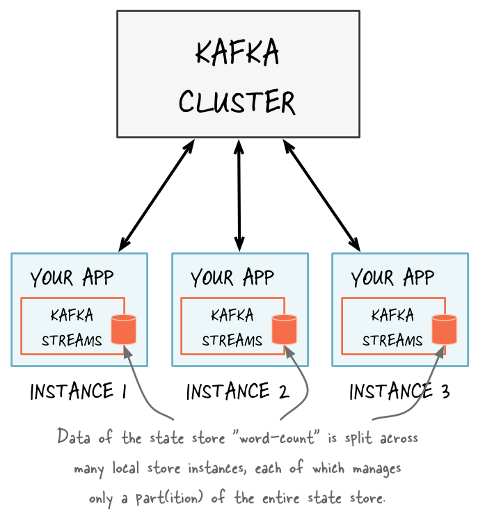
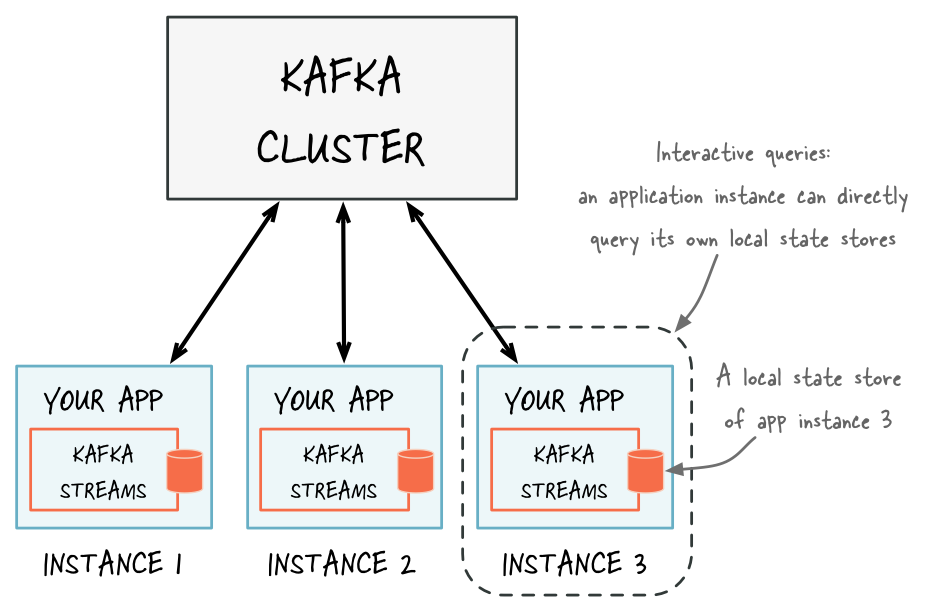
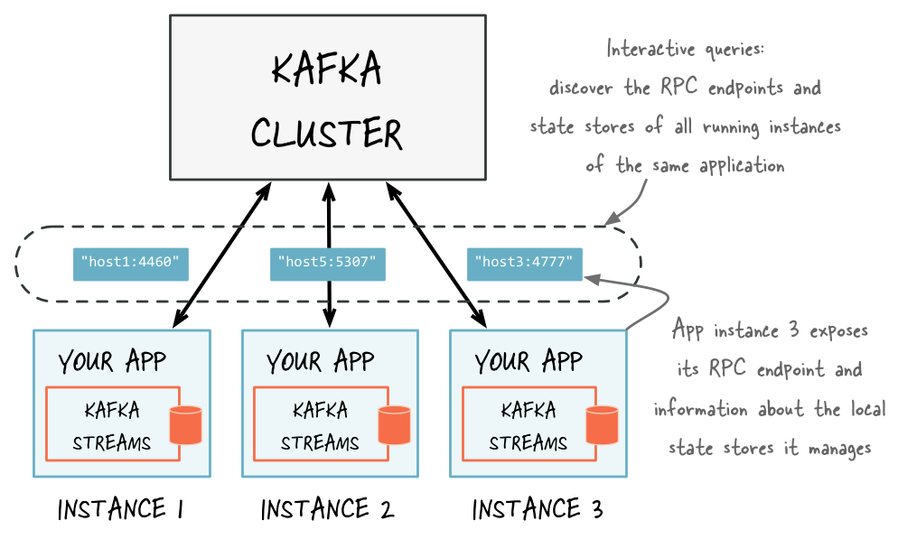

.. _streams_developer-guide_interactive-queries:

`Interactive Queries <#interactive-queries>`__
==============================================

Interactive queries allow you to leverage the state of your application
from outside your application. The Kafka Streams enables your
applications to be queryable.

.. contents:: Table of Contents
   :local:

The full state of your application is typically `split across many
distributed instances of your
application <../architecture.html#streams-architecture-state>`__, and
across many state stores that are managed locally by these application
instances.

There are local and remote components to interactively querying the
state of your application.

Local state
    An application instance can query the locally managed portion of the
    state and directly query its own local state stores. You can use the
    corresponding local data in other parts of your application code, as
    long as it doesn’t required calling the Kafka Streams API. Querying
    state stores is always read-only to guarantee that the underlying
    state stores will never be mutated out-of-band (e.g., you cannot add
    new entries). State stores should only be mutated by the
    corresponding processor topology and the input data it operates on.
    For more information, see `Querying local state stores for an app
    instance <#streams-developer-guide-interactive-queries-local-stores>`__.
Remote state
    To query the full state of your application, you must connect the
    various fragments of the state, including:

    -  query local state stores
    -  discover all running instances of your application in the network
       and their state stores
    -  communicate with these instances over the network (e.g., an RPC
       layer)

    Connecting these fragments enables communication between instances
    of the same app and communication from other applications for
    interactive queries. For more information, see `Querying remote
    state stores for the entire
    app <#streams-developer-guide-interactive-queries-discovery>`__.

Kafka Streams natively provides all of the required functionality for
interactively querying the state of your application, except if you want
to expose the full state of your application via interactive queries. To
allow application instances to communicate over the network, you must
add a Remote Procedure Call (RPC) layer to your application (e.g., REST
API).

This table shows the Kafka Streams native communication support for
various procedures.

+-----------------------------+------------------+---------------------+
| Procedure                   | Application      | Entire application  |
|                             | instance         |                     |
+=============================+==================+=====================+
| Query local state stores of | Supported        | Supported           |
| an app instance             |                  |                     |
+-----------------------------+------------------+---------------------+
| Make an app instance        | Supported        | Supported           |
| discoverable to others      |                  |                     |
+-----------------------------+------------------+---------------------+
| Discover all running app    | Supported        | Supported           |
| instances and their state   |                  |                     |
| stores                      |                  |                     |
+-----------------------------+------------------+---------------------+
| Communicate with app        | Supported        | Not supported (you  |
| instances over the network  |                  | must configure)     |
| (RPC)                       |                  |                     |
+-----------------------------+------------------+---------------------+

`Querying local state stores for an app instance <#querying-local-state-stores-for-an-app-instance>`__
------------------------------------------------------------------------------------------------------

A Kafka Streams application typically runs on multiple instances. The
state that is locally available on any given instance is only a subset
of the `application’s entire
state <../architecture.html#streams-architecture-state>`__. Querying the
local stores on an instance will only return data locally available on
that particular instance.

The method ``KafkaStreams#store(...)`` finds an application instance’s
local state stores by name and type.

Every application instance can directly query any of its local state
stores.

The *name* of a state store is defined when you create the store. You
can create the store explicitly by using the Processor API or implicitly
by using stateful operations in the DSL.

The *type* of a state store is defined by ``QueryableStoreType``. You
can access the built-in types via the class ``QueryableStoreTypes``.
Kafka Streams currently has two built-in types:

-  A key-value store ``QueryableStoreTypes#keyValueStore()``, see
   `Querying local key-value
   stores <#streams-developer-guide-interactive-queries-local-key-value-stores>`__.
-  A window store ``QueryableStoreTypes#windowStore()``, see `Querying
   local window
   stores <#streams-developer-guide-interactive-queries-local-window-stores>`__.

You can also `implement your own
QueryableStoreType <#streams-developer-guide-interactive-queries-custom-stores>`__
as described in section `Querying local custom state
stores <#streams-developer-guide-interactive-queries-custom-stores>`__.

.. note:: 

   Kafka Streams materializes one state store per stream partition. This
   means your application will potentially manage many underlying state
   stores. The API enables you to query all of the underlying stores
   without having to know which partition the data is in.

`Querying local key-value stores <#querying-local-key-value-stores>`__
----------------------------------------------------------------------

To query a local key-value store, you must first create a topology with
a key-value store. This example creates a key-value store named
“CountsKeyValueStore”. This store will hold the latest count for any
word that is found on the topic “word-count-input”.

.. code:: java

    StreamsConfig config = ...;
    StreamsBuilder builder = ...;
    KStream<String, String> textLines = ...;

    // Define the processing topology (here: WordCount)
    KGroupedStream<String, String> groupedByWord = textLines
      .flatMapValues(value -> Arrays.asList(value.toLowerCase().split("\\W+")))
      .groupBy((key, word) -> word, Serialized.with(stringSerde, stringSerde));

    // Create a key-value store named "CountsKeyValueStore" for the all-time word counts
    groupedByWord.count(Materialized.<String, String, KeyValueStore<Bytes, byte[]>as("CountsKeyValueStore"));

    // Start an instance of the topology
    KafkaStreams streams = new KafkaStreams(builder, config);
    streams.start();

After the application has started, you can get access to
“CountsKeyValueStore” and then query it via the
`ReadOnlyKeyValueStore <https://github.com/apache/kafka/blob/1.0/streams/src/main/java/org/apache/kafka/streams/state/ReadOnlyKeyValueStore.java>`__
API:

.. code:: java

    // Get the key-value store CountsKeyValueStore
    ReadOnlyKeyValueStore<String, Long> keyValueStore =
        streams.store("CountsKeyValueStore", QueryableStoreTypes.keyValueStore());

    // Get value by key
    System.out.println("count for hello:" + keyValueStore.get("hello"));

    // Get the values for a range of keys available in this application instance
    KeyValueIterator<String, Long> range = keyValueStore.range("all", "streams");
    while (range.hasNext()) {
      KeyValue<String, Long> next = range.next();
      System.out.println("count for " + next.key + ": " + value);
    }

    // Get the values for all of the keys available in this application instance
    KeyValueIterator<String, Long> range = keyValueStore.all();
    while (range.hasNext()) {
      KeyValue<String, Long> next = range.next();
      System.out.println("count for " + next.key + ": " + value);
    }

You can also materialize the results of stateless operators by using the
overloaded methods that take a ``queryableStoreName`` as shown in the
example below:

.. code:: java

    StreamsConfig config = ...;
    StreamsBuilder builder = ...;
    KTable<String, Integer> regionCounts = ...;

    // materialize the result of filtering corresponding to odd numbers
    // the "queryableStoreName" can be subsequently queried.
    KTable<String, Integer> oddCounts = numberLines.filter((region, count) -> (count % 2 != 0),
      Materialized.<String, Integer, KeyValueStore<Bytes, byte[]>as("queryableStoreName"));

    // do not materialize the result of filtering corresponding to even numbers
    // this means that these results will not be materialized and cannot be queried.
    KTable<String, Integer> oddCounts = numberLines.filter((region, count) -> (count % 2 == 0));

`Querying local window <#querying-local-window-stores>`__
---------------------------------------------------------

A window store will potentially have many results for any given key
because the key can be present in multiple windows. However, there is
only one result per window for a given key.

To query a local window store, you must first create a topology with a
window store. This example creates a window store named
“CountsWindowStore” that contains the counts for words in 1-minute
windows.

.. code:: java

    StreamsConfig config = ...;
    StreamsBuilder builder = ...;
    KStream<String, String> textLines = ...;

    // Define the processing topology (here: WordCount)
    KGroupedStream<String, String> groupedByWord = textLines
      .flatMapValues(value -> Arrays.asList(value.toLowerCase().split("\\W+")))
      .groupBy((key, word) -> word, Serialized.with(stringSerde, stringSerde));

    // Create a window state store named "CountsWindowStore" that contains the word counts for every minute
    groupedByWord.windowedBy(TimeWindows.of(60000))
      .count(Materialized.<String, Long, WindowStore<Bytes, byte[]>as("CountsWindowStore"));

After the application has started, you can get access to
“CountsWindowStore” and then query it via the
`ReadOnlyWindowStore <https://github.com/apache/kafka/blob/1.0/streams/src/main/java/org/apache/kafka/streams/state/ReadOnlyWindowStore.java>`__
API:

.. code:: java

    // Get the window store named "CountsWindowStore"
    ReadOnlyWindowStore<String, Long> windowStore =
        streams.store("CountsWindowStore", QueryableStoreTypes.windowStore());

    // Fetch values for the key "world" for all of the windows available in this application instance.
    // To get *all* available windows we fetch windows from the beginning of time until now.
    long timeFrom = 0; // beginning of time = oldest available
    long timeTo = System.currentTimeMillis(); // now (in processing-time)
    WindowStoreIterator<Long> iterator = windowStore.fetch("world", timeFrom, timeTo);
    while (iterator.hasNext()) {
      KeyValue<Long, Long> next = iterator.next();
      long windowTimestamp = next.key;
      System.out.println("Count of 'world' @ time " + windowTimestamp + " is " + next.value);
    }

`Querying local custom state <#querying-local-custom-state-stores>`__
---------------------------------------------------------------------

.. note::

   Only the `Processor
   API <processor-api.html#streams-developer-guide-processor-api>`__
   supports custom state stores.

Before querying the custom state stores you must implement these
interfaces:

-  Your custom state store must implement ``StateStore``.
-  You must have an interface to represent the operations available on
   the store.
-  You must provide an implementation of ``StoreBuilder`` for creating
   instances of your store.
-  It is recommended that you provide an interface that restricts access
   to read-only operations. This prevents users of this API from
   mutating the state of your running Kafka Streams application
   out-of-band.

The class/interface hierarchy for your custom store might look something
like:

.. code:: java

    public class MyCustomStore<K,V> implements StateStore, MyWriteableCustomStore<K,V> {
      // implementation of the actual store
    }

    // Read-write interface for MyCustomStore
    public interface MyWriteableCustomStore<K,V> extends MyReadableCustomStore<K,V> {
      void write(K Key, V value);
    }

    // Read-only interface for MyCustomStore
    public interface MyReadableCustomStore<K,V> {
      V read(K key);
    }

    public class MyCustomStoreBuilder implements StoreBuilder {
      // implementation of the supplier for MyCustomStore
    }

To make this store queryable you must:

-  Provide an implementation of
   `QueryableStoreType <https://github.com/apache/kafka/blob/1.0/streams/src/main/java/org/apache/kafka/streams/state/QueryableStoreType.java>`__.
-  Provide a wrapper class that has access to all of the underlying
   instances of the store and is used for querying.

Here is how to implement ``QueryableStoreType``:

.. code:: java

    public class MyCustomStoreType<K,V> implements QueryableStoreType<MyReadableCustomStore<K,V>> {

      // Only accept StateStores that are of type MyCustomStore
      public boolean accepts(final StateStore stateStore) {
        return stateStore instanceOf MyCustomStore;
      }

      public MyReadableCustomStore<K,V> create(final StateStoreProvider storeProvider, final String storeName) {
          return new MyCustomStoreTypeWrapper(storeProvider, storeName, this);
      }

    }

A wrapper class is required because each instance of a Kafka Streams
application may run multiple stream tasks and manage multiple local
instances of a particular state store. The wrapper class hides this
complexity and lets you query a “logical” state store by name without
having to know about all of the underlying local instances of that state
store.

When implementing your wrapper class you must use the
`StateStoreProvider <https://github.com/apache/kafka/blob/1.0/streams/src/main/java/org/apache/kafka/streams/state/internals/StateStoreProvider.java>`__
interface to get access to the underlying instances of your store.
``StateStoreProvider#stores(String storeName, QueryableStoreType<T> queryableStoreType)``
returns a ``List`` of state stores with the given storeName and of the
type as defined by ``queryableStoreType``.

Here is an example implementation of the wrapper follows (Java 8+):

.. code:: java

    // We strongly recommended implementing a read-only interface
    // to restrict usage of the store to safe read operations!
    public class MyCustomStoreTypeWrapper<K,V> implements MyReadableCustomStore<K,V> {

      private final QueryableStoreType<MyReadableCustomStore<K, V>> customStoreType;
      private final String storeName;
      private final StateStoreProvider provider;

      public CustomStoreTypeWrapper(final StateStoreProvider provider,
                                    final String storeName,
                                    final QueryableStoreType<MyReadableCustomStore<K, V>> customStoreType) {

        // ... assign fields ...
      }

      // Implement a safe read method
      @Override
      public V read(final K key) {
        // Get all the stores with storeName and of customStoreType
        final List<MyReadableCustomStore<K, V>> stores = provider.getStores(storeName, customStoreType);
        // Try and find the value for the given key
        final Optional<V> value = stores.stream().filter(store -> store.read(key) != null).findFirst();
        // Return the value if it exists
        return value.orElse(null);
      }

    }

You can now find and query your custom store:

.. code:: java

    StreamsConfig config = ...;
    Topology topology = ...;
    ProcessorSupplier processorSuppler = ...;

    // Create CustomStoreSupplier for store name the-custom-store
    MyCustomStoreBuilder customStoreBuilder = new MyCustomStoreBuilder("the-custom-store") //...;
    // Add the source topic
    topology.addSource("input", "inputTopic");
    // Add a custom processor that reads from the source topic
    topology.addProcessor("the-processor", processorSupplier, "input");
    // Connect your custom state store to the custom processor above
    topology.addStateStore(customStoreBuilder, "the-processor");

    KafkaStreams streams = new KafkaStreams(topology, config);
    streams.start();

    // Get access to the custom store
    MyReadableCustomStore<String,String> store = streams.store("the-custom-store", new MyCustomStoreType<String,String>());
    // Query the store
    String value = store.read("key");

`Querying remote state stores for the entire <#querying-remote-state-stores-for-the-entire-app>`__
--------------------------------------------------------------------------------------------------

To query remote states for the entire app, you must expose the
application’s full state to other applications, including applications
that are running on different machines.

For example, you have a Kafka Streams application that processes user
events in a multi-player video game, and you want to retrieve the latest
status of each user directly and display it in a mobile app. Here are
the required steps to make the full state of your application queryable:

#. `Add an RPC layer to your
   application <#streams-developer-guide-interactive-queries-rpc-layer>`__
   so that the instances of your application can be interacted with via
   the network (e.g., a REST API, Thrift, a custom protocol, and so on).
   The instances must respond to interactive queries. You can follow the
   reference examples provided to get started.
#. `Expose the RPC
   endpoints <#streams-developer-guide-interactive-queries-expose-rpc>`__
   of your application’s instances via the ``application.server``
   configuration setting of Kafka Streams. Because RPC endpoints must be
   unique within a network, each instance has its own value for this
   configuration setting. This makes an application instance
   discoverable by other instances.
#. In the RPC layer, `discover remote application
   instances <#streams-developer-guide-interactive-queries-discover-app-instances-and-stores>`__
   and their state stores and `query locally available state
   stores <#streams-developer-guide-interactive-queries-local-stores>`__
   to make the full state of your application queryable. The remote
   application instances can forward queries to other app instances if a
   particular instance lacks the local data to respond to a query. The
   locally available state stores can directly respond to queries.

Discover any running instances of the same application as well as the
respective RPC endpoints they expose for interactive queries

`Adding an RPC layer to your <#adding-an-rpc-layer-to-your-application>`__
--------------------------------------------------------------------------

There are many ways to add an RPC layer. The only requirements are that
the RPC layer is embedded within the Kafka Streams application and that
it exposes an endpoint that other application instances and applications
can connect to.

`Exposing the RPC endpoints of your <#exposing-the-rpc-endpoints-of-your-application>`__
----------------------------------------------------------------------------------------

To enable remote state store discovery in a distributed Kafka Streams
application, you must set the `configuration
property <config-streams.html#streams-developer-guide-required-configs>`__
in ``StreamsConfig``. The ``application.server`` property defines a
unique ``host:port`` pair that points to the RPC endpoint of the
respective instance of a Kafka Streams application. The value of this
configuration property will vary across the instances of your
application. When this property is set, Kafka Streams will keep track of
the RPC endpoint information for every instance of an application, its
state stores, and assigned stream partitions through instances of
:javadoc:`StreamsMetadata|org/apache/kafka/streams/state/StreamsMetadata.html`.

.. tip::

   Consider leveraging the exposed RPC endpoints of your application for
   further functionality, such as piggybacking additional inter-application
   communication that goes beyond interactive queries.

This example shows how to configure and run a Kafka Streams application
that supports the discovery of its state stores.

.. code:: java

    Properties props = new Properties();
    // Set the unique RPC endpoint of this application instance through which it
    // can be interactively queried.  In a real application, the value would most
    // probably not be hardcoded but derived dynamically.
    String rpcEndpoint = "host1:4460";
    props.put(StreamsConfig.APPLICATION_SERVER_CONFIG, rpcEndpoint);
    // ... further settings may follow here ...

    StreamsConfig config = new StreamsConfig(props);
    StreamsBuilder builder = new StreamsBuilder();

    KStream<String, String> textLines = builder.stream(stringSerde, stringSerde, "word-count-input");

    final KGroupedStream<String, String> groupedByWord = textLines
        .flatMapValues(value -> Arrays.asList(value.toLowerCase().split("\\W+")))
        .groupBy((key, word) -> word, Serialized.with(stringSerde, stringSerde));

    // This call to `count()` creates a state store named "word-count".
    // The state store is discoverable and can be queried interactively.
    groupedByWord.count(Materialized.<String, Long, KeyValueStore<Bytes, byte[]>as("word-count"));

    // Start an instance of the topology
    KafkaStreams streams = new KafkaStreams(builder, streamsConfiguration);
    streams.start();

    // Then, create and start the actual RPC service for remote access to this
    // application instance's local state stores.
    //
    // This service should be started on the same host and port as defined above by
    // the property `StreamsConfig.APPLICATION_SERVER_CONFIG`.  The example below is
    // fictitious, but we provide end-to-end demo applications (such as KafkaMusicExample)
    // that showcase how to implement such a service to get you started.
    MyRPCService rpcService = ...;
    rpcService.listenAt(rpcEndpoint);

`Discovering and accessing application instances and their local state <#discovering-and-accessing-application-instances-and-their-local-state-stores>`__
---------------------------------------------------------------------------------------------------------------------------------------------------------

The following methods return
:javadoc:`StreamsMetadata|org/apache/kafka/streams/state/StreamsMetadata.html`
objects, which provide meta-information about application instances such
as their RPC endpoint and locally available state stores.

-  ``KafkaStreams#allMetadata()``: find all instances of this
   application
-  ``KafkaStreams#allMetadataForStore(String storeName)``: find those
   applications instances that manage local instances of the state store
   “storeName”
-  ``KafkaStreams#metadataForKey(String storeName, K key, Serializer<K> keySerializer)``:
   using the default stream partitioning strategy, find the one
   application instance that holds the data for the given key in the
   given state store
-  ``KafkaStreams#metadataForKey(String storeName, K key, StreamPartitioner<K, ?> partitioner)``:
   using ``partitioner``, find the one application instance that holds
   the data for the given key in the given state store

.. attention::

   If ``application.server`` is not configured for an application instance,
   then the above methods will not find any
   :javadoc:`StreamsMetadata|org/apache/kafka/streams/state/StreamsMetadata.html`
   for it.

For example, we can now find the ``StreamsMetadata`` for the state store
named “word-count” that we defined in the code example shown in the
previous section:

.. code:: java

    KafkaStreams streams = ...;
    // Find all the locations of local instances of the state store named "word-count"
    Collection<StreamsMetadata> wordCountHosts = streams.allMetadataForStore("word-count");

    // For illustrative purposes, we assume using an HTTP client to talk to remote app instances.
    HttpClient http = ...;

    // Get the word count for word (aka key) 'alice': Approach 1
    //
    // We first find the one app instance that manages the count for 'alice' in its local state stores.
    StreamsMetadata metadata = streams.metadataForKey("word-count", "alice", Serdes.String().serializer());
    // Then, we query only that single app instance for the latest count of 'alice'.
    // Note: The RPC URL shown below is fictitious and only serves to illustrate the idea.  Ultimately,
    // the URL (or, in general, the method of communication) will depend on the RPC layer you opted to
    // implement.  Again, we provide end-to-end demo applications (such as KafkaMusicExample) that showcase
    // how to implement such an RPC layer.
    Long result = http.getLong("http://" + metadata.host() + ":" + metadata.port() + "/word-count/alice");

    // Get the word count for word (aka key) 'alice': Approach 2
    //
    // Alternatively, we could also choose (say) a brute-force approach where we query every app instance
    // until we find the one that happens to know about 'alice'.
    Optional<Long> result = streams.allMetadataForStore("word-count")
        .stream()
        .map(streamsMetadata -> {
            // Construct the (fictituous) full endpoint URL to query the current remote application instance
            String url = "http://" + streamsMetadata.host() + ":" + streamsMetadata.port() + "/word-count/alice";
            // Read and return the count for 'alice', if any.
            return http.getLong(url);
        })
        .filter(s -> s != null)
        .findFirst();

At this point the full state of the application is interactively
queryable:

-  You can discover the running instances of the application and the
   state stores they manage locally.
-  Through the RPC layer that was added to the application, you can
   communicate with these application instances over the network and
   query them for locally available state.
-  The application instances are able to serve such queries because they
   can directly query their own local state stores and respond via the
   RPC layer.
-  Collectively, this allows us to query the full state of the entire
   application.

To see an end-to-end application with interactive queries, review the
`demo
applications <#streams-developer-guide-interactive-queries-demos>`__.

