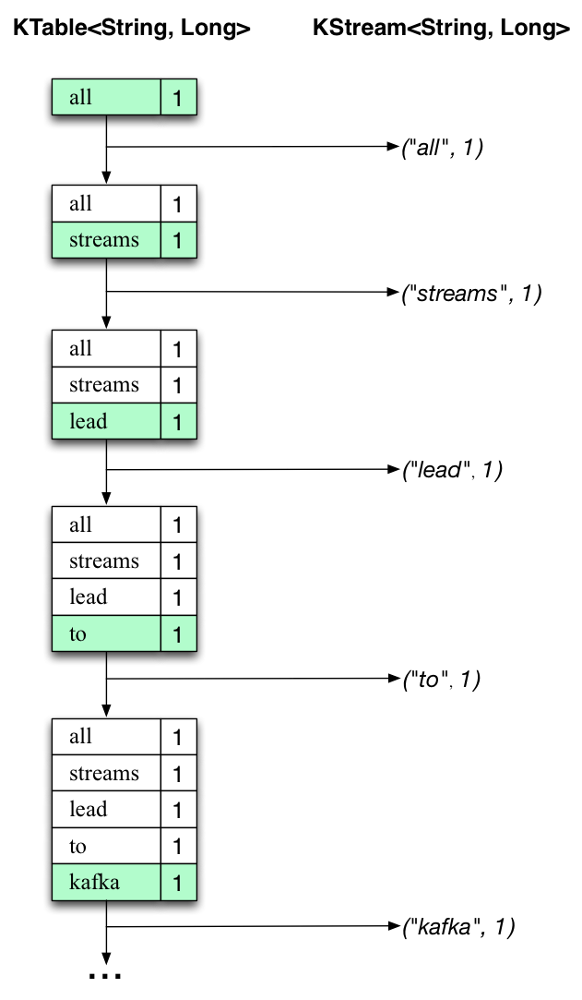
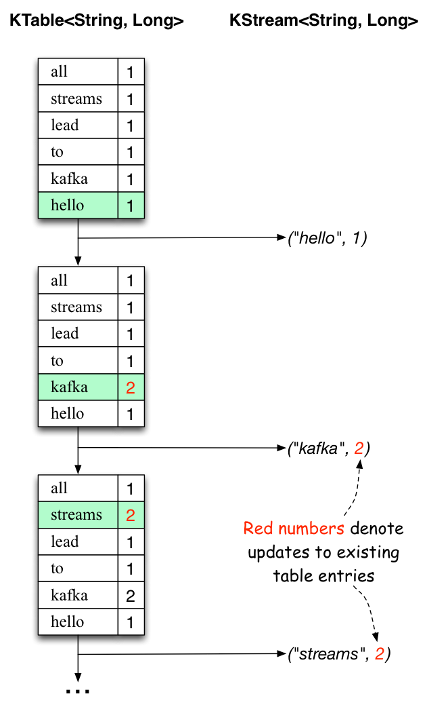

Run Kafka Streams Demo Application
==================================

.. contents::
    :local:

This tutorial assumes you are starting fresh and have no existing Kafka
or ZooKeeper data. However, if you have already started Kafka and
ZooKeeper, feel free to skip the first two steps.

Kafka Streams is a client library for building mission-critical
real-time applications and microservices, where the input and/or output
data is stored in Kafka clusters. Kafka Streams combines the simplicity
of writing and deploying standard Java and Scala applications on the
client side with the benefits of Kafka's server-side cluster technology
to make these applications highly scalable, elastic, fault-tolerant,
distributed, and much more.

This quickstart example will demonstrate how to run a streaming
application coded in this library. Here is the gist of the
``WordCountDemo`` example code (converted to use Java 8 lambda
expressions for easy reading).

.. code:: bash

    // Serializers/deserializers (serde) for String and Long types
    final Serde<String> stringSerde = Serdes.String();
    final Serde<Long> longSerde = Serdes.Long();

    // Construct a `KStream` from the input topic "streams-plaintext-input", where message values
    // represent lines of text (for the sake of this example, we ignore whatever may be stored
    // in the message keys).
    KStream<String, String> textLines = builder.stream("streams-plaintext-input",
        Consumed.with(stringSerde, stringSerde);

    KTable<String, Long> wordCounts = textLines
        // Split each text line, by whitespace, into words.
        .flatMapValues(value -> Arrays.asList(value.toLowerCase().split("\\W+")))

        // Group the text words as message keys
        .groupBy((key, value) -> value)

        // Count the occurrences of each word (message key).
        .count()

    // Store the running counts as a changelog stream to the output topic.
    wordCounts.toStream().to("streams-wordcount-output", Produced.with(Serdes.String(), Serdes.Long()));

It implements the WordCount algorithm, which computes a word occurrence
histogram from the input text. However, unlike other WordCount examples
you might have seen before that operate on bounded data, the WordCount
demo application behaves slightly differently because it is designed to
operate on an **infinite, unbounded stream** of data. Similar to the
bounded variant, it is a stateful algorithm that tracks and updates the
counts of words. However, since it must assume potentially unbounded
input data, it will periodically output its current state and results
while continuing to process more data because it cannot know when it has
processed "all" the input data.

As the first step, we will start Kafka (unless you already have it
started) and then we will prepare input data to a Kafka topic, which
will subsequently be processed by a Kafka Streams application.

`Step 1: Download the code <#quickstart_streams_download>`__
------------------------------------------------------------

:kafka-download:`Download`
the |release| release and un-tar it. Note that there are
multiple downloadable Scala versions and we choose to use the
recommended version (|scala_version|) here:

.. codewithvars:: bash

    > tar -xzf kafka_|scala_version|-|release|.tgz
    > cd kafka_|scala_version|-|release|

`Step 2: Start the Kafka server <#quickstart_streams_startserver>`__
--------------------------------------------------------------------

Kafka uses `ZooKeeper <https://zookeeper.apache.org/>`__ so you need to
first start a ZooKeeper server if you don't already have one. You can
use the convenience script packaged with kafka to get a quick-and-dirty
single-node ZooKeeper instance.

.. code:: bash

    > bin/zookeeper-server-start.sh config/zookeeper.properties
    [2013-04-22 15:01:37,495] INFO Reading configuration from: config/zookeeper.properties (org.apache.zookeeper.server.quorum.QuorumPeerConfig)
    ...

Now start the Kafka server:

.. code:: bash

    > bin/kafka-server-start.sh config/server.properties
    [2013-04-22 15:01:47,028] INFO Verifying properties (kafka.utils.VerifiableProperties)
    [2013-04-22 15:01:47,051] INFO Property socket.send.buffer.bytes is overridden to 1048576 (kafka.utils.VerifiableProperties)
    ...

`Step 3: Prepare input topic and start Kafka producer <#quickstart_streams_prepare>`__
--------------------------------------------------------------------------------------

Next, we create the input topic named **streams-plaintext-input** and
the output topic named **streams-wordcount-output**:

.. code:: bash

    > bin/kafka-topics.sh --create \
        --zookeeper localhost:2181 \
        --replication-factor 1 \
        --partitions 1 \
        --topic streams-plaintext-input
    Created topic "streams-plaintext-input".

Note: we create the output topic with compaction enabled because the
output stream is a changelog stream (cf. `explanation of application
output <#anchor-changelog-output>`__ below).

.. code:: bash

    > bin/kafka-topics.sh --create \
        --zookeeper localhost:2181 \
        --replication-factor 1 \
        --partitions 1 \
        --topic streams-wordcount-output \
        --config cleanup.policy=compact
    Created topic "streams-wordcount-output".

The created topic can be described with the same **kafka-topics** tool:

.. code:: bash

    > bin/kafka-topics.sh --zookeeper localhost:2181 --describe

    Topic:streams-plaintext-input   PartitionCount:1    ReplicationFactor:1 Configs:
        Topic: streams-plaintext-input  Partition: 0    Leader: 0   Replicas: 0 Isr: 0
    Topic:streams-wordcount-output  PartitionCount:1    ReplicationFactor:1 Configs:
        Topic: streams-wordcount-output Partition: 0    Leader: 0   Replicas: 0 Isr: 0

`Step 4: Start the Wordcount Application <#quickstart_streams_start>`__
-----------------------------------------------------------------------

The following command starts the WordCount demo application:

.. code:: bash

    > bin/kafka-run-class.sh org.apache.kafka.streams.examples.wordcount.WordCountDemo

The demo application will read from the input topic
**streams-plaintext-input**, perform the computations of the WordCount
algorithm on each of the read messages, and continuously write its
current results to the output topic **streams-wordcount-output**. Hence
there won't be any STDOUT output except log entries as the results are
written back into in Kafka.

Now we can start the console producer in a separate terminal to write
some input data to this topic:

.. code:: bash

    > bin/kafka-console-producer.sh --broker-list localhost:9092 --topic streams-plaintext-input

and inspect the output of the WordCount demo application by reading from
its output topic with the console consumer in a separate terminal:

.. code:: bash

    > bin/kafka-console-consumer.sh --bootstrap-server localhost:9092 \
        --topic streams-wordcount-output \
        --from-beginning \
        --formatter kafka.tools.DefaultMessageFormatter \
        --property print.key=true \
        --property print.value=true \
        --property key.deserializer=org.apache.kafka.common.serialization.StringDeserializer \
        --property value.deserializer=org.apache.kafka.common.serialization.LongDeserializer

`Step 5: Process some data <#quickstart_streams_process>`__
-----------------------------------------------------------

Now let's write some message with the console producer into the input
topic **streams-plaintext-input** by entering a single line of text and
then hit <RETURN>. This will send a new message to the input topic,
where the message key is null and the message value is the string
encoded text line that you just entered (in practice, input data for
applications will typically be streaming continuously into Kafka, rather
than being manually entered as we do in this quickstart):

.. code:: bash

    > bin/kafka-console-producer.sh --broker-list localhost:9092 --topic streams-plaintext-input
    all streams lead to kafka

This message will be processed by the Wordcount application and the
following output data will be written to the
**streams-wordcount-output** topic and printed by the console consumer:

.. code:: bash

    > bin/kafka-console-consumer.sh --bootstrap-server localhost:9092 \
        --topic streams-wordcount-output \
        --from-beginning \
        --formatter kafka.tools.DefaultMessageFormatter \
        --property print.key=true \
        --property print.value=true \
        --property key.deserializer=org.apache.kafka.common.serialization.StringDeserializer \
        --property value.deserializer=org.apache.kafka.common.serialization.LongDeserializer

    all     1
    streams 1
    lead    1
    to      1
    kafka   1

Here, the first column is the Kafka message key in ``java.lang.String``
format and represents a word that is being counted, and the second
column is the message value in ``java.lang.Long``\ format, representing
the word's latest count.

Now let's continue writing one more message with the console producer
into the input topic **streams-plaintext-input**. Enter the text line
"hello kafka streams" and hit <RETURN>. Your terminal should look as
follows:

.. code:: bash

    > bin/kafka-console-producer.sh --broker-list localhost:9092 --topic streams-plaintext-input
    all streams lead to kafka
    hello kafka streams

In your other terminal in which the console consumer is running, you
will observe that the WordCount application wrote new output data:

.. code:: bash

    > bin/kafka-console-consumer.sh --bootstrap-server localhost:9092 \
        --topic streams-wordcount-output \
        --from-beginning \
        --formatter kafka.tools.DefaultMessageFormatter \
        --property print.key=true \
        --property print.value=true \
        --property key.deserializer=org.apache.kafka.common.serialization.StringDeserializer \
        --property value.deserializer=org.apache.kafka.common.serialization.LongDeserializer

    all     1
    streams 1
    lead    1
    to      1
    kafka   1
    hello   1
    kafka   2
    streams 2

Here the last printed lines **kafka 2** and **streams 2** indicate
updates to the keys **kafka** and **streams** whose counts have been
incremented from **1** to **2**. Whenever you write further input
messages to the input topic, you will observe new messages being added
to the **streams-wordcount-output** topic, representing the most recent
word counts as computed by the WordCount application. Let's enter one
final input text line "join kafka summit" and hit <RETURN> in the
console producer to the input topic **streams-wordcount-input** before
we wrap up this quickstart:

.. code:: bash

    > bin/kafka-console-producer.sh --broker-list localhost:9092 --topic streams-wordcount-input
    all streams lead to kafka
    hello kafka streams
    join kafka summit

 The **streams-wordcount-output** topic will subsequently show the
corresponding updated word counts (see last three lines):

.. code:: bash

    > bin/kafka-console-consumer.sh --bootstrap-server localhost:9092 \
        --topic streams-wordcount-output \
        --from-beginning \
        --formatter kafka.tools.DefaultMessageFormatter \
        --property print.key=true \
        --property print.value=true \
        --property key.deserializer=org.apache.kafka.common.serialization.StringDeserializer \
        --property value.deserializer=org.apache.kafka.common.serialization.LongDeserializer

    all     1
    streams 1
    lead    1
    to      1
    kafka   1
    hello   1
    kafka   2
    streams 2
    join    1
    kafka   3
    summit  1

As one can see, outputs of the Wordcount application is actually a
continuous stream of updates, where each output record (i.e. each line
in the original output above) is an updated count of a single word, aka
record key such as "kafka". For multiple records with the same key, each
later record is an update of the previous one.

The two diagrams below illustrate what is essentially happening behind
the scenes. The first column shows the evolution of the current state of
the ``KTable<String, Long>`` that is counting word occurrences for
``count``. The second column shows the change records that result from
state updates to the KTable and that are being sent to the output Kafka
topic **streams-wordcount-output**.

|pic1| |pic2|

First the text line "all streams lead to kafka" is being processed. The
``KTable`` is being built up as each new word results in a new table
entry (highlighted with a green background), and a corresponding change
record is sent to the downstream ``KStream``.

When the second text line "hello kafka streams" is processed, we
observe, for the first time, that existing entries in the ``KTable`` are
being updated (here: for the words "kafka" and for "streams"). And
again, change records are being sent to the output topic.

And so on (we skip the illustration of how the third line is being
processed). This explains why the output topic has the contents we
showed above, because it contains the full record of changes.

Looking beyond the scope of this concrete example, what Kafka Streams is
doing here is to leverage the duality between a table and a changelog
stream (here: table = the KTable, changelog stream = the downstream
KStream): you can publish every change of the table to a stream, and if
you consume the entire changelog stream from beginning to end, you can
reconstruct the contents of the table.

`Step 6: Teardown the application <#quickstart_streams_stop>`__
---------------------------------------------------------------

You can now stop the console consumer, the console producer, the
Wordcount application, the Kafka broker and the ZooKeeper server in
order via **Ctrl-C**.

